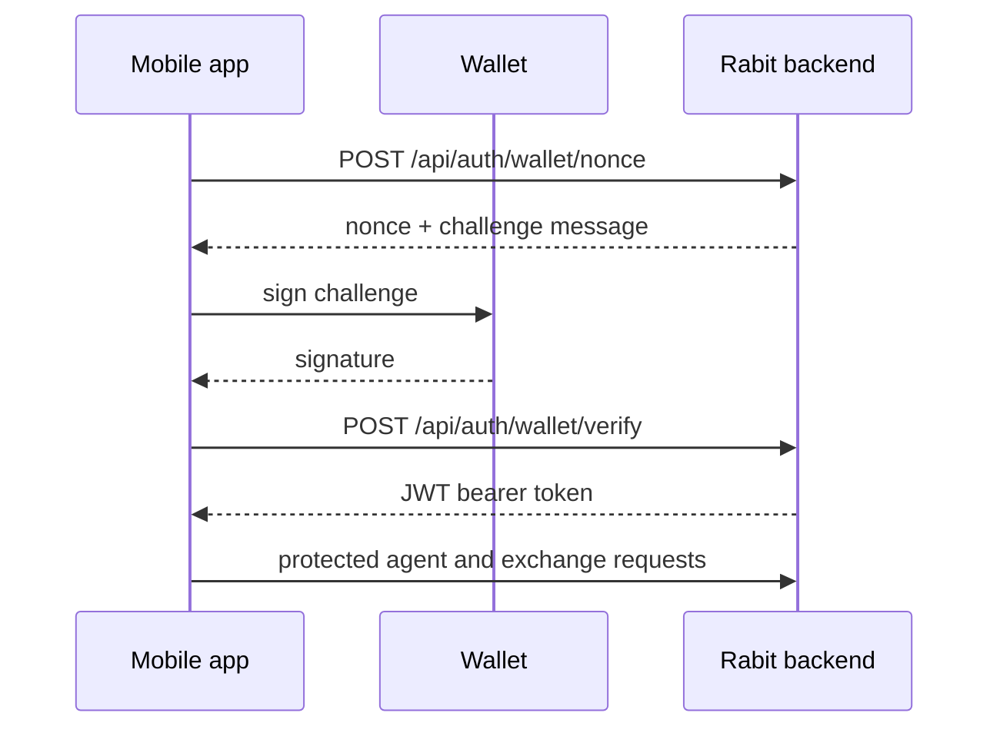

# Wallet Auth

The backend currently uses wallet-based authentication as the main identity layer for protected agent and exchange flows.

## Current Flow

| Step | What happens |
| --- | --- |
| `POST /api/auth/wallet/nonce` | the client requests a backend challenge |
| sign challenge | the wallet signs the returned message |
| `POST /api/auth/wallet/verify` | the backend verifies the signature |
| issue JWT | the backend returns a bearer token |
| protected requests | later API calls send `Authorization: Bearer <token>` |

## Visual Flow

## What The Agent Receives

| Derived value | Why it matters |
| --- | --- |
| `wallet_address` | gives the backend a verified wallet identity |
| `user_id` shaped like `wallet:<wallet_address>` | gives internal services a stable user key |
| authenticated ownership for protected routes | lets account-aware tools trust the identity source |

This matters because the agent runtime should not trust a client-provided `user_id` when identity can instead come from verified auth.

## Why This Matters For Agent Behavior

Wallet auth influences:

| Agent behavior | Why auth matters |
| --- | --- |
| memory ownership | memory should stay tied to the verified user |
| exchange connection ownership | Backpack connections must belong to the authenticated user |
| Backpack credential lookup | the right stored credentials must be selected safely |
| Drift account-linked read-only tools | account reads should follow verified wallet identity |
| Drift same-wallet execution preparation | prepared execution should align with the same authenticated wallet |

In practice, the agent runtime becomes safer because execution and account reads can be tied to verified identity instead of loose request input.

## Exchange Differences

The same wallet-auth layer feeds both exchange families, but the exchange behavior is different:

| Exchange | How wallet auth is used |
| --- | --- |
| Backpack | wallet auth establishes app identity, then exchange access uses encrypted API credentials |
| Drift | wallet auth is both the app identity base and the current same-wallet execution identity base |

For those differences, see:

- [Backpack Agent Behavior](../exchanges/backpack)
- [Drift Agent Behavior](../exchanges/drift)

## Related Documentation

- [Agent Runtime Visual Guide](../runtime/visual-guide)
- [Backpack API Key Flow and Storage](../../integrations/backpack/api-key-flow-and-storage)
- [Drift Auth and Execution Wallet](../../integrations/drift/auth-and-execution-wallet)
