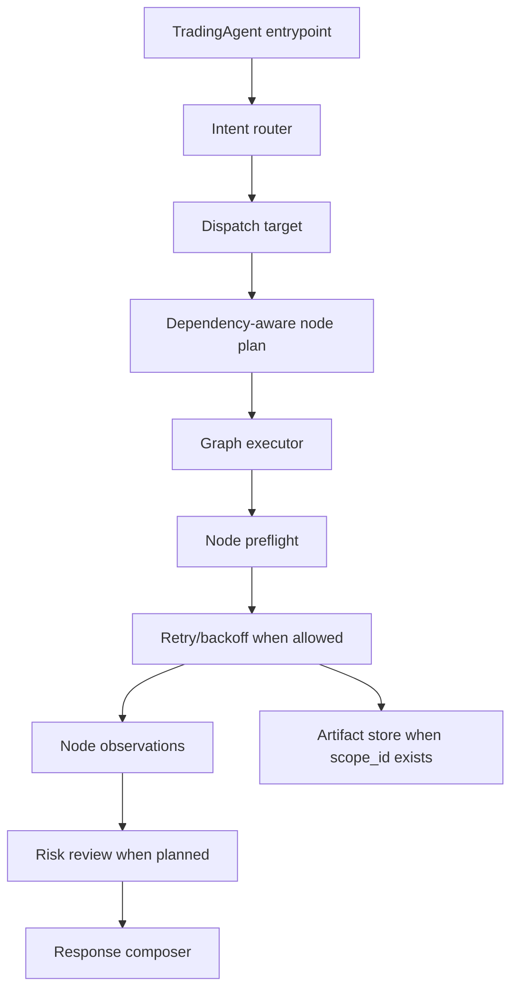

Rabit currently executes requests through one concrete runtime agent: `TradingAgent`.

But the pipeline around it is no longer just “one prompt in, one answer out”.

The backend now uses a multi-agent-ready entrypoint:

- one entry agent receives the request
- one router stage classifies the request
- one dispatch plan selects the next specialist target
- one composable node plan decides which pre-response nodes should run
- one dependency-aware planner decides when a node should not run at all
- one retry-aware executor handles bounded node recovery
- the current runtime still executes the request end-to-end until specialist runtimes are introduced

That choice is important.

Instead of shipping half-finished specialist runtimes too early, Rabit now separates `routing` from `execution` while still keeping one stable execution engine in production. The entrypoint becomes smarter through:

- intent routing
- dispatch planning
- composable pipeline nodes
- tool grouping
- context handling
- safe fallback behavior
- exchange-aware behavior

## Why this matters

This keeps the architecture easier to reason about while still allowing the product to behave differently for:

- analysis
- monitoring
- execution-aware requests
- memory-backed conversations

It also means the backend can evolve into a real router-plus-specialist architecture later without breaking its existing API or mobile integration.

## What this section explains

| Topic | Why it matters |
| --- | --- |
| Runtime structure | shows how the agent is orchestrated |
| Pipeline planning | explains how entrypoint, router, and dispatch planning now fit together |
| Pipeline nodes | explains how one request can run multiple specialist-like steps without hardcoding a second runtime |
| Wallet auth | explains how identity reaches protected agent behavior |
| Market and request context | explains why the same prompt can behave differently depending on the current screen or scope |
| Intent routing | shows how Rabit narrows tool access and response behavior |
| Exchange behavior | explains why Backpack and Drift are handled differently inside the agent |
| Service cost | explains where available models come from and how Rabit now separates model cost from monitoring cost |

## What is true today

Rabit is not yet executing with many independent specialist agents.

Today it does this instead:

- routes every request through a dedicated classifier stage
- chooses the most likely future specialist target
- executes a composable node plan before the main response when needed
- records a pipeline trace for evaluation and regression tests
- keeps execution on the stable runtime agent
- degrades gracefully when routing or tools fail

The first concrete nodes in that system are:

- `chart_analysis`
- `market_snapshot`
- `research_snapshot`
- `portfolio_snapshot`
- `execution_snapshot`
- `memory_snapshot`
- `risk_review`
- `general_fallback`
- `clarification_prep`
- `response_composer`

They behave like specialist steps, but not like fully separate runtimes. That means Rabit can:

- inspect TradingView chart state
- change symbol only when the request is in global market scope
- respect locked-asset market context
- add temporary indicators
- read indicator values and quote data
- gather live price and recent asset-specific headlines
- gather compact research context from news and web search for research-like requests
- gather balances, collateral, and positions for portfolio-oriented requests
- gather execution readiness and open-order state for execution-oriented requests
- gather relevant stored memory for memory-oriented requests
- review downside, invalidation, fresh-news risk, and setup fragility before the final answer
- prepare a safer low-confidence fallback mode when routing confidence drops
- prepare the minimum structured clarification context when ambiguity blocks execution
- pass those observations into the final answer

It also means node-level tool restriction is now part of the execution contract, not just the routing story:

| Node | Tool-surface rule |
| --- | --- |
| `chart_analysis` | analysis mode keeps chart-reading and indicator tools available while blocking draw and alert tools; write mode lets the node itself mutate the chart while still hiding drawing tools from the final model |
| `risk_review` | stays read-only and turns accumulated chart, market, and execution observations into explicit caution flags and invalidation-aware risk framing |
| `general_fallback` | narrows the turn to safe UI-only tools such as hints and plans when routing confidence is low |
| `clarification_prep` | narrows the turn to `show_hint` only so ambiguity resolution stays minimal and controlled |

without turning the whole backend into a hardcoded two-agent system.

## Updated execution map



This is important because the pipeline is no longer just a static ordered list.

It now has three extra behaviors:

| Behavior | What it means |
| --- | --- |
| dependency-aware planning | the graph avoids nodes that do not have the minimum context to make sense |
| node retry/backoff | transient degraded results can retry once in bounded fashion |
| artifact persistence | chart-write screenshots and mutation summaries can live beyond a single turn when the request has a stable `scope_id` |
| response synthesis | the final runtime receives primary evidence, conflict flags, and an answer posture instead of a flat node list |

For chart-heavy or market-sensitive requests, the dispatch target still stays on `market_specialist`. The technical chart-specific part is represented by the `chart_analysis` node, which can now run in either analysis mode or write mode, while the compact price-and-news enrichment step is represented by `market_snapshot`, not by pretending separate runtimes already exist.

So the product gets the benefits of cleaner orchestration now, while avoiding premature specialist implementations.

## Why this architecture is better for the next phase

Rabit is trying to win by making the entrypoint and routing layer:

- better informed
- better gated
- better connected to system tools
- safer around execution
- easier to evaluate
- easier to split into specialists later

That is a more disciplined architecture for the stage Rabit is in now.

## Code organization

The pipeline family now lives together under `agents/pipeline/`.

| Module family | What lives there |
| --- | --- |
| `agents/pipeline/intent_router.py` | intent classification and tool-group planning |
| `agents/pipeline/market_context.py` | frontend market-scope normalization and guidance |
| `agents/pipeline/conversation_style.py` | response-style normalization and prompt guidance |
| `agents/pipeline/trading_style.py` | trading-analysis style normalization and prompt guidance |
| `agents/pipeline/pipeline.py` | dispatch planning, node planning, and pipeline trace models |
| `agents/pipeline/artifacts.py` | session-scoped artifact persistence for pipeline outputs such as chart-write screenshots |

This package is now the source of truth for the pipeline family, so routing, style normalization, market context, and pipeline planning all live in one place.

## Service cost

The agent cost story is no longer just "which model did this turn use?".

Rabit now tracks two backend cost families:

- `model_cost_usd`
- `monitor_cost_usd`

That split exists because OpenRouter usage and price-alert monitoring are different kinds of backend work.

For the model side, Rabit still uses the OpenRouter catalog manager:

- `agents/openrouter/models.py`
- `agents/openrouter/database.py`
- runtime cache file: `data/openrouter_models.json`

### Largest provider groups in the current snapshot

| Provider | Total models | Tool-capable | Reasoning-capable |
| --- | --- | --- | --- |
| `openai` | 61 | 56 | 34 |
| `qwen` | 47 | 44 | 22 |
| `google` | 31 | 16 | 16 |
| `mistralai` | 25 | 22 | 1 |
| `anthropic` | 14 | 14 | 12 |
| `meta-llama` | 14 | 6 | 0 |
| `z-ai` | 13 | 13 | 12 |
| `deepseek` | 11 | 8 | 9 |
| `nvidia` | 10 | 9 | 9 |
| `x-ai` | 10 | 9 | 8 |

## How model and monitoring cost flow through the backend

```mermaid
flowchart LR
    A[OpenRouter model catalog] --> B[OpenRouterModels manager]
    B --> C[data/openrouter_models.json]
    C --> D[/api/models]
    E[Price alert lifecycle] --> F[Monitoring cost ledger]
    G[OpenRouter session usage] --> H[Model cost ledger]
    F --> I[/api/service-costs/{scope_id}]
    H --> I
    I --> J[frontend and future contract settlement]
```

## What model metadata the backend tracks

| Field | Why it matters |
| --- | --- |
| `id` | stable model identifier used by the backend and client |
| `name` | human-readable display name |
| `provider` | groups models by vendor or upstream family |
| `context_length` | tells the product how much prompt context the model supports |
| `input_price` / `output_price` | supports cost-aware model selection and reporting |
| `supports_tools` | tells the system whether tool-calling workflows are viable |
| `supports_reasoning` | tells the system whether reasoning-capable filtering is possible |
| `enabled` | lets the backend disable models without deleting them from the catalog |

## Why this matters for the agent

The agent runtime still uses one chosen model per turn, but the backend around it now understands both:

- the wider model universe
- the wider service-cost picture

That means Rabit can now:

- expose the current model universe to clients
- filter by tools, reasoning, provider, context length, and pricing
- keep a stable local cache instead of depending on a fresh network call every time
- expose `model_cost_usd`, `monitor_cost_usd`, and `total_cost_usd` as one settlement-friendly summary

For the deeper breakdown, use:

- [Service Cost Index](./service-cost)
- [Model](./service-cost/model)
- [Service Cost](./service-cost/service-cost)

## What improved in the latest quality pass

| Area | What changed |
| --- | --- |
| `risk_review` | now derives invalidation quality, confluence strength, news fragility, execution readiness, and a normalized risk summary |
| `response_composer` | now resolves primary evidence, supporting evidence, conflict flags, and recommended answer posture |
| regression coverage | now locks chart-write ambiguity, portfolio ambiguity, research ambiguity, memory ambiguity, and execution degraded behavior |

## Read this with

- [Structure](./runtime/structure)
- [Wallet Auth](./auth/wallet-auth)
- [Intent Routing](./routing/intent-routing)
- [Exchange Execution](/features/execution)
