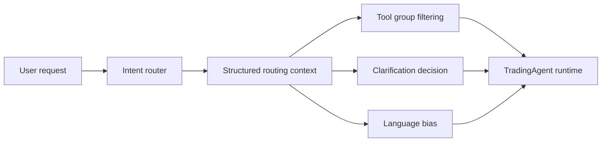
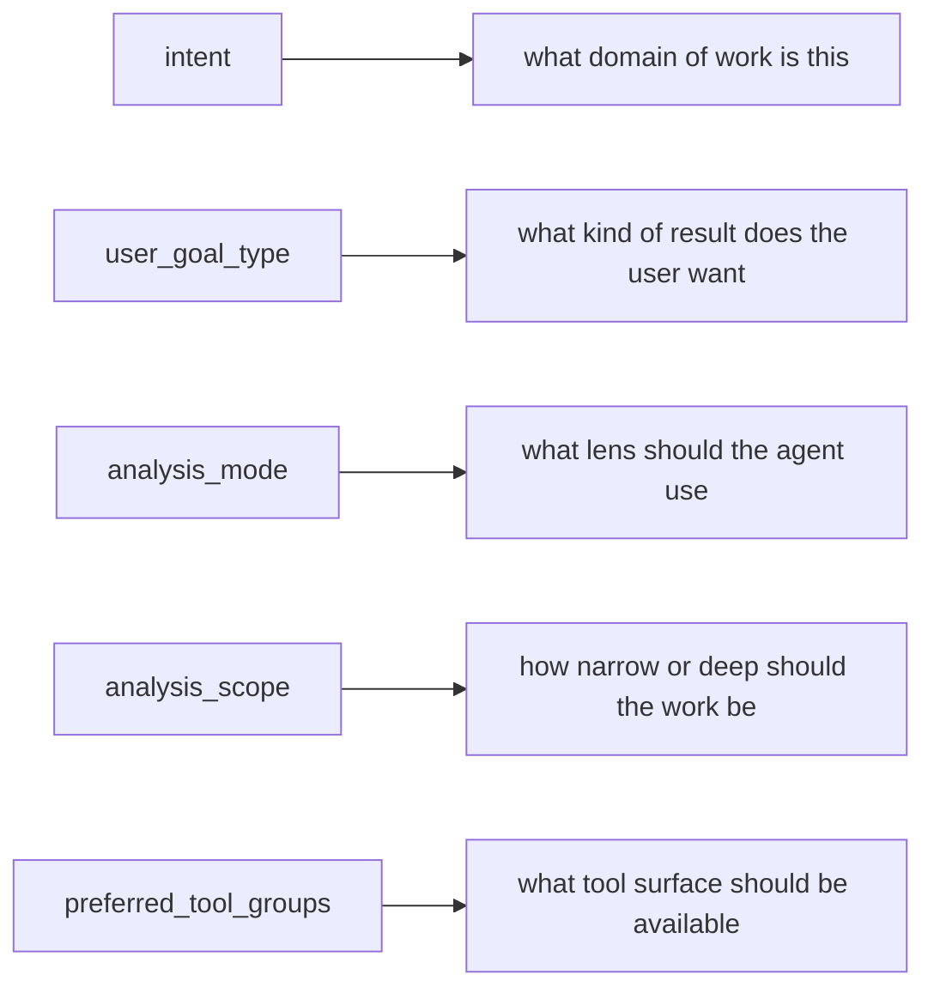

# Intent Routing

This document explains how the backend classifies a user request before the main agent response is generated.

## Why Intent Routing Exists

The backend uses one adaptive `TradingAgent` runtime rather than separate agents for each task.

Intent routing helps the runtime decide four things before the final answer is generated:

| Routing decision | What it affects |
| --- | --- |
| task classification | what kind of work the user is asking for |
| response shape | whether the user needs analysis, planning, comparison, or decision support |
| tool access | which tool groups should be available to the model |
| clarification policy | whether the system should ask instead of guessing |

## Routing Output

The router currently produces a structured context with these key fields:

| Field | What it means | Why it matters |
| --- | --- | --- |
| `intent` | the main domain of work | decides the core behavior path |
| `user_goal_type` | the shape of result the user wants | helps the agent answer as analysis, comparison, planning, or decision support |
| `goal_summary` | a compressed description of the user request | gives the runtime a short operational target |
| `analysis_mode` | the main analysis lens such as technical, news, or macro | changes how the answer should be framed |
| `analysis_scope` | how narrow or deep the work should be | keeps the response appropriately scoped |
| `indicator_preference` | any chart-indicator bias inferred from the request | helps chart-aware workflows feel more relevant |
| `need_indicator_confirmation` | whether the agent should explicitly confirm indicator choice | prevents confident chart assumptions when precision matters |
| `inferred_indicator_hint` | a suggested indicator direction inferred from the request | gives the UI or runtime a safe clue before hard commitment |
| `confidence` | router confidence in its own classification | helps explain whether the result is strong or ambiguous |
| `preferred_tool_groups` | the tool families the model should be allowed to use | narrows the tool surface for efficiency and safety |
| `routing_reason` | a short explanation for why the router chose this classification | helps debugging and product understanding |
| `response_language` | the language bias for the final answer | keeps responses aligned with product policy and user preference |
| `should_clarify` | whether ambiguity is blocking a reliable answer | decides if the system should ask instead of guessing |
| `clarification_reason` | why clarification is needed | makes the ambiguity explicit rather than mysterious |
| `suggested_hint_title` | a suggested title for a guided frontend hint | helps the UI present the choice clearly |
| `suggested_hint_options` | a suggested set of hint branches | lets the frontend render structured user choices |

## Routing flow

## Top-Level Intent Families

| Intent family | What it covers |
| --- | --- |
| `market_analysis` | direct analysis of a symbol, market, or setup |
| `trade_setup` | forming or refining a trade idea |
| `position_management` | managing an existing position or next action on it |
| `portfolio_review` | account-level or portfolio-level review |
| `market_scan` | scanning the tracked universe for interesting candidates |
| `news_impact` | understanding how current news may affect price or sentiment |
| `position_sizing` | sizing a trade with more deterministic logic |
| `broker_execution` | exchange or order-operation workflows |
| `trade_review` | reviewing a completed or active trade |
| `macro_context` | broad macro lens over current market conditions |
| `regulatory_check` | regulatory or compliance-oriented questions |
| `preference_update` | changing user preferences or behavior assumptions |
| `context_reset` | clearing or resetting current contextual assumptions |
| `emotional_check` | psychology, discipline, or behavior-oriented requests |
| `memory_create` | saving durable memory |
| `memory_lookup` | retrieving relevant memory |
| `memory_delete` | forgetting stored memory |
| `research` | broader information-gathering requests |
| `plan_or_strategy` | multi-step or higher-level planning |
| `education` | teaching, explanation, or knowledge-building |
| `journal_debrief` | structured post-trade reflection |
| `alert_setup` | watchlist or alert-oriented requests |
| `general_chat` | requests that do not fit a more specific product intent |

## What `intent` Means

| Field | What it means | Example |
| --- | --- | --- |
| `intent` | the main domain of work | `portfolio_review` means the user is asking at account or portfolio level |
| `intent` | the main domain of work | `trade_setup` means the user is trying to form or refine a setup |
| `intent` | the main domain of work | `broker_execution` means the user is dealing with execution or operational order behavior |

## What `user_goal_type` Means

`user_goal_type` describes the shape of the outcome the user wants.

| Goal type | What it usually means |
| --- | --- |
| `analyze` | explain what is happening |
| `compare` | compare two or more options |
| `plan` | produce a structured next-step path |
| `decision_support` | help the user choose between actions |
| `execution_prep` | get ready for an execution workflow |
| `risk_review` | examine downside, exposure, or weak points |
| `second_opinion` | review or challenge an existing idea |
| `scenario_planning` | reason about multiple future outcomes |

This matters because the same top-level intent can still need very different response shapes.

Example:

- `market_analysis + analyze`
- `market_analysis + compare`
- `market_analysis + second_opinion`

These are all still market analysis, but they should not respond the same way.

## What `analysis_mode` Means

`analysis_mode` is the high-level lens.

| Analysis mode | What lens the agent should use |
| --- | --- |
| `technical` | chart structure, indicators, and price action |
| `fundamental` | project, asset, or business fundamentals |
| `news` | recent events, catalysts, and narrative context |
| `mixed` | more than one lens at once |
| `macro` | macro environment and broader market conditions |
| `portfolio` | account-level exposure and allocation |
| `psychological` | behavior, discipline, and execution mindset |
| `regulatory` | policy, rules, and compliance framing |

This helps the runtime decide how to frame the work even before specific tools are used.

## What `analysis_scope` Means

`analysis_scope` narrows the expected depth or angle.

| Analysis scope | What it narrows toward |
| --- | --- |
| `bias_only` | quick directional read without full setup detail |
| `full_setup` | complete setup framing |
| `risk_review` | downside and weakness analysis |
| `comparison` | contrast between assets, setups, or choices |
| `scenario_planning` | multiple possible future paths |
| `portfolio_review` | account or holdings review |
| `market_scan` | ranked or filtered opportunity search |
| `liquidity` | liquidity or execution-friction angle |
| `correlation` | relationship between assets or exposures |

This lets the router keep the taxonomy compact without creating too many top-level intents.

## Combination-Only Patterns

Some patterns are intentionally not top-level intents.

They are represented as combinations instead:

| Pattern | Typical routing expression |
| --- | --- |
| `comparison` | `market_analysis + user_goal_type=compare` |
| `second_opinion` | `market_analysis + user_goal_type=second_opinion` |
| `scenario_planning` | `plan_or_strategy` or `portfolio_review` plus `user_goal_type=scenario_planning` |
| `opportunity_timing` | `trade_setup` or `position_management` plus `user_goal_type=timing_decision` |
| `liquidity_check` | `market_analysis + analysis_scope=liquidity` |
| `correlation_check` | `market_analysis + analysis_scope=correlation` |
| `knowledge_gap` | `education + user_goal_type=learn_path` |

This keeps the top-level taxonomy stable while still letting the router express useful nuance.

## Tool Group Filtering

After routing, the backend can narrow the available tool schema using tool groups.

| Tool group | What it gives the agent |
| --- | --- |
| `market` | price, asset, and market-state awareness |
| `research` | broader search and information-gathering capability |
| `chart` | chart-aware workflows such as TradingView-oriented actions |
| `monitoring` | monitoring and watch-oriented workflows |
| `memory` | durable memory and structured reflection workflows |
| `portfolio` | account- and holdings-level reads |
| `execution` | exchange-aware order and execution preparation behavior |
| `ui` | structured frontend events such as plans and hints |

This means the router is not only descriptive. It also shapes the tool surface sent to the model.

| Intent | Tool coverage example |
| --- | --- |
| `position_sizing` | can use `calculate_position_size` |
| `market_scan` | can use `scan_markets` |
| `journal_debrief` | can persist structured reflections through `create_trade_debrief` |

## Clarification Behavior

The router also decides whether a request should be clarified.

The current behavior is intentionally conservative:

| Clarification rule | What it means in practice |
| --- | --- |
| minor typos should not trigger clarification | the router should tolerate imperfect input when intent is still obvious |
| shorthand should usually be inferred | short trader-style phrasing should not force unnecessary follow-up |
| `show_hint` should only be used when ambiguity blocks a reliable answer | the product should ask only when the uncertainty is operationally important |

So `should_clarify` is for genuinely blocking ambiguity, not for every imperfect message.

## Response Language

| Language mode | What it does |
| --- | --- |
| `english` | keeps the final response in English |
| `match_user` | follows the user language more closely when preference is clear |

The backend policy is still English by default unless the user clearly prefers another language.

## Practical Mental Model

| Field | Quick mental model |
| --- | --- |
| `intent` | what domain of work is this |
| `user_goal_type` | what kind of result does the user want |
| `analysis_mode` | what lens should the agent use |
| `analysis_scope` | how narrow or deep should the work be |
| `preferred_tool_groups` | what tool surface should be available |

## Related Documentation

- [Agents Index](..)
- [Agent Runtime](../runtime)
- [Agent Context](../context)
- [Agent Platform Feature](../../features/agent)
