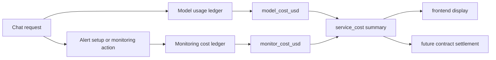

Rabit now treats backend cost as a `service cost` surface, not as one flat model bill.

That matters because the product now has two different cost sources:

- `model_cost_usd`
- `monitor_cost_usd`

## What service cost means

| Cost family | What creates it | Why it is separate |
| --- | --- | --- |
| `model_cost_usd` | OpenRouter usage during routing, answering, tool follow-up, and compression | it reflects LLM usage directly |
| `monitor_cost_usd` | price-alert monitoring lifecycle such as setup, active symbol-hours, and trigger events | it reflects backend runtime work, not model tokens |
| `total_cost_usd` | combined service cost | this is the number that later fits pay-as-you-go settlement best |

## Why Rabit splits cost this way

If monitoring cost were mixed into model cost, the product would lose an important distinction:

- one part is `AI usage`
- one part is `backend monitoring usage`

That separation is useful for:

- frontend cost reporting
- pay-as-you-go backend accounting
- future contract settlement
- session-key or delegated-signature charging flows

## Service cost flow

## Main API surfaces

| Surface | What it returns |
| --- | --- |
| `POST /api/agent/chat` | final response plus `session_cost` and combined `service_cost` |
| `POST /api/agent/chat/stream` | final `done` event plus combined `service_cost` |
| `GET /api/openrouter/session-costs/{scope_id}` | model-only cost ledger |
| `GET /api/service-costs/{scope_id}` | combined model + monitoring cost ledger |

## What to read next

| If you want... | Read |
| --- | --- |
| model catalog and model-only charging | [Model](./model) |
| combined cost and monitoring settlement shape | [Service Cost](./service-cost) |
