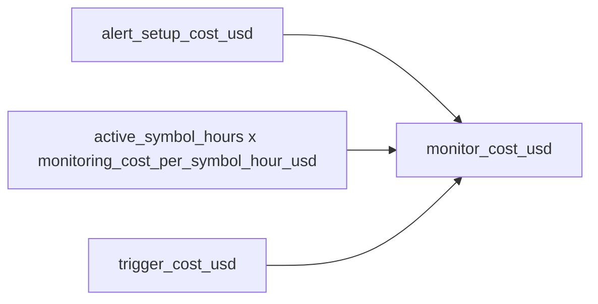

Service cost is the backend-facing number that matters most for pay-as-you-go.

Instead of only exposing model usage, Rabit now combines:

- `model_cost_usd`
- `monitor_cost_usd`

into:

- `total_cost_usd`

## Combined summary shape

| Field | Meaning |
| --- | --- |
| `model_cost_usd` | cost estimated from OpenRouter usage |
| `monitor_cost_usd` | cost estimated from backend alert monitoring |
| `total_cost_usd` | combined backend cost |
| `session_cost` | model-only nested summary |
| `monitoring_cost` | monitoring-only nested summary |

## Monitoring cost formula

Rabit now prices price-alert monitoring separately from model usage.



## Default backend pricing in this codebase

| Config | Default |
| --- | --- |
| `ALERT_SETUP_COST_USD` | `0.001` |
| `MONITORING_COST_PER_SYMBOL_HOUR_USD` | `0.002` |
| `ALERT_TRIGGER_COST_USD` | `0.0005` |

## How monitoring cost flows

```mermaid
flowchart LR
    A[add_price_alert] --> B[record alert setup cost]
    B --> C[start active symbol window]
    C --> D[background price monitor]
    D --> E{threshold hit or alert removed?}
    E -->|hit| F[close active symbol window]
    E -->|removed| F
    F --> G[record trigger cost if triggered]
    G --> H[monitor_cost_usd summary]
    H --> I[/api/service-costs/{scope_id}]
```

## Why this is better for contract settlement

This shape is friendlier for future pay-as-you-go charging because the backend can:

- keep model and monitoring cost separate while work is happening
- present one settlement-ready `total_cost_usd`
- pass that downstream into contract settlement or delegated signing later

## Related monitoring fields

| Monitoring summary field | What it means |
| --- | --- |
| `alert_setup_count` | number of alert setups charged |
| `trigger_count` | number of triggered alerts charged |
| `active_alert_count` | how many alerts are still active right now |
| `active_symbol_count` | how many symbols are currently consuming monitoring time |
| `active_symbols` | which symbols are still active |
| `total_symbol_hours` | accumulated symbol-hours behind monitoring cost |
