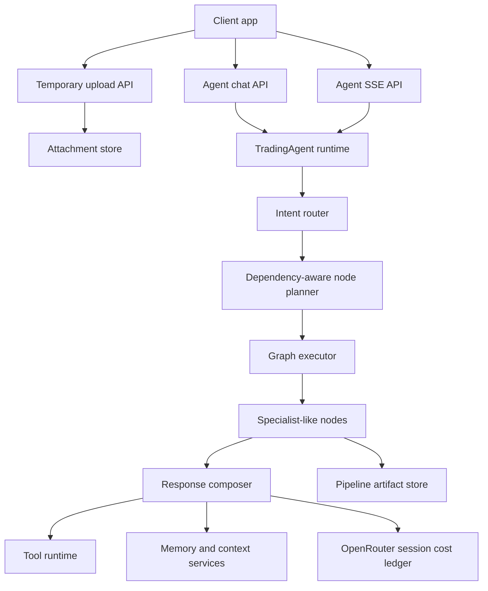
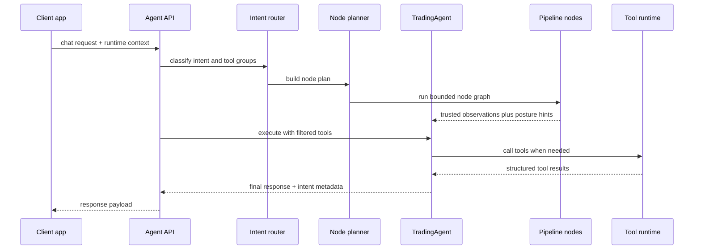
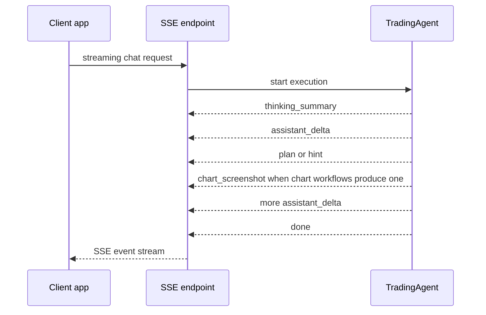
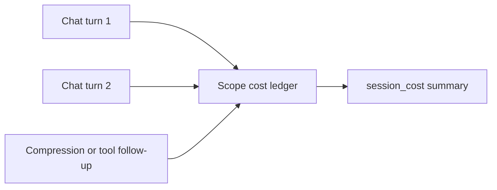

## What this section explains

This guide explains how the agent-facing API works as a product surface.

Use it to understand:

- how frontend and mobile clients talk to the trading agent
- why uploads, chat, and streaming are split into separate flows
- how runtime context travels with each request
- how the pipeline now injects specialist-like node observations before the final answer
- how OpenRouter cost is accumulated at session scope

Use the OpenAPI endpoint pages in this tab for exact request and response schema.

## Architecture view

## Why the agent API is split this way

The agent API is not a single endpoint because the client has three different jobs:

- upload temporary multimodal files
- request a normal one-shot response
- stream partial assistant output and UI events

Splitting those concerns keeps each transport predictable.

### Uploads

Uploads exist separately so the client can send files once, then reference them in later chat calls using attachment identifiers.

That avoids repeatedly sending large files with every message.

### Standard chat

Standard chat is the simplest request-response path.

It is best for:

- background calls
- testing
- non-streaming clients
- places where the full answer is fine to receive at once

### SSE chat

Streaming chat exists because assistant output is a progressive UI experience, not only a final string.

That lets the frontend render:

- assistant text deltas
- thinking summaries
- plans
- hints
- final done state

## Request context model

The agent API carries more than a prompt.

Each request can also include runtime context such as:

- conversation style
- trading style
- market context
- news headline tail inside market context
- Backpack execution state
- Drift execution state
- uploaded attachment references
- stable `scope_id` for session accumulation

This keeps the product adaptive without forcing the backend to infer everything from plain text alone.

## Pipeline-aware request model

The agent API is still exposed as one entrypoint, but the runtime behind it is no longer flat.

Before the final answer is generated, the backend can now run a composable node plan such as:

- `chart_analysis`
- `market_snapshot`
- `research_snapshot`
- `portfolio_snapshot`
- `execution_snapshot`
- `memory_snapshot`
- `risk_review`
- `general_fallback`
- `clarification_prep`
- `response_composer`

This matters because the final answer is now shaped by backend-generated observations, not only by whatever the model decides to call during the last turn.

## Chat flow

## Streaming flow

## What the pipeline contributes now

Two node families are especially important for the final API behavior:

| Node | What it contributes to the final answer |
| --- | --- |
| `risk_review` | invalidation quality, confluence strength, news fragility, execution readiness, and normalized risk framing |
| `response_composer` | primary evidence, supporting evidence, conflict flags, resolved symbol/timeframe, and recommended answer posture |

That means the final assistant output is now more intentionally shaped:

- `direct` when evidence is clean
- `balanced` when some tension exists but the setup is still usable
- `cautious` when conflict or fragility is significant
- `risk_first` when downside framing should dominate
- `uncertainty_aware` when fallback behavior is safer than commitment

## Why SSE and WebSocket are not the same thing

The backend uses SSE for agent output and WebSocket for market transport.

That split is intentional:

- SSE fits linear assistant output well
- WebSocket fits continuous bidirectional market feeds better

So the agent API should not be treated as the same transport layer as real-time price streaming.

## Session cost model

OpenRouter billing metadata is accumulated at session scope, not only per assistant turn.

The unit of accumulation is `scope_id`.

This design is better for pay-as-you-go billing because:

- the client does not have to recalculate usage itself
- multi-turn conversations can be charged as one session unit
- background routing and compression cost can be included in one total

## Pipeline artifacts

The agent surface now also persists session-scoped pipeline artifacts when a request carries a stable `scope_id`.

That matters most for chart-write turns because the backend can now keep:

- the chart mutation summary
- the resulting screenshot URL
- the node that produced it
- the scope that owns it

This makes it easier for the frontend or later tooling to reopen what the agent actually drew, instead of treating chart screenshots as one-turn-only ephemeral state.

The main API surface for that persistence is:

- `GET /api/agent/artifacts/{scope_id}`

That route exists for product surfaces that want to reopen or inspect what a prior chart-write turn actually produced.

## Design principles

The agent API is designed around product behavior rather than database resources.

Key choices:

- one adaptive agent entry point instead of many exposed agent endpoints
- streaming and non-streaming separated by transport
- uploads separated from chat execution
- request context treated as first-class runtime input
- pipeline node observations treated as first-class backend evidence
- session cost exposed as a frontend-friendly aggregate

## Exact endpoint details

Use the OpenAPI-generated pages in this tab for:

- parameters
- request bodies
- response schemas
- example payloads

Use this guide for:

- architecture
- transport model
- runtime context design
- session cost reasoning

## Related docs

- [API Overview](/api-reference/introduction)
- [API Design](/api-reference/design)
- [Auth Architecture](/api-reference/auth)
