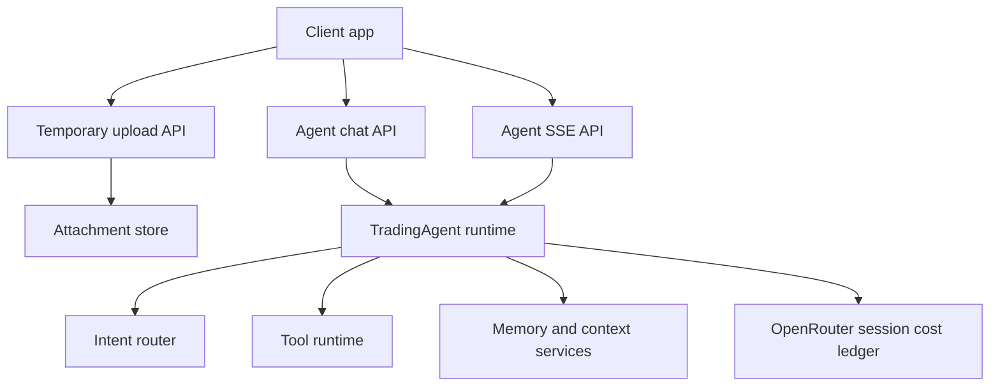
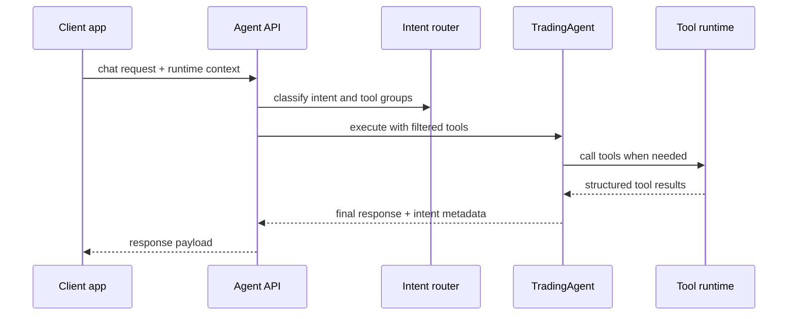
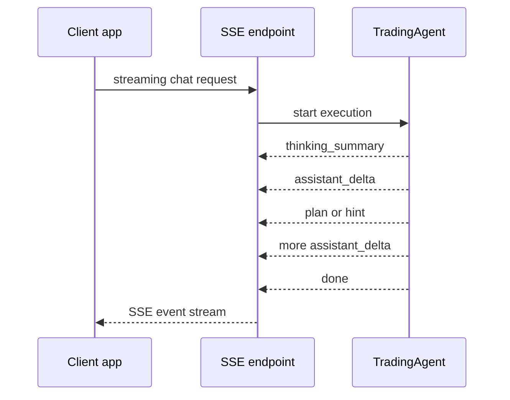
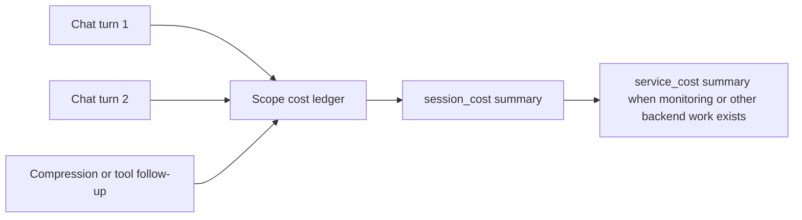
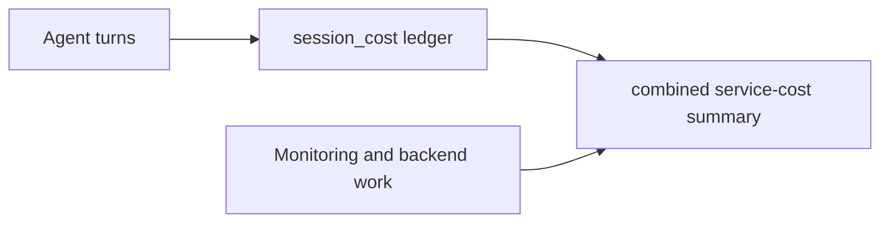

## What this section explains

This guide explains how the agent-facing API works as a product surface.

Use it to understand:

- how frontend and mobile clients talk to the trading agent
- why uploads, chat, and streaming are split into separate flows
- how runtime context travels with each request
- how OpenRouter cost is accumulated at session scope

Use the OpenAPI endpoint pages in this tab for exact request and response schema.

## Architecture view

## Why the agent API is split this way

The agent API is not a single endpoint because the client has three different jobs:

- upload temporary multimodal files
- request a normal one-shot response
- stream partial assistant output and UI events

Splitting those concerns keeps each transport predictable.

### Uploads

Uploads exist separately so the client can send files once, then reference them in later chat calls using attachment identifiers.

That avoids repeatedly sending large files with every message.

### Standard chat

Standard chat is the simplest request-response path.

It is best for:

- background calls
- testing
- non-streaming clients
- places where the full answer is fine to receive at once

### SSE chat

Streaming chat exists because assistant output is a progressive UI experience, not only a final string.

That lets the frontend render:

- assistant text deltas
- thinking summaries
- plans
- hints
- final done state

## Request context model

The agent API carries more than a prompt.

Each request can also include runtime context such as:

- conversation style
- trading style
- market context
- Backpack execution state
- Drift execution state
- uploaded attachment references
- stable `scope_id` for session accumulation

This keeps the product adaptive without forcing the backend to infer everything from plain text alone.

## Chat flow

## Streaming flow

## Why SSE and WebSocket are not the same thing

The backend uses SSE for agent output and WebSocket for market transport.

That split is intentional:

- SSE fits linear assistant output well
- WebSocket fits continuous bidirectional market feeds better

So the agent API should not be treated as the same transport layer as real-time price streaming.

## Session cost model

Model-side billing metadata is accumulated at session scope, not only per assistant turn.

The unit of accumulation is `scope_id`.

This design is better for pay-as-you-go billing because:

- the client does not have to recalculate usage itself
- multi-turn conversations can be charged as one session unit
- background routing and compression cost can be included in one total

## From session cost to service cost

`session_cost` is still useful because it explains model usage clearly, but it is not always the final billing object.

When the backend also performs work such as monitoring or alert-related processing, Rabit can combine:

- model usage cost
- monitoring/service cost

into one service-cost summary that is easier to pass downstream into settlement or contract charging.

## Design principles

The agent API is designed around product behavior rather than database resources.

Key choices:

- one adaptive agent entry point instead of many exposed agent endpoints
- streaming and non-streaming separated by transport
- uploads separated from chat execution
- request context treated as first-class runtime input
- session cost exposed as a frontend-friendly aggregate

## Exact endpoint details

Use the OpenAPI-generated pages in this tab for:

- parameters
- request bodies
- response schemas
- example payloads

Use this guide for:

- architecture
- transport model
- runtime context design
- session cost reasoning
- how session cost relates to combined service cost

## Related docs

- [API Overview](/api-reference/introduction)
- [API Design](/api-reference/design)
- [Auth Architecture](/api-reference/auth)
- [Service Cost](/agents/service-cost/service-cost)
