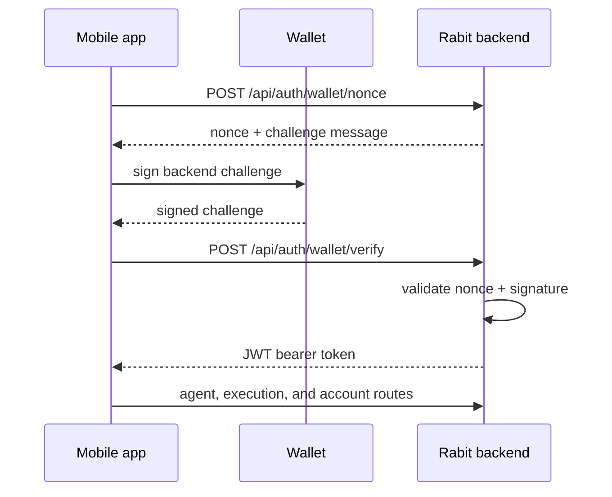
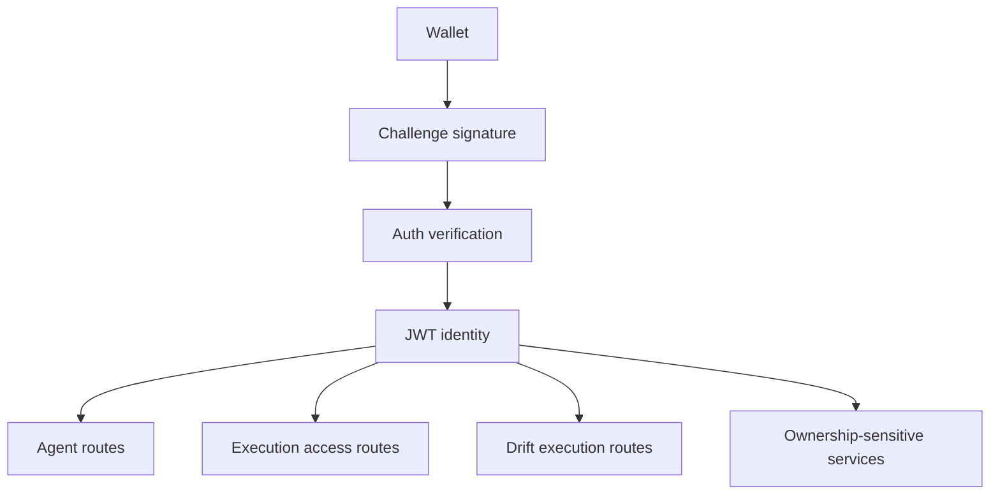
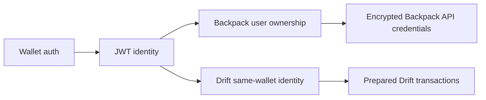
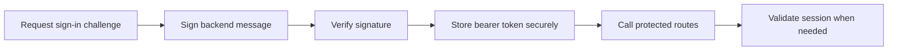

## What this auth layer does

Rabit uses wallet-based authentication as the main identity layer for protected API routes.

| Responsibility | Why it exists |
| --- | --- |
| prove wallet ownership | ensures the acting user actually controls the wallet |
| convert wallet ownership into backend identity | gives the backend a stable user model |
| issue a reusable bearer token | avoids asking the wallet to sign every request |
| protect account-scoped routes | secures chat, execution, and ownership-sensitive APIs |

Use the OpenAPI endpoint pages in this tab for exact endpoint schema.

## Visual flow



## Flow summary

| Step | What happens | Why it exists |
| --- | --- | --- |
| Request nonce | the client asks the backend for a one-time challenge | prevents simple replay and proves the flow started from Rabit |
| Sign challenge | the wallet signs the backend-provided message | proves wallet ownership without revealing a private key |
| Verify signature | the backend checks the signature against the public key | converts wallet control into backend-trusted identity |
| Issue JWT | the backend returns a reusable bearer token | avoids forcing the user to sign every request |
| Use protected routes | the client calls agent and exchange APIs with bearer auth | gives the product a practical day-to-day auth model |

## Architecture view



## Identity model

After verification, the backend derives identity in this shape:

```json
{
  "sub": "<wallet_address>",
  "wallet_address": "<wallet_address>",
  "user_id": "wallet:<wallet_address>"
}
```

| Identity rule | What it means |
| --- | --- |
| client-provided `user_id` is not authoritative by itself | the frontend cannot simply claim ownership |
| auth-derived identity should win whenever available | verified wallet identity is the backend source of truth |

## Security model

This flow uses challenge-response verification.

### What it protects against

| Threat | What the auth flow prevents |
| --- | --- |
| fake wallet ownership | someone sending an address they do not control |
| fake Backpack ownership | someone pretending to own exchange credentials |
| fake memory or context ownership | someone trying to access another user’s scoped state |
| unauthorized Drift execution preparation | someone trying to prepare or submit execution without verified identity |

### Core security rules

| Rule | Why it matters |
| --- | --- |
| the nonce must be one-time and short-lived | reduces replay risk |
| the wallet signs a backend-provided challenge | proves control without exposing the private key |
| the backend verifies the signature against the public key | makes the identity check cryptographically grounded |
| the backend issues a JWT only after successful verification | keeps bearer access tied to real proof |
| later requests use bearer auth instead of repeating wallet signing each time | keeps the product usable in normal flow |

## Operational auth lifecycle

The high-level architecture is already clear, but implementers usually also need to understand the expected lifecycle behavior.

| Operational concern | Expected behavior |
| --- | --- |
| nonce lifetime | should be short-lived and treated as single-use |
| nonce reuse | should be rejected after successful verification or expiry |
| JWT lifetime | should be treated as a session credential with explicit expiry |
| expired JWT behavior | client should restart the sign-in flow rather than assume silent recovery |
| refresh behavior | if no refresh-token flow exists, re-authentication is the safe default |

The exact TTL values belong in the backend implementation and endpoint-level examples, but the architectural rule is simple: challenge material should be short-lived, and bearer tokens should be finite-lived rather than effectively permanent.

## Client expectations

For frontend and mobile teams, the safest operational assumption is:

1. request a new nonce whenever sign-in starts
2. sign and verify immediately rather than caching a challenge
3. store the JWT as a session credential
4. if the JWT expires or verification fails, restart the wallet sign-in flow

## Why this design

### Why wallet sign-in first

The product is wallet-native, so the cleanest identity source is a wallet address backed by a real signature challenge.

| Why wallet-first auth fits Rabit | Product implication |
| --- | --- |
| execution ownership is wallet-adjacent | the backend can reason about who is allowed to act |
| exchange credentials belong to a verified app user | Backpack ownership stays scoped to the authenticated user |
| Drift same-wallet behavior depends on wallet identity | the execution path stays coherent with Solana-native authority |

### Why issue JWT after wallet verification

Signing every request would create too much friction for normal product usage.

| JWT benefit | Why it matters |
| --- | --- |
| lower latency after login | users can keep moving without repeated wallet prompts |
| simpler client behavior | mobile apps can use a normal bearer-token model |
| standard bearer auth | protected routes stay consistent |
| one verified identity across many calls | the product feels session-based instead of request-by-request |

### Why not trust `user_id` from the client

Because a client-provided `user_id` is only input unless it is backed by verification.

The safer long-term model is:

- verify wallet ownership
- issue JWT
- derive `user_id` from verified auth

## How this affects Backpack and Drift

Both exchange families share the same auth layer, but not the same execution authority model.



### Backpack

| Backpack auth implication | What it means |
| --- | --- |
| wallet auth proves who the app user is | the backend knows who owns the connection |
| exchange access uses encrypted Backpack API credentials owned by that user | execution stays tied to verified ownership |

### Drift

| Drift auth implication | What it means |
| --- | --- |
| wallet auth proves who the app user is | the backend has a verified wallet identity |
| the authenticated wallet is also the current base identity for same-wallet execution | execution stays aligned with Solana-native authority |

## Recommended client flow



## Exact endpoint details

Use the OpenAPI-generated pages in this tab for:

- parameters
- request bodies
- response schemas
- example payload structure

Use this guide for:

- auth architecture
- identity model
- security reasoning
- exchange implications

## Related docs

- [API Overview](/api-reference/introduction)
- [API Design](/api-reference/design)
