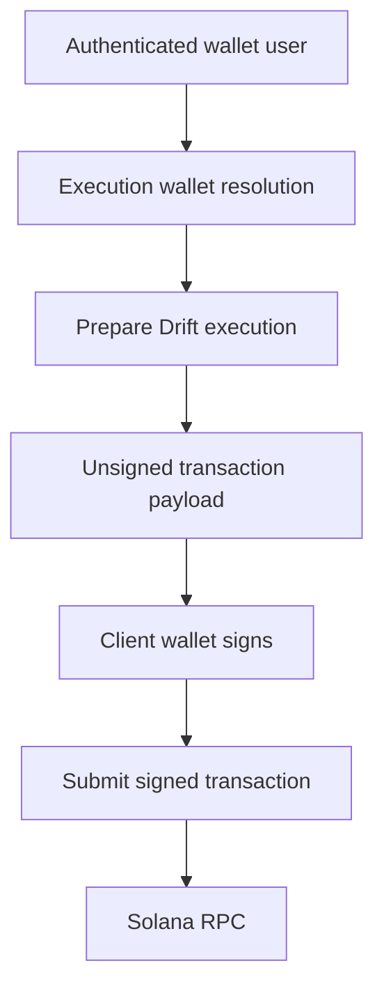
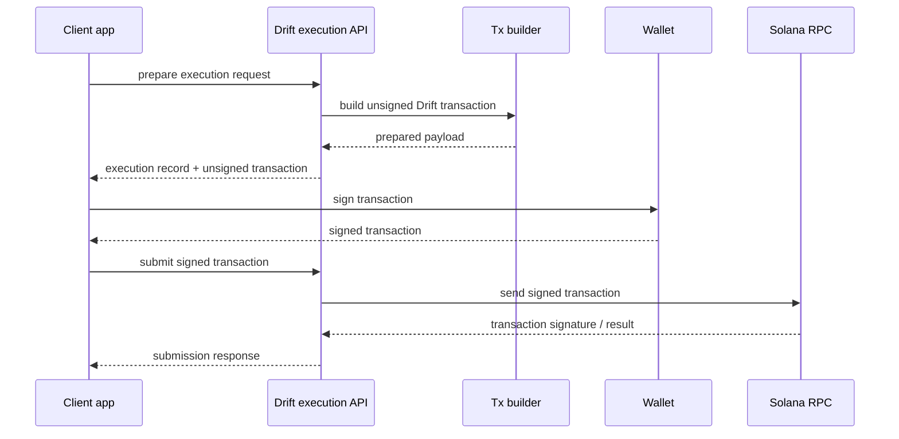

## What this section explains

This guide explains the current Drift execution model in Rabit.

It focuses on:

- why Drift is modeled differently from Backpack
- how same-wallet execution works today
- why the backend prepares transactions but does not hold the signer
- how this design supports a future session-key model

Use the OpenAPI-generated endpoint pages for exact request and response details.

## Why Drift is different from Backpack

Backpack is credential-based.

Drift is signer-based.

That difference matters because the backend is not just storing a secret for an exchange API. It is dealing with wallet authority and transaction signing rules.

Because of that, Rabit currently uses a safer intermediate model:

- backend prepares Drift transactions
- client signs them
- backend submits the signed transaction

## Current architecture

## Same-wallet model

The current production path is same-wallet oriented.

That means:

- the authenticated wallet is the execution wallet
- the backend does not assume linked-wallet or delegated signer support yet
- execution readiness can be reasoned about more safely

This reduces ambiguity while the contract-side session-key story is still evolving.

## Prepare and submit flow

## Why the backend does not sign Drift transactions

That choice is intentional.

Reasons:

- holding a primary wallet signer server-side raises custody risk
- same-wallet client signing is easier to reason about while the long-term authority model is still being finalized
- this leaves room for a cleaner future move to session keys instead of forcing a backend-held signer model too early

## Security model

Key rules in the current design:

- auth wallet identity gates access to Drift execution preparation
- same-wallet rules avoid ambiguous wallet ownership
- unsigned payloads are prepared server-side but not executed until the client signs
- signed transaction submission still goes through backend ownership checks

## Future direction

The long-term seamless path is expected to be session-key oriented, not primary-wallet-backend-signing by default.

That future model would preserve:

- lower user friction
- scoped authority
- better safety than a permanently backend-held primary signer

## Exact endpoint details

Use the OpenAPI-generated pages in this tab for:

- parameters
- request bodies
- response schemas
- execution record fields

Use this guide for:

- execution model
- signing flow
- current constraints
- security reasoning

## Related docs

- [API Overview](/api-reference/introduction)
- [API Design](/api-reference/design)
- [Auth Architecture](/api-reference/auth)
- [Execution Access Architecture](/api-reference/exchange-connections)
