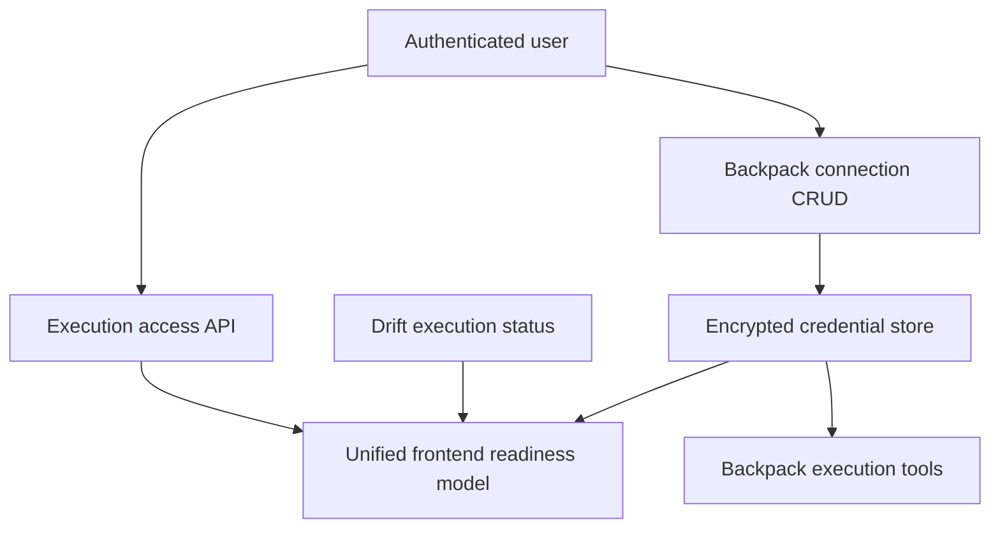
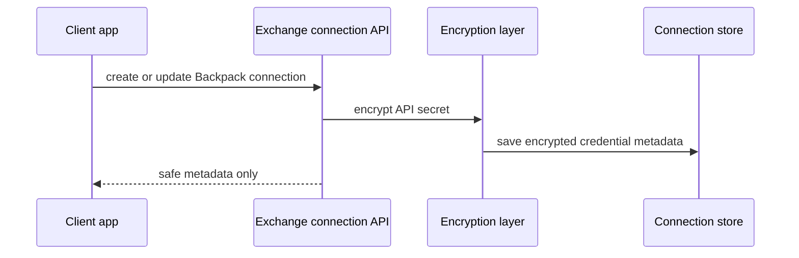
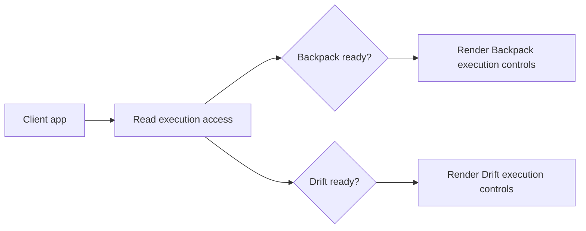

## What this section explains

This guide explains how Rabit models exchange execution access for frontend clients.

It focuses on:

- why Backpack connection management exists as a separate surface
- how execution readiness is unified across Backpack and Drift
- how credential storage differs from execution authority
- what the frontend should treat as the primary readiness signal

Use the OpenAPI pages in this tab for exact endpoint schema.

## Architecture view

## Why this API exists

Backpack and Drift do not expose execution authority in the same way.

- Backpack uses stored exchange API credentials
- Drift uses wallet-based execution authority

The frontend still needs one simple answer:

- is this exchange connected
- is execution currently ready

That is why Rabit exposes a unified execution-access layer instead of forcing the client to understand every exchange implementation detail.

## Backpack credential flow

## Security model

The security goal is to keep credential handling separate from normal frontend state.

Key rules:

- secrets are encrypted at rest
- response payloads return metadata, not raw secrets
- ownership should be derived from verified auth whenever available
- the frontend should rely on execution-access status instead of re-deriving readiness itself

## Why a unified execution-access response exists

The frontend should not need one Backpack-specific readiness algorithm and one Drift-specific readiness algorithm.

Instead, the backend provides a stable abstraction:

- Backpack reports readiness through credential and gate state
- Drift reports readiness through wallet/session execution state

Both are summarized into one execution-access payload.

## Frontend integration model

The frontend should treat execution-access as the main UI signal for:

- showing connected state
- enabling execution controls
- deciding whether to prompt the user for setup

## Why this is not only a CRUD API

The connection routes are partly CRUD, but the product goal is not storage for its own sake.

The real purpose is:

- secure credential ownership
- readiness evaluation
- consistent exchange setup UX

That is why execution-access and connection management belong together conceptually.

## Exact endpoint details

Use the OpenAPI-generated pages in this tab for:

- parameters
- request bodies
- response schemas
- exact field names

Use this guide for:

- connection architecture
- credential security model
- frontend readiness abstraction

## Related docs

- [API Overview](/api-reference/introduction)
- [API Design](/api-reference/design)
- [Auth Architecture](/api-reference/auth)
- [Drift Execution Architecture](/api-reference/drift)
