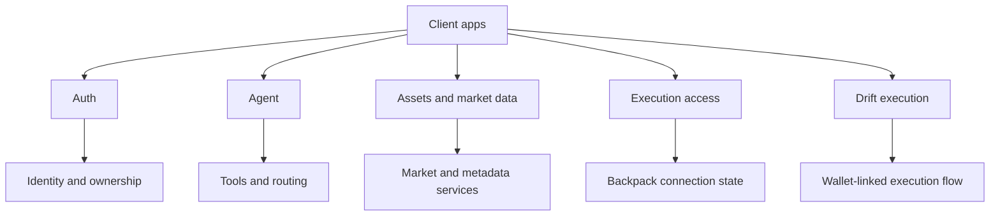

## Base URLs

The backend mounts its primary HTTP API under the `/api` prefix.

- application root metadata: `/`
- OpenAPI Swagger UI: `/docs`
- ReDoc: `/redoc`
- main REST API: `/api/*`

## What this API is for

The Rabit API is not just a CRUD backend. It combines:

- wallet-based authentication
- agent chat and streaming workflows
- exchange-aware execution flows
- market data and chart data access
- memory and model-management utilities

In practice, the API is used by frontend and mobile clients to:

- authenticate users with Solana wallet signatures
- send messages to the trading agent
- stream assistant output and UI events
- fetch persisted pipeline artifacts such as chart-write screenshots by `scope_id`
- manage Backpack execution access
- prepare and submit Drift execution flows
- fetch tracked asset and OHLC data
- inspect model and session-cost state

## Endpoint groups

| Group | Purpose |
| --- | --- |
| System | service health and platform metadata |
| Auth | wallet-based sign-in and current identity |
| Agent | uploads, chat, and SSE chat |
| Agent Artifacts | persisted per-scope pipeline artifacts such as chart-write screenshots |
| Memory | Mem0-backed memory health and CRUD |
| Exchange Connections | Backpack credential storage and execution access state |
| Drift | same-wallet execution wallet and prepare/submit flow |
| Assets | asset lookup, trending, related assets, and OHLC data |
| News | asset-specific news snapshot plus live news WebSocket feed |
| Models | OpenRouter model catalog and session-cost tracking |
| Streaming | SSE agent output plus WebSocket price and news transport |

## How the backend is shaped

At a high level, the API sits in front of five runtime concerns:

1. authentication and identity resolution
2. adaptive agent execution
3. exchange-specific execution helpers
4. market-data services
5. storage-backed support services such as memory and model metadata

That is why the API surface is grouped by behavior rather than by database table.

## API system map



## Auth pattern

Protected routes use bearer auth when available:

```http
Authorization: Bearer <jwt>
```

## Important notes

- Some compatibility routes still accept `user_id` explicitly.
- The long-term direction is auth-derived ownership instead of trusting client-provided identity.
- Backpack and Drift do not share the same execution authority model, so they are documented separately.

## Reading this section

Use this API reference in two layers:

- overview pages for architecture, purpose, and design decisions
- OpenAPI-generated endpoint pages for exact request and response details

If you are integrating from a client app, start with:

1. Authentication
2. Agent
3. Exchange Connections or Drift
4. Assets
5. Models if you need session-cost tracking

## API reference pages

<CardGroup cols={2}>
  <Card title="API design" icon="sitemap" href="/api-reference/design">
    Purpose, grouping logic, identity model, and design rules.
  </Card>
  <Card title="Authentication" icon="shield-check" href="/api-reference/auth">
    Wallet nonce, signature verification, and current identity.
  </Card>
  <Card title="Agent" icon="message-bot" href="/api-reference/agent">
    Uploads, chat, SSE streaming, intent metadata, and session cost.
  </Card>
  <Card title="Streaming" icon="radio" href="/api-reference/streaming">
    SSE agent output plus WebSocket price and news transport.
  </Card>
  <Card title="Exchange Connections" icon="key" href="/api-reference/exchange-connections">
    Execution access state and Backpack credential management.
  </Card>
  <Card title="Drift" icon="arrow-trend-up" href="/api-reference/drift">
    Same-wallet execution prepare and submit flow.
  </Card>
  <Card title="Assets" icon="coins" href="/api-reference/assets">
    Asset list, search, categories, summaries, related assets, and OHLC.
  </Card>
  <Card title="Models" icon="cpu" href="/api-reference/models">
    OpenRouter model catalog and accumulated session cost.
  </Card>
  <Card title="Memory" icon="brain" href="/api-reference/memory">
    Mem0 health, search, list, create, and delete.
  </Card>
</CardGroup>
