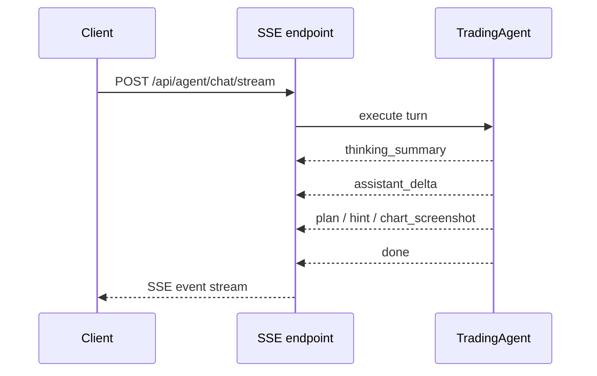
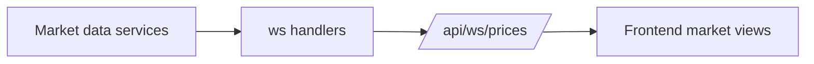

## Why this page exists

Not every real-time surface in Rabit appears in the OpenAPI-generated endpoint list.

That is expected.

OpenAPI covers the HTTP request-response API well, but Rabit also exposes:

- SSE for agent output
- WebSocket for live market and news streams

Those transports need a manual architecture page so the client can understand the contract clearly.

## Transport map

| Transport | Route | Purpose | Why it is separate |
| --- | --- | --- | --- |
| SSE | `POST /api/agent/chat/stream` | stream assistant deltas and structured UI events | assistant output is linear and event-oriented |
| WebSocket | `/api/ws/prices` | stream live price updates | price transport is continuous and feed-like |
| WebSocket | `/api/ws/news` | stream live news snapshots and updates | news transport is feed-like and symbol-filtered |
| HTTP | `GET /api/news/assets/{symbol}` | fetch a compact asset-specific news snapshot | snapshot reads are easier to cache and reuse |

## Why WebSocket routes are not in OpenAPI

The generated OpenAPI reference is built from the FastAPI HTTP schema.

That means WebSocket routes such as:

- `/api/ws/prices`
- `/api/ws/news`

do not appear as full generated endpoint pages in the same way as normal REST routes.

They are still real product surfaces. They are just documented manually here.

## SSE: agent output

`POST /api/agent/chat/stream` is the streaming version of the agent chat API.

It can emit:

| Event | What it means |
| --- | --- |
| `thinking_summary` | short safe progress update |
| `plan` | structured plan data |
| `hint` | structured branch choice for human-in-the-loop UX |
| `chart_screenshot` | chart screenshot payload from TradingView workflows |
| `assistant_delta` | partial assistant text |
| `done` | final completion event with metadata |



## WebSocket: price stream

`/api/ws/prices` is the live price stream.

It is the surface a client uses when it wants:

- live ticker-style updates
- continuous market-state refresh
- a transport that is separate from the conversational agent stream



## WebSocket: news stream

`/api/ws/news` is the live news feed surface.

It accepts symbol-oriented filtering such as:

```text
ws://localhost:8000/api/ws/news?symbols=BTC,SOL&tail=5
```

The backend uses the internal news monitor plus a symbol tail buffer so the client can receive:

- a `news_snapshot` when the socket starts
- `news_update` events when new headlines arrive

## News payload freshness model

News payloads now include explicit freshness helpers.

| Field | What it means |
| --- | --- |
| `date` | publish time from the source when available |
| `detected_at` | when Rabit first saw the headline |
| `timestamp` | when the backend sent the current snapshot or update payload |
| `freshness_seconds` | age of the headline based on `detected_at` |
| `is_new` | whether the headline is inside the configured freshness window |

That lets the frontend distinguish:

- newly seen headlines
- older but still relevant headlines
- source publish time versus Rabit detection time

## News stream flow

```mermaid
flowchart LR
    A[DuckDuckGo news retrieval] --> B[news monitor]
    B --> C[per-symbol tail buffer]
    C --> D[/api/ws/news/]
    D --> E[frontend news feed]
    C --> F[GET /api/news/assets/{symbol}]
```

## Practical client guidance

| If the client needs... | Use |
| --- | --- |
| progressive assistant output | `POST /api/agent/chat/stream` |
| live prices | `/api/ws/prices` |
| live news feed | `/api/ws/news` |
| one-shot news lookup for a symbol | `GET /api/news/assets/{symbol}` |

## Related docs

- [API Overview](/api-reference/introduction)
- [Agent Architecture](/api-reference/agent)
- [WebSocket Overview](/websocket/overview)
