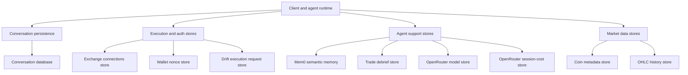

Rabit does not use only one database.

Instead, it uses a small set of purpose-specific storage layers depending on the job:

- JSON-backed local persistence for lightweight app state
- encrypted JSON storage for exchange credentials
- external Mem0 storage for semantic memory
- market-history caches for OHLC and asset metadata

This split keeps the system simple while still supporting the product behaviors the agent needs.

## Why the data layer is split

Different parts of Rabit have different storage needs.

- conversation state needs simple persistence across restarts
- exchange credentials need encrypted storage
- trade debrief entries need structured journaling
- market metadata needs cache-like persistence
- semantic memory needs retrieval-oriented storage

Using one generic store for all of that would make the system harder to reason about.

## High-level map

## Agent-facing storage

These stores directly affect agent behavior or agent-adjacent flows.

| Store | Purpose | Backend shape | Path or location |
| --- | --- | --- | --- |
| Conversation database | Persist chat history across restarts | local JSON | `data/conversations.json` |
| Mem0 | Long-term semantic memory and retrieval | external service | `MEM0_URL` / Mem0 server |
| Trade debrief database | Structured journaling after trades | local JSON | `TRADE_DEBRIEF_DB_PATH` |
| OpenRouter models database | Cache model catalog and pricing metadata | local JSON | `data/openrouter_models.json` |
| OpenRouter session cost database | Accumulate per-scope billing summaries | local JSON | `OPENROUTER_SESSION_COST_DB_PATH` |

### What each one does

#### Conversation persistence

The conversation database keeps chat sessions alive across backend restarts.

This is different from Mem0:

- conversation persistence keeps transcript-like session history
- Mem0 keeps semantic memory and recallable user facts

#### Mem0

Mem0 is not a local JSON file in this repo.

It is an external memory service used for:

- user memory search
- long-term recall
- memory create/delete flows

#### Trade debriefs

Trade debriefs are stored separately because they are structured records, not free-form memory only.

They are used by the decision-support layer for post-trade review and journaling.

#### OpenRouter models and session cost

Rabit stores:

- model catalog metadata for OpenRouter
- accumulated session cost summaries keyed by `scope_id`

That helps the backend support model lookup and pay-as-you-go billing flows without recomputing everything from scratch.

## Execution and auth storage

These stores support protected flows and exchange execution readiness.

| Store | Purpose | Backend shape | Path or location |
| --- | --- | --- | --- |
| Exchange connections database | Store Backpack connection metadata and encrypted credentials | encrypted JSON | `EXCHANGE_CONNECTIONS_DB_PATH` |
| Wallet nonce store | Keep one-time auth challenges with TTL and single-use semantics | local JSON | `WALLET_AUTH_NONCE_DB_PATH` |
| Drift execution requests database | Persist prepared and submitted Drift execution records | local JSON | `DRIFT_EXECUTION_REQUESTS_DB_PATH` |

### Why these are separate

They all relate to protected behavior, but they solve different problems:

- exchange connections store ownership and credential state
- wallet nonces prove identity
- Drift execution requests track prepare and submit lifecycle

Keeping them separate makes audit and ownership behavior easier to follow.

## Market and asset storage

These stores support market-facing product surfaces.

| Store | Purpose | Backend shape | Path or location |
| --- | --- | --- | --- |
| Coin metadata database | Cache CoinGecko coin information for tracked assets | local JSON | `data/coins.json` |
| OHLC database | Persist historical candles across exchanges and intervals | local JSON | `data/ohlc_history.json` |

### Asset information database

Yes, there is a dedicated asset-information cache.

The CoinGecko database stores coin metadata such as:

- symbol
- name
- description
- links
- categories
- last update timestamp

That cache exists to avoid unnecessary refetching and to reduce rate-limit pressure.

### OHLC history database

The OHLC database stores historical candles across exchanges such as:

- Binance
- Backpack
- Drift

It is used for chart and history workflows rather than agent memory.

## Upload and temporary file storage

Rabit also uses temporary file storage for multimodal uploads.

| Store | Purpose | Backend shape | Path or location |
| --- | --- | --- | --- |
| Upload directory | Temporary storage for uploaded image and PDF attachments | file storage | `AGENT_UPLOAD_DIR` |

This is not a database in the classic sense, but it is part of the data layer because it persists user-provided artifacts long enough for agent processing.

## Why this matters for the agent

The agent does not operate only on prompt text.

It depends on several persistent layers:

- conversations
- memory
- debrief records
- execution state
- exchange connection ownership
- asset metadata
- market history

That is what allows Rabit to behave more like a trading system than a stateless chat endpoint.

## Security and ownership model

The data layer does not apply the same trust model everywhere.

- Mem0 is user-scoped semantic storage
- exchange connections use encrypted secret storage
- auth nonces are single-use security records
- Drift execution requests are ownership-sensitive records
- asset and OHLC stores are shared market caches rather than user-private state

This distinction matters because not all persisted data should be treated as the same risk class.

## Current implementation style

Most persistence in Rabit is intentionally lightweight today.

That means:

- many stores are JSON-backed
- some stores are external-service-backed
- the system favors simple operational behavior over early database complexity

That is appropriate for the current phase, but several stores could later move to a more formal database backend if scale or audit needs increase.

## Related docs

- [System Overview](./system)
- [Memory and Context](../features/memory)
- [CoinGecko Integration](../integrations/coingecko/integration)
- [OHLC Database](../integrations/ohlc/database)
- [Backpack API Key Flow and Storage](../integrations/backpack/api-key-flow-and-storage)
