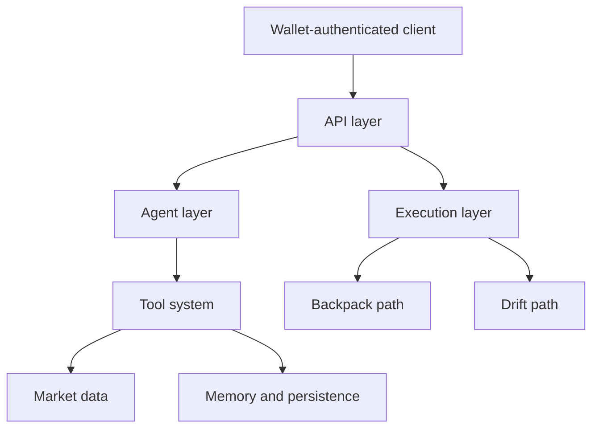

Rabit is easier to understand as a coordinated system than as a collection of API endpoints.

The backend combines identity, agent reasoning, market data, persistence, and exchange-specific execution into one runtime.

## What this section explains

| Topic | Why it matters |
| --- | --- |
| the major backend layers | shows the main building blocks |
| how those layers connect | shows how requests and data move through the system |
| where data and authority flow | shows where trust, ownership, and execution decisions are resolved |

## The core backend layers

| Layer | Role in the system |
| --- | --- |
| API layer | exposes chat, auth, execution, assets, and system endpoints |
| Agent layer | turns user requests into tool-aware, context-aware responses |
| Data layer | stores durable state such as memory, debriefs, session costs, and exchange connections |
| Market-data layer | feeds the agent and frontend with live and recent market context |
| Execution layer | bridges Backpack and Drift through exchange-aware authority models |

## System snapshot

## Best reading order

1. [System Overview](./system)
2. [Data Layer](./data-layer)
3. [Agents](/agents)

