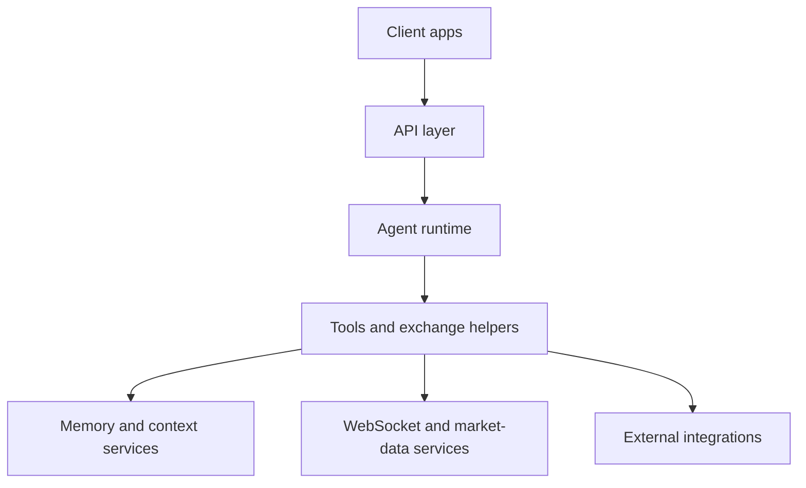
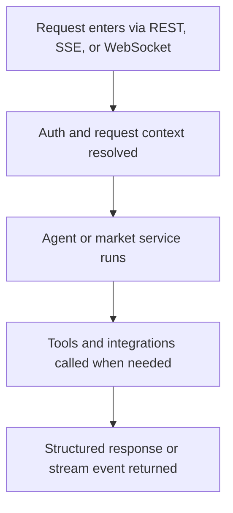

This page is the lightweight system map for the Rabit backend.

## Main Runtime Layers

## Core Layers

### API Layer

| Responsibility | What it means |
| --- | --- |
| expose REST routes | normal request/response API surface |
| expose SSE and WebSocket entry points | streaming and live-update transport |
| validate request and response models | keeps the contract cleaner and safer |

Main code:

- `main.py`
- `api/`

### Agent Layer

| Responsibility | What it means |
| --- | --- |
| run the trading assistant | executes the main adaptive runtime |
| shape requests with routing and context | keeps behavior relevant to the active task |
| call tools and stream UI-safe events | lets the product go beyond plain text answers |

Main code:

- `agents/core/`
- `agents/intent_router.py`
- `agents/tools/`

### Market and Streaming Layer

| Responsibility | What it means |
| --- | --- |
| subscribe to external market feeds | connect to live sources |
| normalize market updates | make different provider payloads usable together |
| support charting and price consumers | feed market-aware product features |

Main code:

- `ws/`

### Integration Layer

| Responsibility | What it means |
| --- | --- |
| connect to provider-specific services | bridge external dependencies into Rabit |
| handle storage, auth, or SDK behavior | encapsulate provider-specific complexity |
| support exchange-specific account and execution workflows | keep Backpack and Drift behavior honest and separated |

Main code:

- `agents/backpack_execution/`
- `agents/drift_execution/`
- `agents/exchange_connections/`
- provider-specific integration helpers

## How The Pieces Fit Together

The current backend is built around one adaptive agent runtime rather than many separate runtime binaries.

## Related Documentation

- [Project Overview](../project)
- [Agents Index](../../agents)
- [WebSocket Index](../../websocket)
- [API Reference](/api-reference/introduction)
