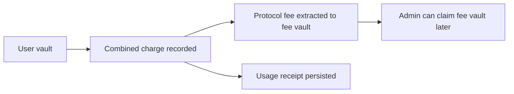

This page is the technical companion to the higher-level architecture page. It keeps the current implementation easy to reference without turning into an internal audit notebook.

## Program Crate

The on-chain program lives at:

```text
programs/rabit-contract/
```

The main source layout is:

```text
src/
├── lib.rs
├── constants.rs
├── errors.rs
└── features/
    ├── admin/
    ├── vault/
    ├── delegation/
    ├── ai_usage/
    └── model_registry/
```

## State Accounts

| Account | PDA seeds | Main fields |
| --- | --- | --- |
| `PlatformConfig` | `["config"]` | authority, backend_authority, fee policy, pause state, fee vault pubkey |
| `Vault` | `["vault", owner]` | owner, balance, totals, usage sequence |
| `DelegatedSigner` | `["delegated_signer", owner, delegate]` | delegated pubkey, expiry, spending limit, spent amount, active flag |
| `ModelRegistry` | `["model_registry", model_id]` | provider, pricing hint, features, active flag, usage counters |
| `AiUsageRecord` | `["ai_usage", vault, usage_sequence]` | model id, base cost, service cost, markup, platform fee, total charged |

## Instruction Surface

| Domain | Instructions |
| --- | --- |
| Admin | `initialize_config`, `update_platform_fee`, `update_default_markup`, `update_authority`, `update_backend_authority`, `toggle_pause`, `claim_fees` |
| Vault | `initialize_vault`, `deposit_to_vault`, `withdraw_from_vault`, `close_vault` |
| Delegation | `create_delegated_signer`, `revoke_delegated_signer`, `close_delegated_signer` |
| Model Registry | `register_model`, `update_model`, `deactivate_model` |
| Usage | `record_ai_usage`, `record_ai_usage_with_delegation` |

## Charging Inputs

The backend submits two cost inputs:

| Field | Meaning |
| --- | --- |
| `base_cost` | model/provider cost |
| `service_cost` | monitoring or other backend service cost |

The program computes:

```text
chargeable_cost   = base_cost + service_cost
markup_amount     = chargeable_cost * markup_bps / 10000
cost_after_markup = chargeable_cost + markup_amount
platform_fee      = cost_after_markup * platform_fee_bps / 10000
total_charged     = cost_after_markup + platform_fee
```

## Fee Movement



Important detail:

- only the platform fee is extracted into `fee_vault`
- model cost and service cost are reflected in the charge, but remain part of the backend settlement story off-chain

## Delegation Rules

Delegated usage is accepted only when all of these are true:

- backend signer matches `config.backend_authority`
- delegated signer is active
- delegated signer is not expired
- delegated signer can still spend `total_charged`
- vault balance covers the charge

This gives Rabit a practical automation path without giving the backend direct withdrawal rights over user vaults.

## Current Implementation Notes

| Area | Current behavior |
| --- | --- |
| IDL generation | working |
| test harness | off-chain Anchor integration tests |
| current passing tests | `28` |
| model registry role | optional on-chain catalog and pricing hint source |
| charging path | supports both direct user-signature and delegated backend-signature usage |

## Read This With

- [/contract/index](/contract/index)
- [/contract/architecture](/contract/architecture)
- [/contract/service-cost](/contract/service-cost)
- [/contract/testing](/contract/testing)
