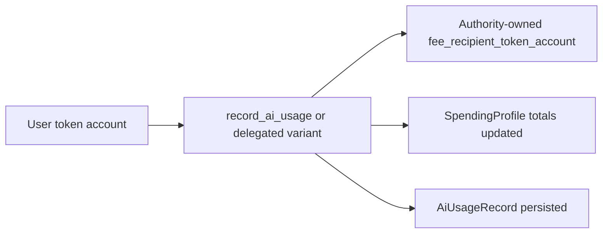

This page is the technical companion to the higher-level architecture page.

## Program Crate

The on-chain program lives at:

```text
programs/rabit-contract/
```

Main source layout:

```text
src/
├── lib.rs
├── constants.rs
├── errors.rs
└── features/
    ├── admin/
    ├── spending_profile/
    ├── delegation/
    ├── ai_usage/
    └── model_registry/
```

## State Accounts

| Account | PDA seeds | Main fields |
| --- | --- | --- |
| `PlatformConfig` | `["config"]` | authority, backend authority, fee policy, pause state |
| `SpendingProfile` | `["spending_profile", owner]` | payment mint, total charged, total model cost, total service cost, total platform fee, total delegated usage, usage sequence |
| `DelegatedSigner` | `["delegated_signer", owner, delegate]` | delegated pubkey, expiry, spending limit, spent amount, active flag |
| `ModelRegistry` | `["model_registry", model_id]` | provider, pricing hint, features, active flag, usage counters |
| `AiUsageRecord` | `["ai_usage", spending_profile, usage_sequence]` | model id, base cost, service cost, markup, platform fee, total charged |

## Instruction Surface

| Domain | Instructions |
| --- | --- |
| Admin | `initialize_config`, `update_platform_fee`, `update_default_markup`, `update_authority`, `update_backend_authority`, `toggle_pause`, `claim_fees` |
| Spending profile | `initialize_spending_profile`, `approve_spending_delegate`, `revoke_spending_delegate`, `close_spending_profile` |
| Delegation | `create_delegated_signer`, `revoke_delegated_signer`, `close_delegated_signer` |
| Model registry | `register_model`, `update_model`, `deactivate_model` |
| Usage | `record_ai_usage`, `record_ai_usage_with_delegation` |

## Payment Path

The contract charges from the user's SPL token account, not from a contract-held prepaid balance.



The current implementation has two separate collection paths:

- SPL charging writes into a runtime `fee_recipient_token_account` owned by `config.authority`
- `claim_fees` only withdraws lamports already held by the `fee_recipient` PDA

## Charging Inputs

| Field | Meaning |
| --- | --- |
| `base_cost` | model/provider cost |
| `service_cost` | monitoring or other backend service cost |

The program computes:

```text
chargeable_cost   = base_cost + service_cost
markup_amount     = chargeable_cost * markup_bps / 10000
cost_after_markup = chargeable_cost + markup_amount
platform_fee      = cost_after_markup * platform_fee_bps / 10000
total_charged     = cost_after_markup + platform_fee
```

## Delegated Charging Rules

Delegated usage is accepted only when all of these are true:

- backend signer matches `config.backend_authority`
- delegated signer is active
- delegated signer is not expired
- delegated signer can still spend `total_charged`
- user token account mint matches the spending profile payment mint
- delegated token approval already exists on the user's token account

## Current Implementation Notes

| Area | Current behavior |
| --- | --- |
| payment asset | SPL token selected by the user profile |
| charging authority | direct user signer or delegated signer PDA |
| ledger account | `SpendingProfile` |
| receipt account | `AiUsageRecord` |
| model ids longer than 32 bytes | seeded with deterministic on-chain alias |
