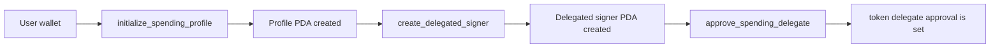
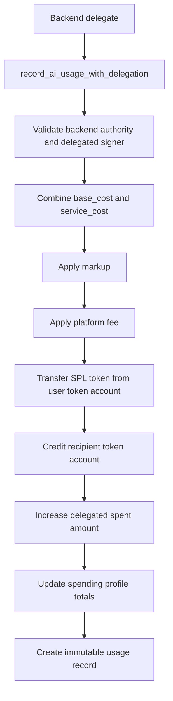

The Rabit contract is the on-chain payment and delegation layer behind Rabit. It stores per-user charging policy, enforces delegated spending limits, records usage, and separates protocol policy from user-owned token balances.

## Program Structure

The program follows the standard Anchor workspace layout and lives in `programs/rabit-contract/src`.

```mermaid
flowchart TD
    A[lib.rs<br/>Program entry point]
    B[constants.rs<br/>Limits and shared constants]
    C[errors.rs<br/>Program error definitions]
    D[features/*/state.rs<br/>Persistent account types]
    E[features/*/instructions.rs<br/>Instruction handlers]

    D1[admin/state.rs<br/>Platform configuration]
    D2[spending_profile/state.rs<br/>User charging profile]
    D3[delegation/state.rs<br/>Delegation state]
    D4[ai_usage/state.rs<br/>Immutable usage records]
    D5[model_registry/state.rs<br/>Model catalog metadata]

    E1[admin/instructions.rs<br/>Admin controls]
    E2[spending_profile/instructions.rs<br/>Profile and token delegate controls]
    E3[delegation/instructions.rs<br/>Delegation lifecycle]
    E4[ai_usage/instructions.rs<br/>Usage charging and accounting]
    E5[model_registry/instructions.rs<br/>Catalog management]

    A --> B
    A --> C
    A --> D
    A --> E
```

## Account Model

| Account | PDA seeds | Used for |
| --- | --- | --- |
| `PlatformConfig` | `PDA(["config"])` | global fee policy, backend authority, pause state |
| `SpendingProfile` | `PDA(["spending_profile", owner])` | payment mint and cumulative charging ledger |
| `DelegatedSigner` | `PDA(["delegated_signer", owner, delegate])` | bounded backend charging authority |
| `AiUsageRecord` | `PDA(["ai_usage", spending_profile, usage_sequence])` | immutable receipt for one charge |
| `ModelRegistry` | `PDA(["model_registry", model_id])` | model metadata and optional pricing hints |

The important separation is:

- the user's funds stay in the user's token account
- `SpendingProfile` is policy and ledger state, not custody
- `DelegatedSigner` is temporary charging authority, not ownership
- `AiUsageRecord` is the permanent receipt that explains why a charge happened

## Main User Flow

## Delegated Charging Flow

This path lets the backend automate usage charging without receiving direct ownership over the user's wallet.

## Charging Model

The contract expects two backend-supplied cost components:

- `base_cost`: model/provider cost
- `service_cost`: monitoring or other backend service cost

Those are combined into one chargeable amount before markup and platform fee are applied.

| Step | Formula |
| --- | --- |
| chargeable cost | `base_cost + service_cost` |
| markup | `chargeable_cost * markup_bps / 10000` |
| platform fee | `(chargeable_cost + markup) * platform_fee_bps / 10000` |
| total charged | `cost_after_markup + platform_fee` |

## Security Model

| Protection | What it stops |
| --- | --- |
| PDA seeds include owner keys | cross-user account substitution |
| delegated signer expiry and spend caps | unlimited backend charging |
| SPL delegate approval is explicit | hidden token spending authority |
| pause control | continued charging during incidents |
| immutable usage records | silent or opaque billing changes |
