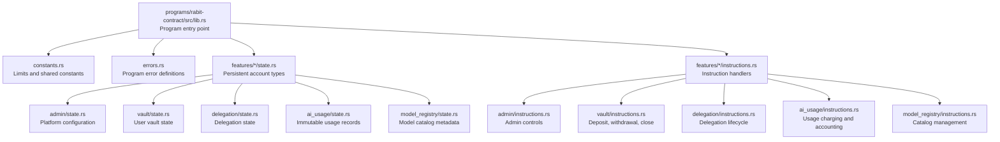
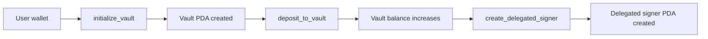
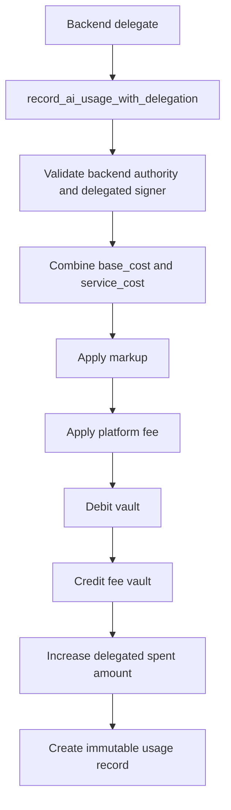
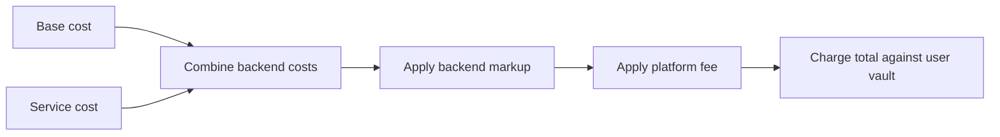
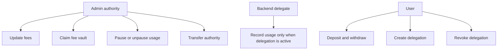

The Rabit contract is the on-chain payment and delegation layer behind Rabit. It stores prepaid user balances, enforces delegated spending limits, records usage, and separates user balances from protocol fees.

This page explains the contract in the order a reviewer usually needs it: code structure, account model, charging flow, and trust boundaries.

## Program Structure

The contract now follows the standard Anchor workspace layout. The on-chain program lives in `programs/rabit-contract/src`.

| Area | Purpose | Why it matters |
| --- | --- | --- |
| `lib.rs` | Registers program entrypoints and routes instructions. | Defines the public on-chain surface. |
| `features/*/state.rs` | Stores durable PDAs such as vaults and delegations. | Makes balances and permissions verifiable on-chain. |
| `features/*/instructions.rs` | Implements validation, transfers, and bookkeeping. | Encodes the contract's trust model and business rules. |
| `constants.rs` and `errors.rs` | Shared limits and explicit failure modes. | Keeps safety checks consistent across instructions. |

## Account Model

| Account | PDA seeds | Stored data | Used for |
| --- | --- | --- | --- |
| `PlatformConfig` | `["config"]` | Authority, fee bps, pause status, backend authority | Global contract policy |
| `Vault` | `["vault", owner]` | User balance, aggregate totals, usage sequence | Prepaid spending account |
| `DelegatedSigner` | `["delegated_signer", owner, delegate]` | Expiry, spend cap, amount spent, active flag | Bounded backend spending authority |
| `AiUsageRecord` | `["ai_usage", vault, usage_sequence]` | Base cost, service cost, markup, platform fee, usage metadata | Immutable accounting trail |
| `ModelRegistry` | `["model_registry", model_id]` | Model metadata, optional pricing hint, usage counters | Optional on-chain model catalog |

The important separation is:

- `Vault` is the user's prepaid money
- `DelegatedSigner` is temporary charging authority, not ownership
- `PlatformConfig` defines system-wide rules
- `AiUsageRecord` is the permanent receipt that explains why a charge happened

## Main User Flow

In product terms:

- `initialize_vault` creates the user's on-chain balance container
- `deposit_to_vault` converts wallet-held SOL into prepaid contract balance
- `create_delegated_signer` gives the backend a time-limited, spend-limited charging path

## Delegated Charging Flow

This is the core automation path. The backend never gets direct ownership of user funds. It only gets a narrow right to invoke one charging path, and that path always leaves an immutable accounting record behind.

## Charging Model

The contract now expects the backend to pass two cost components:

- `base_cost`: model/provider cost
- `service_cost`: monitoring or other backend service cost

Those are combined into one chargeable amount before markup and protocol fee are applied.

| Step | Formula | Example with `base_cost = 100`, `service_cost = 20`, and both fees at `5%` |
| --- | --- | --- |
| Chargeable cost | `base_cost + service_cost` | `100 + 20 = 120` |
| Markup | `chargeable_cost * markup_bps / 10000` | `120 * 500 / 10000 = 6` |
| Cost after markup | `chargeable_cost + markup_amount` | `120 + 6 = 126` |
| Platform fee | `cost_after_markup * platform_fee_bps / 10000` | `126 * 500 / 10000 = 6` |
| Total charged | `cost_after_markup + platform_fee_amount` | `126 + 6 = 132` |

For a deeper explanation, read [/contract/service-cost](/contract/service-cost).

## Security Model

The security model is based on role separation.

| Protection | What it stops |
| --- | --- |
| PDA seeds include owner keys | Cross-user account substitution |
| Delegated signer expiry and spend caps | Unlimited backend charging |
| Separate fee vault PDA | Mixing protocol revenue with user balances |
| Pause control | Continued charging during incidents |

## Event System

| Event | When emitted | Main consumer |
| --- | --- | --- |
| `AiUsageRecorded` | Every successful usage charge | Off-chain analytics and billing reconciliation |
| `VaultClosed` | User closes empty vault | Monitoring and cleanup |
| `DelegationClosed` | Delegation is closed after revoke or expiry | Backend session cleanup |
| Fee and authority update events | Admin updates governance state | Operations and auditing |
