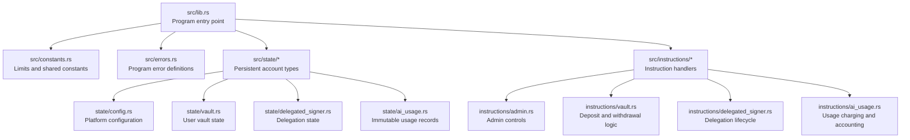
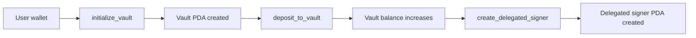
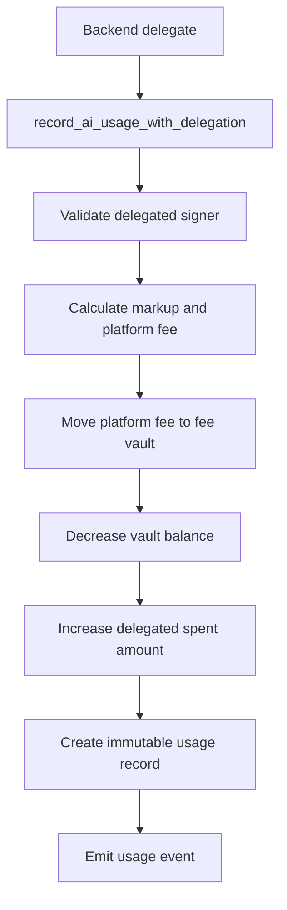
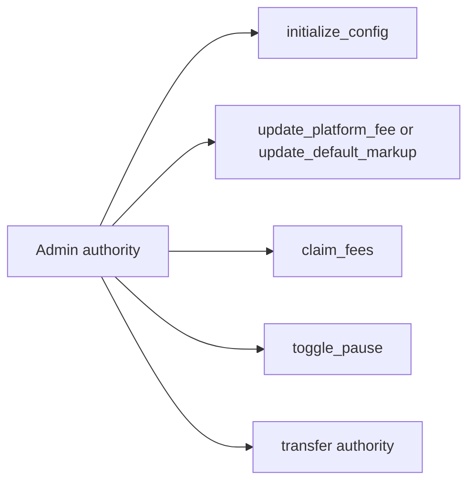
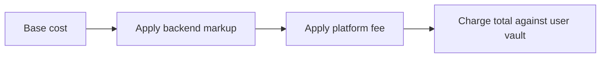
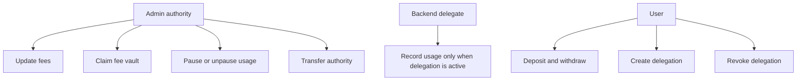
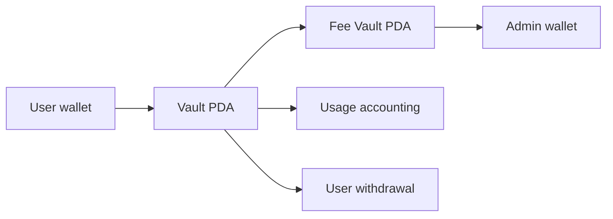

The Rabit contract is the on-chain payment and delegation layer behind Rabit. It stores prepaid user balances, enforces delegated spending limits, records AI usage, and separates user funds from protocol fees.

This page explains the contract in the order a reviewer usually needs it: how the codebase is organized, what the main accounts represent, how users and the backend interact with the program, how fees are computed, and what keeps the system safe.

## Program Structure

The contract is split into a small number of predictable domains. The goal is to keep persistent state definitions separate from instruction handlers, so that the storage model and the execution model can be reviewed independently.

| Area | Purpose | Why it matters |
| --- | --- | --- |
| `lib.rs` | Registers program entrypoints and routes instructions. | Defines the public on-chain surface. |
| `state/*` | Stores durable PDAs such as vaults and delegations. | Makes balances and permissions verifiable on-chain. |
| `instructions/*` | Implements validation, transfers, and bookkeeping. | Encodes the contract's trust model and business rules. |
| `constants.rs` and `errors.rs` | Shared limits and explicit failure modes. | Keeps safety checks consistent across instructions. |

In practice, this split makes the contract easier to audit. A reviewer can inspect `state/*` to understand what the program remembers over time, then inspect `instructions/*` to see which roles are allowed to mutate that state.

## Account Model

The contract revolves around four main account types. Each one represents a distinct responsibility so that value storage, protocol configuration, delegated authority, and immutable usage receipts do not get mixed together.

| Account | PDA seeds | Stored data | Used for |
| --- | --- | --- | --- |
| `PlatformConfig` | `["config"]` | Authority, fee bps, pause status, backend authority | Global contract policy |
| `Vault` | `["vault", owner]` | User balance, aggregate deposit and withdrawal totals | Prepaid spending account |
| `DelegatedSigner` | `["delegated_signer", owner, delegate]` | Expiry, spend cap, amount spent, active flag | Session-like backend spending authority |
| `AiUsageRecord` | `["ai_usage", vault, timestamp or sequence]` | Base cost, markup, platform fee, usage metadata | Immutable accounting trail |

The key design decision here is separation of concerns:
- `Vault` is the user's money.
- `DelegatedSigner` is temporary spending authority, not ownership.
- `PlatformConfig` defines system-wide rules.
- `AiUsageRecord` is the permanent receipt that explains why a charge happened.

## Instruction Flows

The contract exposes several instruction families, but most of the product behavior falls into three flows: onboarding a user, recording delegated AI usage, and letting the admin manage protocol state.

### User Onboarding

This is the cleanest way to understand the user lifecycle. A user first creates a vault, funds it, and optionally delegates bounded charging authority to the backend.

What this means in product terms:
- `initialize_vault` creates the user's on-chain balance container.
- `deposit_to_vault` converts wallet-held SOL into prepaid contract balance.
- `create_delegated_signer` turns the backend into a limited executor that can charge usage without asking for a new wallet signature every time.

### AI Usage With Delegation

This is the core automation path. The backend is allowed to record usage only when delegation is active and within its configured limits.

This flow is important because it shows that the backend never gets direct ownership of user funds. Instead, it gets a narrow right to invoke one spending path, and that path always leaves an immutable accounting record behind.

### Admin Controls

The admin surface is intentionally small. It should be able to configure policy, claim protocol fees, and pause usage when something looks wrong, but it should not behave like a generic operator over user balances.

The admin flow matters mainly for governance and incident response. It defines what the team can change at runtime and what must remain under user control.

## Fee Calculation

Fee calculation happens in layers. The contract starts from an externally supplied base cost, applies backend markup, then applies protocol fee on top of the marked-up amount.

| Step | Formula | Example with base cost `100` and both fees at `5%` |
| --- | --- | --- |
| Markup | `base_cost * markup_bps / 10000` | `100 * 500 / 10000 = 5` |
| Cost after markup | `base_cost + markup_amount` | `100 + 5 = 105` |
| Platform fee | `cost_after_markup * platform_fee_bps / 10000` | `105 * 500 / 10000 = 5` with integer rounding |
| Total charged | `cost_after_markup + platform_fee_amount` | `105 + 5 = 110` |

The reason this section matters is that it clarifies the trust model around billing:
- the backend can propose the base cost,
- the contract deterministically applies markup and platform fee,
- and the user ultimately pays from a prepaid vault rather than an unlimited wallet pull.

## Security Model

The security model is based on role separation. The user controls funds, the backend controls bounded usage execution, and the admin controls protocol-level policy.

| Protection | What it stops |
| --- | --- |
| PDA seeds include owner keys | Cross-user account substitution |
| Delegated signer expiry and spend caps | Unlimited backend charging |
| Separate fee vault PDA | Mixing protocol revenue with user balances |
| Pause control | Continued charging during incidents |

The contract stays safe not because any one role is all-powerful, but because each role is limited to a narrow subset of actions that match its responsibility.

## Value Movement

The value movement model is intentionally simple: users fund vaults, usage consumes vault balances, platform fees accumulate in a dedicated fee vault, and users can still withdraw unused balances.

This separation makes the money trail easier to inspect:
- deposits go from user wallet to user vault,
- usage charges reduce the vault,
- only protocol fee flows into the fee vault,
- and admin fee claims come only from the fee vault rather than directly from user balances.

## Event System

Events are the bridge between on-chain state changes and off-chain product behavior. They help the backend, analytics pipeline, and monitoring layer understand what the contract just did.

| Event | When emitted | Main consumer |
| --- | --- | --- |
| `AiUsageRecorded` | Every successful usage charge | Off-chain analytics and billing reconciliation |
| `VaultClosed` | User closes empty vault | Monitoring and cleanup |
| `DelegationClosed` | Delegation is closed after revoke or expiry | Backend session cleanup |
| Fee and authority update events | Admin updates governance state | Operations and auditing |

For a reviewer, these events are the easiest way to see how the contract fits into the larger Rabit system: the contract enforces value movement on-chain, while the backend and product layers react to those events off-chain.
