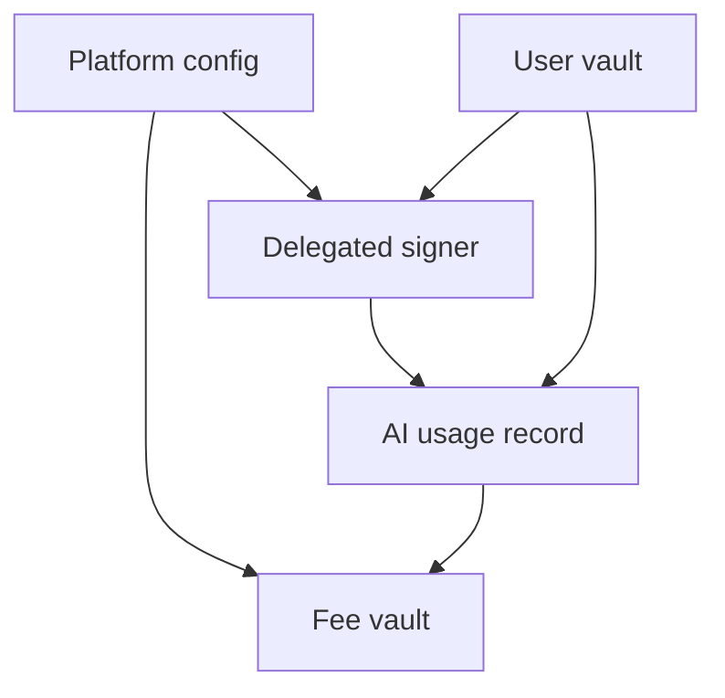

This page explains the contract at the instruction and account level. It complements the higher-level architecture page by showing what the program stores, what each instruction family is responsible for, and how value moves through the contract.

## Contract Overview

| Field | Value |
| --- | --- |
| Program name | Rabit Contract |
| Program id | `C4tLzpTr3CQ78rPXv9oWURdayWa1t5kBsKSn5UyMJfVh` |
| Target network | Solana |
| Framework | Anchor 0.32+ / CLI 1.0 |
| Primary language | Rust 1.93.1+ |
| Main responsibility | Pay-as-you-go AI spending with user vaults and delegated charging |

## Architecture



| Component | Scope | Purpose |
| --- | --- | --- |
| `PlatformConfig` | Singleton | Stores authority, fee policy, pause state, and backend authority. |
| `FeeVault` | Singleton PDA | Holds protocol fee revenue until admin claims it. |
| `Vault` | Per user | Holds prepaid SOL and aggregate usage counters. |
| `DelegatedSigner` | Per user and delegate pair | Allows bounded backend spending without requiring a user signature for every usage record. |
| `AiUsageRecord` | Per usage | Creates an immutable receipt for billing, analytics, and auditing. |

## Design Principles

| Principle | Why it exists |
| --- | --- |
| Prepaid vaults | Charging happens against user-funded balances instead of open-ended wallet pulls. |
| Delegation is bounded | Backend automation stays limited by time and spend caps. |
| Fees are separated from user balances | Platform revenue can be audited and claimed independently. |
| Usage is recorded immutably | Every charge has an on-chain trail for reconciliation. |

## Features Breakdown

### 1. Admin Management (7 Instructions)

#### 1.1 Platform Configuration
**Instruction**: `initialize_config`
- **Purpose**: One-time platform setup
- **Parameters**:
  - `platform_fee_bps: u16` - Platform fee (500 = 5%)
  - `default_markup_bps: u16` - Default backend markup (500 = 5%)
  - `backend_authority: Pubkey` - Backend wallet
- **Creates**: PlatformConfig account + Fee Vault PDA
- **Authority**: Anyone (first-time only)

#### 1.2 Fee Management
**Instructions**:
- `update_platform_fee` - Change platform fee (max 20%)
- `update_default_markup` - Change default markup (max 50%)
- `claim_fees` - Withdraw collected fees
- **Authority**: Admin only
- **Events**: PlatformFeeUpdated, DefaultMarkupUpdated, FeesClaimed

#### 1.3 Authority Management
**Instructions**:
- `update_authority` - Transfer admin control
- `update_backend_authority` - Change backend wallet
- **Authority**: Current admin only
- **Events**: AuthorityTransferred, BackendAuthorityUpdated

#### 1.4 Emergency Controls
**Instruction**: `toggle_pause`
- **Purpose**: Emergency stop for AI usage
- **Effect**: Blocks both AI usage recording paths
- **Does NOT affect**: Vault deposits/withdrawals, delegations
- **Authority**: Admin only
- **Event**: PlatformPauseToggled

---

### 2. Model Registry (3 Instructions)

#### 2.1 Model Registration
**Instruction**: `register_model`
- **Purpose**: Add AI model to registry
- **Parameters**:
  - `model_id: String` - e.g., "gpt-4-turbo" (max 64 chars)
  - `provider: String` - e.g., "openai" (max 32 chars)
  - `base_cost_per_token: u64` - Suggested cost in lamports
  - `features: String` - e.g., "chat,vision" (max 256 chars)
- **Creates**: ModelRegistry PDA per model
- **Authority**: Admin (currently)
- **Event**: ModelRegistered

#### 2.2 Model Management
**Instructions**:
- `update_model` - Update pricing, features, custom contract
- `deactivate_model` - Disable model usage
- **Authority**: Admin only
- **Event**: ModelUpdated

#### 2.3 Model Usage Tracking
- Automatic stats update on AI usage
- Tracks: total_usage_count, total_tokens_processed
- Optional in usage recording (flexible design)

---

### 3. User Vaults (4 Instructions)

#### 3.1 Vault Creation
**Instruction**: `initialize_vault`
- **Purpose**: Create prepaid balance account
- **Creates**: Vault PDA (one per user)
- **Initial State**: balance = 0
- **Authority**: User (vault owner)

#### 3.2 Deposit Management
**Instruction**: `deposit_to_vault`
- **Purpose**: Add SOL to vault
- **Parameters**: `amount: u64` (lamports)
- **Updates**: vault.balance, vault.total_deposited
- **Authority**: Vault owner
- **Minimum**: 1 lamport

#### 3.3 Withdrawal Management
**Instruction**: `withdraw_from_vault`
- **Purpose**: Remove SOL from vault
- **Parameters**: `amount: u64` (lamports)
- **Protection**: Must maintain rent-exempt balance
- **Updates**: vault.balance, vault.total_withdrawn
- **Authority**: Vault owner only

#### 3.4 Vault Closure
**Instruction**: `close_vault`
- **Purpose**: Close vault and reclaim rent
- **Requirement**: balance must be 0
- **Returns**: Rent to owner
- **Authority**: Vault owner only
- **Event**: VaultClosed

---

### 4. Delegated Signers (3 Instructions)

#### 4.1 Delegation Creation
**Instruction**: `create_delegated_signer`
- **Purpose**: Allow backend to auto-sign usage
- **Parameters**:
  - `expiry_duration: i64` - Seconds until expiry (60s - 30 days)
  - `spending_limit: u64` - Max lamports (up to 1000 SOL)
- **Creates**: DelegatedSigner PDA per user-delegate pair
- **Authority**: User (vault owner)
- **Use Case**: Backend can record usage without user signature

#### 4.2 Delegation Revocation
**Instruction**: `revoke_delegated_signer`
- **Purpose**: Instantly disable delegation
- **Effect**: Backend can no longer use delegation
- **Authority**: User (delegation owner)
- **Note**: Revocation is instant (no grace period)

#### 4.3 Delegation Closure
**Instruction**: `close_delegated_signer`
- **Purpose**: Close delegation and reclaim rent
- **Requirement**: Must be revoked OR expired
- **Returns**: Rent to owner
- **Authority**: User (delegation owner)
- **Event**: DelegationClosed

---

### 5. AI Usage Recording (2 Instructions)

#### 5.1 Direct Usage Recording
**Instruction**: `record_ai_usage`
- **Purpose**: Record AI usage with user signature
- **Parameters**:
  - `model_id: String` - Model identifier
  - `base_cost: u64` - Model/provider cost (lamports)
  - `service_cost: u64` - Monitoring or backend service cost (lamports)
  - `usage_type: String` - "text", "image", "audio", "video"
  - `tokens_used: u64` - Token count
  - `markup_bps: Option<u16>` - Override markup (or use default)
- **Process**:
  1. Combine `base_cost + service_cost`
  2. Calculate total cost (combined cost + markup + platform fee)
  3. Check vault balance
  4. Transfer platform fee to fee_vault
  5. Update vault balance
  6. Create immutable usage record
  7. Update model stats (if registry provided)
- **Authority**: User (vault owner)
- **Event**: AiUsageRecorded

#### 5.2 Delegated Usage Recording
**Instruction**: `record_ai_usage_with_delegation`
- **Purpose**: Record AI usage with backend signature
- **Parameters**: Same as record_ai_usage
- **Additional Checks**:
  - Delegation must be active
  - Delegation must not be expired
  - Spending limit must not be exceeded
- **Process**: Same as direct recording + update delegation spent_amount
- **Authority**: Delegate (backend wallet)
- **Event**: AiUsageRecorded (includes delegated_signer)

---

## Fee Structure

### Fee Calculation Formula

```
chargeable_cost = base_cost + service_cost
markup_amount = chargeable_cost × markup_bps / 10000
cost_after_markup = chargeable_cost + markup_amount
platform_fee = cost_after_markup × platform_fee_bps / 10000
total_charged = cost_after_markup + platform_fee
```

### Example Calculation

**Input**:
- base_cost = 1000 lamports
- service_cost = 200 lamports
- markup_bps = 500 (5%)
- platform_fee_bps = 500 (5%)

**Calculation**:
```
chargeable_cost = 1000 + 200 = 1200 lamports
markup_amount = 1200 × 500 / 10000 = 60 lamports
cost_after_markup = 1200 + 60 = 1260 lamports
platform_fee = 1260 × 500 / 10000 = 63 lamports
total_charged = 1260 + 63 = 1323 lamports
```

**Breakdown**:
- User pays: 1323 lamports (from vault)
- Model cost: 1000 lamports
- Service cost: 200 lamports
- Markup: 60 lamports (backend's revenue)
- Platform fee: 63 lamports (extracted to fee_vault)

### Fee Limits

- **Platform Fee**: 0-20% (0-2000 bps)
- **Markup**: 0-50% (0-5000 bps)
- **Configurable**: Admin can update anytime
- **Per-Usage Override**: Markup can be overridden per transaction

---

## Account Types

### 1. PlatformConfig (Singleton)
**PDA Seeds**: `["config"]`
**Size**: 131 bytes
**Fields**:
- authority: Pubkey (admin)
- backend_authority: Pubkey
- platform_fee_bps: u16
- default_markup_bps: u16
- fee_vault: Pubkey
- total_fees_collected: u64
- total_markup_collected: u64
- is_paused: bool
- bump: u8
- fee_vault_bump: u8

### 2. Fee Vault (Singleton PDA)
**PDA Seeds**: `["fee_vault"]`
**Type**: Native SOL account
**Purpose**: Collect platform fees
**Access**: Admin can claim via claim_fees

### 3. ModelRegistry (Per Model)
**PDA Seeds**: `["model_registry", model_id.as_bytes()]`
**Size**: Dynamic (based on string lengths)
**Fields**:
- model_id: String
- provider: String
- custom_contract: `Option<Pubkey>`
- base_cost_per_token: u64
- is_active: bool
- is_verified: bool
- features: String
- total_usage_count: u64
- total_tokens_processed: u64
- created_at: i64
- updated_at: i64
- bump: u8

### 4. Vault (Per User)
**PDA Seeds**: `["vault", owner.key()]`
**Size**: 89 bytes
**Fields**:
- owner: Pubkey
- balance: u64
- total_deposited: u64
- total_withdrawn: u64
- total_ai_usage: u64
- created_at: i64
- usage_sequence: u64
- bump: u8

### 5. DelegatedSigner (Per User-Delegate Pair)
**PDA Seeds**: `["delegated_signer", owner.key(), delegate.key()]`
**Size**: 105 bytes
**Fields**:
- owner: Pubkey
- delegated_pubkey: Pubkey
- created_at: i64
- expires_at: i64
- spending_limit: u64
- spent_amount: u64
- is_active: bool
- bump: u8

### 6. AiUsageRecord (Per Usage)
**PDA Seeds**: `["ai_usage", vault.key(), timestamp.to_le_bytes()]`
**Size**: Dynamic (based on string lengths)
**Fields**:
- user: Pubkey
- vault: Pubkey
- delegated_signer: `Option<Pubkey>`
- model_id: String
- usage_type: String
- tokens_used: u64
- base_cost: u64
- markup_bps: u16
- markup_amount: u64
- platform_fee_bps: u16
- platform_fee_amount: u64
- total_charged: u64
- timestamp: i64
- bump: u8

---

## Events

### Admin Events (7)
1. **ConfigInitialized** - Platform setup complete
2. **PlatformFeeUpdated** - Fee percentage changed
3. **DefaultMarkupUpdated** - Markup percentage changed
4. **AuthorityTransferred** - Admin changed
5. **BackendAuthorityUpdated** - Backend wallet changed
6. **PlatformPauseToggled** - Emergency pause toggled
7. **FeesClaimed** - Admin claimed fees

### Model Events (2)
1. **ModelRegistered** - New model added
2. **ModelUpdated** - Model configuration changed

### Vault Events (1)
1. **VaultClosed** - Vault closed and rent reclaimed

### Delegation Events (1)
1. **DelegationClosed** - Delegation closed and rent reclaimed

### Usage Events (1)
1. **AiUsageRecorded** - AI usage recorded (with full breakdown)

**Total**: 12 events (all include timestamp for indexing)

---

## Warning:  Error Codes

### Delegation Errors (4)
- `DelegatedSignerExpired` - Delegation expired
- `DelegatedSignerNotActive` - Delegation revoked
- `SpendingLimitExceeded` - Spending limit reached
- `InvalidDelegationDuration` - Duration out of range

### Vault Errors (3)
- `InsufficientVaultBalance` - Not enough balance
- `VaultAlreadyInitialized` - Duplicate vault
- `CannotCloseNonZeroBalance` - Cannot close with balance

### Usage Errors (3)
- `InvalidUsageAmount` - Amount is 0 or invalid
- `InvalidUsageType` - Invalid usage type string
- `UsageRecordCannotBeClosed` - Usage records are immutable

### Fee Errors (3)
- `InvalidFeePercentage` - Fee > MAX_FEE
- `InsufficientFeeBalance` - Fee vault balance too low
- `InvalidMarkupPercentage` - Markup > MAX_MARKUP

### Authorization Errors (4)
- `Unauthorized` - Generic unauthorized access
- `NotAuthorized` - Not admin
- `NotAuthorizedBackend` - Not backend authority
- `InvalidAccountOwner` - Wrong account owner

### Model Errors (4)
- `ModelNotFound` - Model doesn't exist
- `ModelNotActive` - Model deactivated
- `InvalidModelId` - Model ID invalid
- `ModelAlreadyRegistered` - Duplicate model

### State Errors (4)
- `AccountAlreadyInitialized` - Duplicate account
- `DelegatedSignerAlreadyRevoked` - Already revoked
- `CannotCloseWithActiveDelegations` - Cannot close active delegation
- `PlatformPaused` - Platform is paused

### Arithmetic Errors (2)
- `ArithmeticOverflow` - Overflow detected
- `InvalidStringLength` - String too long

**Total**: 27 error codes

---

## Security:  Security Features

### 1. Checked Arithmetic
- All math operations use `checked_add`, `checked_sub`, `checked_mul`, `checked_div`
- Prevents overflow/underflow attacks
- Transaction fails on arithmetic errors

### 2. PDA-Based Accounts
- All accounts use Program Derived Addresses
- Prevents account substitution attacks
- Deterministic address generation

### 3. Authority Verification
- `has_one` constraints on all privileged operations
- Signature verification on all state changes
- Owner checks on vault and delegation operations

### 4. Rent Protection
- Vault withdrawals maintain rent-exempt minimum
- Prevents account closure attacks
- All accounts initialized with sufficient rent

### 5. Emergency Pause
- Admin can pause AI usage recording
- Does not affect user fund access
- Allows time to fix issues

### 6. Spending Limits
- Delegations have configurable spending limits
- Cumulative tracking of spent amounts
- Prevents unlimited delegation abuse

### 7. Expiry Mechanism
- Delegations have user-set expiry
- Checked on every usage
- Automatic invalidation after expiry

### 8. Immutable Records
- Usage records cannot be modified
- Provides full audit trail
- Transparent cost breakdown

---

## Usage Statistics

### Platform Metrics
- Total fees collected (on-chain)
- Total markup collected (tracked)
- Active vaults count
- Active delegations count
- Total usage records

### Model Metrics (per model)
- Total usage count
- Total tokens processed
- Active status
- Verification status

### User Metrics (per vault)
- Total deposited
- Total withdrawn
- Total AI usage spending
- Current balance

### Delegation Metrics (per delegation)
- Spent amount
- Spending limit
- Expiry timestamp
- Active status

---

## Integration Guide

### For Frontend Developers

**1. Initialize User**
```typescript
// Create vault
await program.methods.initializeVault().rpc();

// Deposit SOL
await program.methods.depositToVault(new BN(100000000)).rpc(); // 0.1 SOL
```

**2. Setup Delegation**
```typescript
// Create delegation (7 days, 0.1 SOL limit)
await program.methods.createDelegatedSigner(
  new BN(604800),      // 7 days in seconds
  new BN(100000000)    // 0.1 SOL in lamports
).rpc();
```

**3. Monitor Balance**
```typescript
const vault = await program.account.vault.fetch(vaultPDA);
console.log("Balance:", vault.balance.toString());
```

### For Backend Developers

**1. Record Usage**
```typescript
await program.methods.recordAiUsageWithDelegation(
  "gpt-4-turbo",           // model_id
  new BN(1000),            // base_cost
  "text",                  // usage_type
  new BN(500),             // tokens_used
  500                      // markup_bps (5%)
).accounts({
  vault: userVaultPDA,
  delegatedSigner: delegationPDA,
  delegate: backendWallet.publicKey,
  // ...
}).signers([backendWallet]).rpc();
```

**2. Check Delegation Status**
```typescript
const delegation = await program.account.delegatedSigner.fetch(delegationPDA);
if (!delegation.isActive) throw new Error("Delegation revoked");
if (Clock.now() > delegation.expiresAt) throw new Error("Delegation expired");
if (delegation.spentAmount >= delegation.spendingLimit) throw new Error("Limit reached");
```

### For Admin

**1. Initialize Platform**
```typescript
await program.methods.initializeConfig(
  500,                     // platform_fee_bps (5%)
  500,                     // default_markup_bps (5%)
  backendWallet.publicKey  // backend_authority
).rpc();
```

**2. Register Models**
```typescript
await program.methods.registerModel(
  "gpt-4-turbo",
  "openai",
  new BN(100),             // base_cost_per_token
  "chat,vision"
).rpc();
```

**3. Claim Fees**
```typescript
await program.methods.claimFees(new BN(50000000)).rpc(); // 0.05 SOL
```

---

## Performance Metrics

### Transaction Costs (Estimated)
- Initialize vault: ~0.002 SOL (rent + gas)
- Deposit: ~0.00001 SOL (gas only)
- Withdraw: ~0.00001 SOL (gas only)
- Create delegation: ~0.002 SOL (rent + gas)
- Record usage: ~0.003 SOL (rent + gas for usage record)
- Close accounts: ~0.00001 SOL (gas only, rent returned)

### Account Sizes
- PlatformConfig: 131 bytes
- Vault: 81 bytes
- DelegatedSigner: 105 bytes
- ModelRegistry: ~200-400 bytes (dynamic)
- AiUsageRecord: ~150-300 bytes (dynamic)

### Throughput
- Theoretical: ~50,000 TPS (Solana limit)
- Practical: ~1,000-5,000 TPS (with proper optimization)
- Bottleneck: Usage record creation (one per transaction)

---

## Upgrade Path

### Current Version: 1.0.0
- 19 instructions
- 12 events
- 27 error codes
- 6 account types

### Planned Enhancements
1. Add sequence number to usage PDA (prevent timestamp collision)
2. Enforce backend_authority in delegation usage
3. Add delegation extension instruction
4. Add batch usage recording
5. Add oracle integration for pricing
6. Add model owner revenue split

### Backward Compatibility
- New fields can be added (with defaults)
- New instructions can be added
- Existing accounts remain valid
- No breaking changes planned

---

## Support & Resources

### Documentation
- [Main README](/)
- [Complete Documentation](Doch/README.md)
- [API Reference](Doch/api/API.md)
- [Security Guide](Doch/security/SECURITY.md)

### External Resources
- [Solana Docs](https://docs.solana.com/)
- [Anchor Framework](https://www.anchor-lang.com/)
- [Solana Cookbook](https://solanacookbook.com/)

### Contact
- GitHub: [Repository](#)
- Discord: [Community](#)
- Email: support@rabit.ai

---

**Last Updated**: 2024
**Version**: 1.0.0
**Status**: Production Ready (Testnet)
