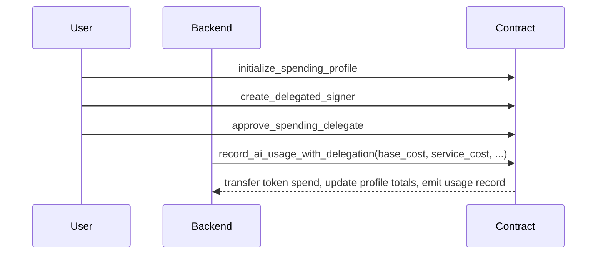

Rabit Contract is the Solana program that lets the product charge backend work in a wallet-native way without forcing users into a prepaid custody flow.

Instead of moving funds into a contract-held balance first, the contract now combines:

- a user-owned `SpendingProfile`
- a delegated signer with expiry and spending limits
- SPL token spending from the user's token account
- immutable per-usage receipts

## Contract Address

| Field | Value |
| --- | --- |
| Contract name | `rabit_contract` |
| Source program id | `Eq7vUXz6hdoYDXgmjNT4HbTtZb43QjenDhMLWdqVcpHT` |
| Latest live devnet deployment | `Eq7vUXz6hdoYDXgmjNT4HbTtZb43QjenDhMLWdqVcpHT` |

## Devnet Address Breakdown

### Fixed addresses

| Component | Address | Notes |
| --- | --- | --- |
| Program / contract address | `Eq7vUXz6hdoYDXgmjNT4HbTtZb43QjenDhMLWdqVcpHT` | latest deployed devnet program |
| Admin authority | `HfMHdkJuHztBm1y2JpPfZwauqesZQdmenQaHVL3J9wMP` | current config authority |
| Backend authority | `HfMHdkJuHztBm1y2JpPfZwauqesZQdmenQaHVL3J9wMP` | current delegated usage backend |
| Platform config PDA | `DipGVm96xHJeqJZ6BhJHZEuRkWBptxnecWWHMcRrGAL2` | singleton policy account |

### Dynamic addresses

| Component | Address pattern | Why it is dynamic |
| --- | --- | --- |
| Spending profile | `PDA(["spending_profile", owner])` | every user gets their own charging policy and ledger account |
| Delegated signer | `PDA(["delegated_signer", owner, delegate])` | every owner/delegate pair gets its own delegation account |
| Usage record | `PDA(["ai_usage", spending_profile, usage_sequence])` | every usage charge creates a new immutable receipt |
| Model registry | `PDA(["model_registry", model_id])` | every model has its own registry account |

For the full current model registry list, see [/contract/model-registry-catalog](/contract/model-registry-catalog).

The source tree and the latest successful live devnet deployment are now aligned on program id `Eq7vUXz6hdoYDXgmjNT4HbTtZb43QjenDhMLWdqVcpHT`.

## What it manages

| Domain | Purpose |
| --- | --- |
| spending profiles | store user payment mint and cumulative usage ledgers |
| delegated signers | allow bounded backend authority with expiry and spending limits |
| usage records | create an immutable on-chain log of each recorded charge |
| platform config | stores admin authority, backend authority, fee settings, and pause state |
| model registry | stores model catalog metadata and optional pricing hints |

## Why it exists

| Problem | Contract-side answer |
| --- | --- |
| model and monitoring billing are opaque off-chain | backend cost can be charged against a user-owned SPL token account |
| backend automation often needs dangerous long-lived authority | delegated signers let the user scope time and spend limits |
| fee and markup accounting is hard to audit | every accepted charge becomes an immutable on-chain record |
| model catalogs drift from billing logic | on-chain registry gives a shared anchor point for model metadata |

## Core flow

## Key Product Value

| Theme | Rabit's answer |
| --- | --- |
| wallet-native trust | users keep funds in their own token account |
| backend automation without unlimited trust | delegated signer uses expiry and spending caps |
| transparent charging | every accepted charge creates an immutable usage record |
| extensible billing model | the contract supports both model cost and service cost |

## Read this next

| If you want... | Read |
| --- | --- |
| architecture and account model | [/contract/architecture](/contract/architecture) |
| deeper technical spec | [/contract/architecture-spec](/contract/architecture-spec) |
| how model cost and monitoring cost become one settlement call | [/contract/service-cost](/contract/service-cost) |
| current registry ids and aliases | [/contract/model-registry-catalog](/contract/model-registry-catalog) |
| instruction-level reference | [/contract/api-reference](/contract/api-reference) |
