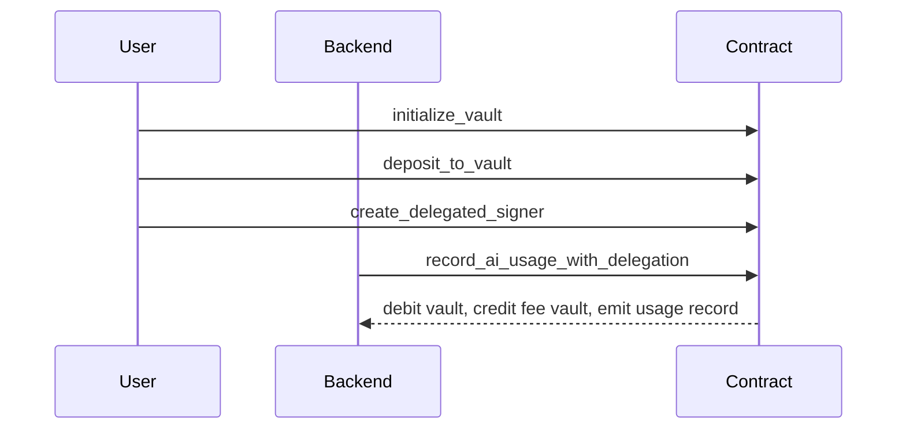

Rabit Contract is the Solana program that lets the product charge for AI usage in a wallet-native way.

Instead of keeping pricing and authorization fully off-chain, it introduces a contract-side payment and permission layer built around vaults, delegated signers, usage records, and fee accounting.

## What it manages

| Domain | Purpose |
| --- | --- |
| user vaults | hold prepaid SOL for AI usage |
| delegated signers | allow bounded backend authority with expiry and spending limits |
| usage records | create an immutable on-chain log of each recorded charge |
| platform config | stores admin authority, backend authority, fee settings, and pause state |
| fee vault | accumulates platform fees |
| model registry | stores optional model metadata and pricing hints |

## Why it exists

| Problem | Contract-side answer |
| --- | --- |
| AI usage billing is usually opaque and off-chain | usage can be charged against an on-chain vault |
| backend automation often needs dangerous long-lived authority | delegated signers let the user scope time and spend limits |
| fee and markup accounting is hard to audit | fee flow becomes part of program state |
| Solana apps keep rebuilding the same payment pattern | the contract turns it into a reusable primitive |

## Core flow

## Read this next

| If you want... | Read |
| --- | --- |
| the real build and test workflow | [/getting-started/run/quickstart-contract](/getting-started/run/quickstart-contract) |
| architecture and account model | [/contract/architecture](/contract/architecture) |
| instruction-level reference | [/contract/api-reference](/contract/api-reference) |
| security analysis | [/contract/security](/contract/security) |
