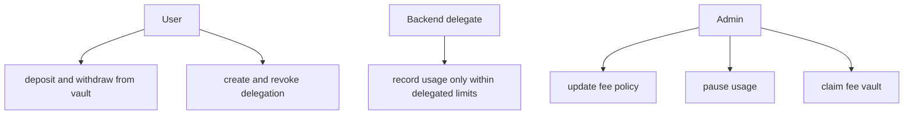

Rabit does not try to make the backend all-powerful. The security model is built around narrow roles and explicit limits.

## The simple model

That means:

- users control funding and delegation
- the backend can charge only through the allowed usage path
- the admin controls protocol policy, not direct user spending

## Main protections

| Protection | What it does |
| --- | --- |
| PDA derivation | prevents account substitution across users and delegates |
| signer checks | prevents unauthorized admin and owner actions |
| delegation expiry | prevents old backend permissions from lasting forever |
| spending limit | caps how much delegated charging can happen |
| pause flag | lets the protocol stop new usage recording during incidents |
| fee and markup caps | prevents extreme fee configuration |
| immutable usage records | makes every accepted charge explainable afterward |

## What the contract protects well

| Question | Current answer |
| --- | --- |
| Can someone withdraw from another user's vault? | no, owner checks and PDA derivation prevent that |
| Can the backend charge forever once delegated? | no, delegation expires and can be revoked |
| Can delegated charging exceed its configured budget? | no, spent amount and limit are checked on each charge |
| Can the admin directly withdraw user vault balances? | no, the admin can only claim the separate fee vault |

## What still requires trust

The contract narrows trust, but it does not eliminate it.

| Residual trust | Why it exists |
| --- | --- |
| backend-reported cost inputs | the backend still reports `base_cost` and `service_cost` |
| admin governance | the admin still controls fee policy and pause behavior |
| user delegation choice | a user can still choose a backend they should not have trusted |

## Practical takeaway

The simplest security explanation is:

1. user funds are prepaid into a vault
2. backend charging is bounded by user-created delegation
3. fee extraction is separated from user balances
4. every successful charge leaves an immutable receipt

So the contract is useful because it turns backend automation into something bounded, explicit, and auditable rather than informal and invisible.
