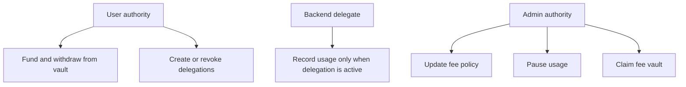

The Rabit contract is designed around a narrow authority model: users control funding, delegated signers control bounded charging, and admins control configuration and fee collection. The goal is to make every charge auditable and every privileged action explicit.

## Security Overview

## Implemented Controls

| Control | What it protects | Implementation pattern |
| --- | --- | --- |
| Checked arithmetic | Overflow and underflow on balances and fees | `checked_add`, `checked_sub`, `checked_mul`, `checked_div` |
| Authority constraints | Unauthorized admin actions | `has_one = authority` and signer checks |
| PDA validation | Account substitution and cross-user access | Seeds include owner and delegate public keys |
| Rent-aware withdrawals | Draining accounts below rent minimum | Balance checks before transfer |
| Delegation validation | Expired, revoked, or over-limit backend charges | Active flag, expiry check, spend limit check |
| Fee caps | Configuration abuse | Hard max values for platform fee and markup |
| Emergency pause | Continued charging during incidents | Pause flag checked on usage instructions |
| Input validation | Invalid amounts and durations | Explicit bounds and zero-value rejection |

## Operational Mental Model

| Role | Allowed actions | Explicitly not allowed |
| --- | --- | --- |
| User | Fund vault, withdraw, create delegation, revoke delegation | Admin config changes and fee claims |
| Backend delegate | Record usage through delegation | Withdraw, change fees, create new delegations |
| Admin | Update fee policy, claim protocol fees, pause usage | Spend user vault funds directly |

## Attack Surface Summary

| Threat area | Current posture | Main mitigating factor |
| --- | --- | --- |
| Reentrancy | Not applicable | Solana account model and atomic instruction execution |
| Front-running | Partially mitigated | Economic issue rather than a direct contract bug |
| Timestamp manipulation | Low residual risk | Consensus clock and bounded delegation checks |
| Sybil behavior | Mitigated | Vaults and delegations are tied to specific public keys |
| Denial of service | Mitigated | No unbounded loops and pause control available |
| Privilege escalation | Mitigated | Signer checks, PDA seeds, and explicit authority separation |

## Operational Best Practices

### For Users

| Area | Recommended behavior |
| --- | --- |
| Delegations | Keep expiry short and spend limits narrow. |
| Vault funding | Deposit only what is needed for expected usage. |
| Recovery | Revoke delegation immediately if a backend session looks suspicious. |
| Fee awareness | Monitor paid fees and verify contract parameters before heavy use. |

### For Admins

| Area | Recommended behavior |
| --- | --- |
| Authority custody | Use a hardware wallet and prefer multisig on mainnet. |
| Fee governance | Announce changes in advance and keep fee ranges predictable. |
| Incident response | Maintain a pause runbook and monitor abnormal usage patterns. |
| External review | Perform audit and load testing before production launch. |

## Audit and Disclosure

| Topic | Recommendation |
| --- | --- |
| Formal audit | Engage Solana-focused security reviewers before mainnet. |
| Stress testing | Simulate heavy usage and fee-claim traffic. |
| Economic review | Check fee assumptions and backend trust boundaries. |
| Responsible disclosure | Route issues to `security@rabit.ai` instead of public issue trackers. |

## Security Checklist

| Item | Status |
| --- | --- |
| Arithmetic overflow protection | Implemented |
| Authority validation | Implemented |
| PDA validation | Implemented |
| Rent-exempt protection | Implemented |
| Delegated signer security | Implemented |
| Fee limits | Implemented |
| Emergency pause | Implemented |
| Balance validation | Implemented |
| Input validation | Implemented |
| Account ownership verification | Implemented |
| External security audit | Pending |
| Bug bounty program | Pending |
