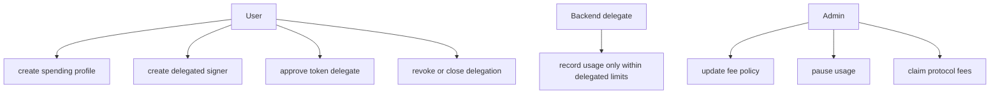

Rabit is built around narrow roles and explicit limits.

## The simple model

## Main protections

| Protection | What it does |
| --- | --- |
| PDA derivation | prevents account substitution across users and delegates |
| signer checks | prevents unauthorized admin and owner actions |
| delegation expiry | prevents old backend permissions from lasting forever |
| spending limit | caps how much delegated charging can happen |
| explicit token delegate approval | prevents hidden token spending authority |
| profile close requires cleared delegate approval | prevents stale token delegation from surviving profile teardown |
| admin-gated model registry writes | prevents arbitrary users from rewriting catalog metadata |
| bounded usage type enum | prevents arbitrary immutable usage labels from being recorded |
| immutable usage records | makes every accepted charge explainable afterward |

## Residual trust

| Residual trust | Why it exists |
| --- | --- |
| backend-reported cost inputs | the backend still reports `base_cost` and `service_cost` |
| admin governance | the admin still controls fee policy and pause behavior |
| user delegation choice | a user can still choose a backend they should not have trusted |
