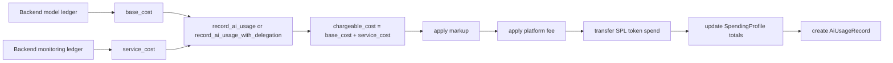

This page explains the contract-facing billing shape behind Rabit's pay-as-you-go flow.

The backend can accumulate more than one kind of cost while serving a user session:

- model usage cost from the LLM provider
- monitoring or service cost from long-running backend work such as alert monitoring

The contract does not need to understand every off-chain subsystem separately. Instead, the backend sends a settlement-ready split:

- `base_cost`: model usage cost
- `service_cost`: monitoring or other backend service cost

The program then charges the combined amount from the user's SPL token account while still storing both fields separately in the immutable usage record.

## Settlement Flow



## What gets stored on-chain

| Field | Meaning |
| --- | --- |
| `model_id` | the model the backend says it used |
| `base_cost` | model/provider cost |
| `service_cost` | backend service or monitoring cost |
| `tokens_used` | token count for stats and optional pricing checks |
| `markup_amount` | markup amount applied to the combined cost |
| `platform_fee_amount` | protocol fee charged on top |
| `total_charged` | final token amount charged |

## Formula

```text
chargeable_cost   = base_cost + service_cost
markup_amount     = chargeable_cost * markup_bps / 10000
cost_after_markup = chargeable_cost + markup_amount
platform_fee      = cost_after_markup * platform_fee_bps / 10000
total_charged     = cost_after_markup + platform_fee
```
