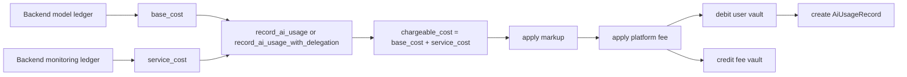

This page explains the contract-facing billing shape behind Rabit's pay-as-you-go flow.

The backend may accumulate more than one kind of cost while serving a user session:

- model usage cost from the LLM provider
- monitoring or service cost from long-running backend work such as alert monitoring

The contract does not need to understand every off-chain subsystem separately. Instead, the backend sends a settlement-ready split:

- `base_cost`: model usage cost
- `service_cost`: monitoring or other backend service cost

The program then charges the combined amount on-chain while still storing both fields separately in the immutable usage record.

## Why this shape exists

| Need | Contract-side answer |
| --- | --- |
| Keep model and monitoring accounting separate off-chain | backend sends `base_cost` and `service_cost` separately |
| Charge one user-visible amount from the vault | program computes one `chargeable_cost = base_cost + service_cost` |
| Keep markup and protocol fee deterministic on-chain | markup and platform fee are applied by the contract |
| Preserve auditability for later settlement review | `AiUsageRecord` stores model cost and service cost separately |

## Settlement Flow



## What gets stored on-chain

| Field | Meaning |
| --- | --- |
| `model_id` | the model the backend says it used |
| `base_cost` | model/provider cost in lamports |
| `service_cost` | backend service or monitoring cost in lamports |
| `tokens_used` | token count for stats and optional pricing checks |
| `markup_bps` | backend markup percentage |
| `markup_amount` | markup amount applied to the combined cost |
| `platform_fee_bps` | protocol fee percentage |
| `platform_fee_amount` | protocol fee charged on top |
| `total_charged` | final amount debited from the vault |

## Formula

```text
chargeable_cost   = base_cost + service_cost
markup_amount     = chargeable_cost * markup_bps / 10000
cost_after_markup = chargeable_cost + markup_amount
platform_fee      = cost_after_markup * platform_fee_bps / 10000
total_charged     = cost_after_markup + platform_fee
```

## Example

| Input | Value |
| --- | --- |
| `base_cost` | `1000` lamports |
| `service_cost` | `200` lamports |
| `markup_bps` | `500` |
| `platform_fee_bps` | `500` |

```text
chargeable_cost   = 1000 + 200 = 1200
markup_amount     = 1200 * 500 / 10000 = 60
cost_after_markup = 1260
platform_fee      = 1260 * 500 / 10000 = 63
total_charged     = 1323
```

## Product Explanation

The simplest product story is:

1. the user prepays SOL into a vault
2. the backend does AI work and optional monitoring work
3. the backend summarizes both costs into one settlement call
4. the contract charges one final amount, but preserves the split for auditability

That makes the contract useful even if the backend adds more off-chain services later. The settlement path stays stable: summarize backend cost off-chain, enforce the charge on-chain, and keep the receipt immutable.
