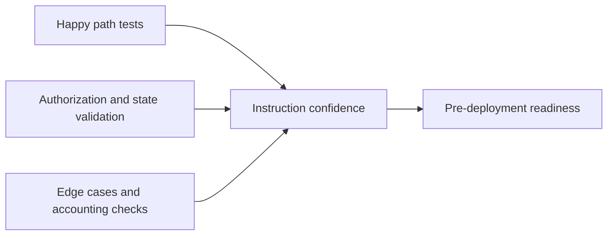

This page tracks how the contract is validated in practice.

The current suite is an off-chain integration suite built with Anchor TypeScript tests against a local validator. If you come from Solidity, the closest mental model is a Foundry integration suite that exercises the real program interface and checks resulting state transitions.

## Test Strategy

## Current Status

| Signal | Current state |
| --- | --- |
| test harness | Anchor TypeScript integration tests |
| current passing tests | `28` |
| IDL generation | working |
| direct usage coverage | implemented |
| delegated usage coverage | implemented |
| vault close coverage | implemented |
| model registry admin coverage | implemented |

## Implemented Coverage Highlights

- [x] initialize and update platform config
- [x] reject unauthorized admin actions
- [x] reject fee and markup values above configured max
- [x] deposit and withdraw vault funds
- [x] reject over-withdrawal
- [x] close empty vaults and reject closing non-zero vaults
- [x] create, revoke, and close delegated signers
- [x] reject invalid delegation duration
- [x] reject closing active delegations
- [x] record usage with user signature
- [x] record usage with delegated backend signer
- [x] reject delegated usage from unauthorized backend
- [x] reject usage while paused
- [x] register, update, and deactivate models
- [x] claim protocol fees and reject unauthorized claims

## What These Tests Prove

| Category | What it proves |
| --- | --- |
| Happy path | Valid instructions succeed and update state correctly |
| Authorization | Non-owners and non-admins cannot cross trust boundaries |
| State validation | Invalid inputs and invalid state combinations fail safely |
| Accounting | Vault debits, fee movements, and usage records stay internally consistent |
| Close flows | Delegations and vaults only close under safe conditions |

## Remaining Gaps

This suite is strong enough for iterative development and product validation, but it is not the same thing as a formal audited 100% line-and-branch coverage report.

The main remaining gaps are:

- explicit numeric coverage tooling for the Rust program itself
- more adversarial cases around duplicate accounts and malformed account substitution
- more model registry edge cases such as long strings and duplicate registrations
- explicit event assertion coverage for every emitted event
