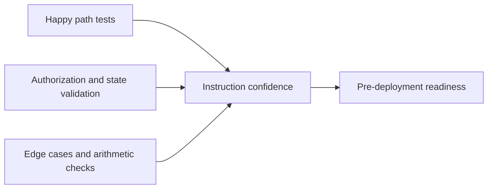

This page tracks how the contract should be validated before release. The high-level sections below explain the intent of the test strategy, while the detailed matrix underneath stays close to the actual instruction surface.

## Test Strategy

| Category | What it proves |
| --- | --- |
| Happy path | Valid instructions succeed and update state correctly. |
| Authorization | Non-owners and non-admins cannot cross trust boundaries. |
| State validation | Invalid inputs and invalid state combinations fail safely. |
| Edge cases | Max values, zero values, and repeated actions remain safe. |
| Race conditions | Concurrent-like flows do not produce broken accounting. |
| Arithmetic | Fee and balance calculations avoid overflow and truncation bugs. |
| PDA validation | Accounts cannot be substituted across users or instructions. |

## Reading the Matrix

| Marker | Meaning |
| --- | --- |
| `[x]` | Already implemented or confirmed in tests |
| `[ ]` | Still planned or needs stronger coverage |
| Comment in parentheses | Extra context about why a case matters |

## 1. Admin Instructions

### 1.1 initialize_config

#### Happy Path
- [x] Initialize with valid parameters
- [x] Verify config state after init
- [x] Verify fee_vault PDA created

#### Authorization
- [ ] Non-admin cannot initialize (N/A - anyone can init first time)

#### State Validation
- [ ] Cannot initialize twice (duplicate PDA)
- [ ] Invalid platform_fee_bps (> MAX_PLATFORM_FEE_BPS)
- [ ] Invalid default_markup_bps (> MAX_MARKUP_BPS)

#### Edge Cases
- [ ] platform_fee_bps = 0 (valid)
- [ ] platform_fee_bps = MAX_PLATFORM_FEE_BPS (2000)
- [ ] default_markup_bps = 0 (valid)
- [ ] default_markup_bps = MAX_MARKUP_BPS (5000)
- [ ] backend_authority = authority (same wallet)

---

### 1.2 update_platform_fee

#### Happy Path
- [x] Admin updates fee successfully
- [x] Verify config.platform_fee_bps updated

#### Authorization
- [ ] Non-admin cannot update fee
- [ ] Wrong authority signature rejected

#### State Validation
- [ ] Config not initialized
- [ ] Invalid new_platform_fee_bps (> MAX)

#### Edge Cases
- [ ] Update to 0 (valid)
- [ ] Update to MAX_PLATFORM_FEE_BPS
- [ ] Update to same value (no-op)
- [ ] Multiple updates in sequence

---

### 1.3 update_default_markup

#### Happy Path
- [x] Admin updates markup successfully
- [x] Verify config.default_markup_bps updated

#### Authorization
- [ ] Non-admin cannot update markup

#### State Validation
- [ ] Invalid new_default_markup_bps (> MAX)

#### Edge Cases
- [ ] Update to 0 (valid)
- [ ] Update to MAX_MARKUP_BPS
- [ ] Update to same value (no-op)

---

### 1.4 update_authority

#### Happy Path
- [ ] Admin transfers authority successfully
- [ ] New authority can perform admin actions
- [ ] Old authority cannot perform admin actions

#### Authorization
- [ ] Non-admin cannot transfer authority
- [ ] Old authority cannot reclaim after transfer

#### Edge Cases
- [ ] Transfer to same address (no-op)
- [ ] Transfer to system program (dangerous but allowed)
- [ ] Chain of transfers (A -> B -> C)

---

### 1.5 update_backend_authority

#### Happy Path
- [ ] Admin updates backend authority
- [ ] Verify config.backend_authority updated

#### Authorization
- [ ] Non-admin cannot update backend authority

#### Edge Cases
- [ ] Update to same address (no-op)
- [ ] Update to admin address (same wallet)

---

### 1.6 toggle_pause

#### Happy Path
- [ ] Admin pauses platform (is_paused = true)
- [ ] Admin unpauses platform (is_paused = false)
- [ ] AI usage blocked when paused
- [ ] Vault operations work when paused

#### Authorization
- [ ] Non-admin cannot toggle pause

#### Edge Cases
- [ ] Multiple pause/unpause cycles
- [ ] Pause while usage transaction in-flight

---

### 1.7 claim_fees

#### Happy Path
- [ ] Admin claims fees successfully
- [ ] Verify SOL transferred to admin
- [ ] Verify fee_vault balance decreased

#### Authorization
- [ ] Non-admin cannot claim fees

#### State Validation
- [ ] Cannot claim more than fee_vault balance
- [ ] Cannot claim 0 amount

#### Edge Cases
- [ ] Claim exact fee_vault balance
- [ ] Claim partial amount
- [ ] Multiple claims in sequence
- [ ] Claim when fee_vault empty

---

## 2. Model Registry Instructions

### 2.1 register_model

#### Happy Path
- [x] Register model with valid parameters
- [x] Verify model_registry state
- [x] Verify ModelRegistered event emitted

#### Authorization
- [ ] Non-admin can register (currently allowed - should restrict?)

#### State Validation
- [ ] Cannot register duplicate model_id
- [ ] model_id empty string
- [ ] model_id too long (> MAX_MODEL_ID_LEN)
- [ ] provider empty string
- [ ] provider too long (> MAX_PROVIDER_LEN)
- [ ] features too long (> MAX_FEATURES_LEN)

#### Edge Cases
- [ ] model_id = 1 character (valid)
- [ ] model_id = MAX_MODEL_ID_LEN characters
- [ ] base_cost_per_token = 0 (valid)
- [ ] base_cost_per_token = u64::MAX
- [ ] features = empty string (valid)
- [ ] Special characters in model_id

---

### 2.2 update_model

#### Happy Path
- [ ] Update base_cost_per_token
- [ ] Update is_active
- [ ] Update features
- [ ] Update custom_contract
- [ ] Update multiple fields at once
- [ ] Verify ModelUpdated event emitted

#### Authorization
- [ ] Non-admin cannot update model

#### State Validation
- [ ] Model not found
- [ ] All parameters None (no-op)

#### Edge Cases
- [ ] Update to same values (no-op)
- [ ] Update features to empty string
- [ ] Update custom_contract to None (clear)

---

### 2.3 deactivate_model

#### Happy Path
- [ ] Deactivate active model
- [ ] Verify is_active = false
- [ ] Verify ModelUpdated event emitted
- [ ] Usage with deactivated model fails

#### Authorization
- [ ] Non-admin cannot deactivate model

#### State Validation
- [ ] Model not found
- [ ] Deactivate already deactivated model (no-op)

---

## 3. Delegation Instructions

### 3.1 create_delegated_signer

#### Happy Path
- [x] User creates delegation successfully
- [x] Verify delegated_signer state
- [x] Backend can use delegation

#### Authorization
- [ ] Non-owner cannot create delegation for user

#### State Validation
- [ ] Cannot create duplicate delegation (same owner + delegate)
- [ ] expiry_duration < MIN_DELEGATION_DURATION
- [ ] expiry_duration > MAX_DELEGATION_DURATION
- [ ] spending_limit > MAX_SPENDING_LIMIT

#### Edge Cases
- [ ] expiry_duration = MIN_DELEGATION_DURATION (60s)
- [ ] expiry_duration = MAX_DELEGATION_DURATION (30 days)
- [ ] spending_limit = 0 (valid but useless)
- [ ] spending_limit = MAX_SPENDING_LIMIT
- [ ] delegate = owner (self-delegation)
- [ ] Multiple delegations to different delegates

---

### 3.2 revoke_delegated_signer

#### Happy Path
- [ ] User revokes delegation
- [ ] Verify is_active = false
- [ ] Backend cannot use revoked delegation

#### Authorization
- [ ] Non-owner cannot revoke delegation
- [ ] Delegate cannot revoke own delegation

#### State Validation
- [ ] Delegation not found
- [ ] Revoke already revoked delegation

#### Edge Cases
- [ ] Revoke immediately after creation
- [ ] Revoke expired delegation (redundant)
- [ ] Revoke while usage transaction in-flight

---

## 4. Vault Instructions

### 4.1 initialize_vault

#### Happy Path
- [x] User creates vault successfully
- [x] Verify vault state (balance = 0)

#### Authorization
- [ ] Non-owner cannot create vault for user

#### State Validation
- [ ] Cannot create duplicate vault (same owner)

#### Edge Cases
- [ ] Create vault, close, recreate (if close implemented)

---

### 4.2 deposit_to_vault

#### Happy Path
- [x] User deposits SOL to vault
- [x] Verify vault.balance increased
- [x] Verify vault.total_deposited increased
- [x] Verify SOL transferred

#### Authorization
- [ ] Non-owner cannot deposit to vault (currently allowed - should restrict?)

#### State Validation
- [ ] Vault not initialized
- [ ] Deposit amount = 0
- [ ] Insufficient SOL in owner wallet

#### Edge Cases
- [ ] Deposit 1 lamport (minimum)
- [ ] Deposit u64::MAX lamports (if owner has balance)
- [ ] Multiple deposits in sequence
- [ ] Deposit after withdrawal

---

### 4.3 withdraw_from_vault

#### Happy Path
- [ ] User withdraws SOL from vault
- [ ] Verify vault.balance decreased
- [ ] Verify vault.total_withdrawn increased
- [ ] Verify SOL transferred

#### Authorization
- [ ] Non-owner cannot withdraw from vault

#### State Validation
- [ ] Vault not initialized
- [ ] Withdraw amount = 0
- [ ] Insufficient vault balance
- [ ] Withdraw would drain rent-exempt balance

#### Edge Cases
- [ ] Withdraw 1 lamport (minimum)
- [ ] Withdraw exact balance (leaving rent-exempt)
- [ ] Withdraw after deposit
- [ ] Multiple withdrawals in sequence
- [ ] Withdraw when balance = rent-exempt minimum

---

## 5. AI Usage Instructions

### 5.1 record_ai_usage

#### Happy Path
- [x] User records AI usage successfully
- [x] Verify usage_record state
- [x] Verify vault.balance decreased
- [x] Verify fee_vault received platform fee
- [x] Verify AiUsageRecorded event emitted
- [x] Verify model_registry stats updated (if provided)

#### Authorization
- [ ] Non-owner cannot record usage for vault

#### State Validation
- [ ] Platform paused
- [ ] Vault not initialized
- [ ] base_cost = 0
- [ ] model_id empty
- [ ] Model registry provided but model inactive
- [ ] markup_bps > MAX_MARKUP_BPS
- [ ] Insufficient vault balance

#### Edge Cases
- [ ] base_cost = 1 lamport (minimum)
- [ ] base_cost = u64::MAX (if vault has balance)
- [ ] markup_bps = 0 (valid)
- [ ] markup_bps = MAX_MARKUP_BPS
- [ ] markup_bps = None (use default)
- [ ] tokens_used = 0 (valid for non-token usage)
- [ ] tokens_used = u64::MAX
- [ ] usage_type = empty string
- [ ] model_registry = None (optional)
- [ ] Multiple usage records in same second (should fail - duplicate PDA)
- [ ] Multiple usage records in different seconds

#### Arithmetic
- [ ] Fee calculation with small base_cost (truncation)
- [ ] Fee calculation with large base_cost (overflow check)
- [ ] markup_amount = 0 (when base_cost * markup / 10000 < 1)
- [ ] platform_fee = 0 (when cost_after_markup * fee / 10000 < 1)

---

### 5.2 record_ai_usage_with_delegation

#### Happy Path
- [x] Backend records usage with delegation
- [x] Verify usage_record state
- [x] Verify vault.balance decreased
- [x] Verify delegated_signer.spent_amount increased
- [x] Verify fee_vault received platform fee
- [x] Verify AiUsageRecorded event emitted

#### Authorization
- [ ] Non-delegate cannot use delegation
- [ ] Wrong delegate signature rejected

#### State Validation
- [ ] Platform paused
- [ ] Delegation not active
- [ ] Delegation expired
- [ ] Vault not initialized
- [ ] base_cost = 0
- [ ] model_id empty
- [ ] Model registry provided but model inactive
- [ ] markup_bps > MAX_MARKUP_BPS
- [ ] Spending limit exceeded
- [ ] Insufficient vault balance
- [ ] Vault owner != delegation owner

#### Edge Cases
- [ ] Usage at exact spending limit
- [ ] Usage at exact expiry time
- [ ] Usage 1 second before expiry
- [ ] Usage 1 second after expiry (should fail)
- [ ] Multiple usage records up to spending limit
- [ ] Usage after revocation (should fail)
- [ ] Usage with expired delegation (should fail)

#### Race Conditions
- [ ] Usage submitted, delegation revoked, transaction lands
- [ ] Usage submitted, delegation expires, transaction lands
- [ ] Usage submitted, platform paused, transaction lands
- [ ] Usage submitted, model deactivated, transaction lands

---

## 6. Cross-Instruction Tests

### 6.1 Admin Flow
- [ ] Initialize config -> Update fees -> Claim fees
- [ ] Initialize config -> Pause -> Unpause
- [ ] Initialize config -> Transfer authority -> Old admin cannot act
- [ ] Initialize config -> Update backend -> Backend can record usage

### 6.2 Model Registry Flow
- [ ] Register model -> Update model -> Deactivate model
- [ ] Register model -> Use in AI usage -> Verify stats updated
- [ ] Register model -> Deactivate -> Usage fails

### 6.3 Delegation Flow
- [ ] Create delegation -> Use delegation -> Revoke -> Cannot use
- [ ] Create delegation -> Wait for expiry -> Cannot use
- [ ] Create delegation -> Use until spending limit -> Cannot use
- [ ] Create delegation -> Revoke -> Create new delegation

### 6.4 Vault Flow
- [ ] Initialize vault -> Deposit -> Withdraw -> Verify balances
- [ ] Initialize vault -> Deposit -> Record usage -> Verify balances
- [ ] Initialize vault -> Deposit -> Record usage until empty -> Cannot record

### 6.5 Full User Journey
- [ ] Initialize vault -> Deposit -> Create delegation -> Backend records usage -> User revokes -> User withdraws

---

## 7. Adversarial Tests

### 7.1 PDA Attacks
- [ ] Provide wrong PDA seeds (should fail)
- [ ] Provide correct seeds but wrong bump (should fail)
- [ ] Provide account from different program (should fail)
- [ ] Provide uninitialized account (should fail)

### 7.2 Account Substitution
- [ ] Substitute vault account (should fail - PDA check)
- [ ] Substitute config account (should fail - PDA check)
- [ ] Substitute delegation account (should fail - PDA check)
- [ ] Substitute model_registry account (should fail - PDA check)
- [ ] Substitute fee_vault account (should fail - PDA check)

### 7.3 Signature Bypass
- [ ] Provide unsigned account as signer (should fail)
- [ ] Provide wrong signer (should fail)
- [ ] Reuse signature from different transaction (should fail)

### 7.4 Reentrancy
- [ ] Attempt reentrancy via CPI (not possible in Solana)

### 7.5 Overflow/Underflow
- [ ] vault.balance - large_amount (underflow check)
- [ ] vault.balance + large_amount (overflow check)
- [ ] delegated_signer.spent_amount + large_amount (overflow check)
- [ ] config.total_fees_collected + large_amount (overflow check)
- [ ] Fee calculation with u64::MAX (overflow check)

---

## 8. Event Tests

### 8.1 Event Emission
- [ ] ModelRegistered event on register_model
- [ ] ModelUpdated event on update_model
- [ ] ModelUpdated event on deactivate_model
- [ ] AiUsageRecorded event on record_ai_usage
- [ ] AiUsageRecorded event on record_ai_usage_with_delegation

### 8.2 Event Data
- [ ] Verify all event fields populated correctly
- [ ] Verify timestamp in events
- [ ] Verify event indexing works

---

## 9. Upgrade & Migration Tests

### 9.1 Program Upgrade
- [ ] Deploy new program version
- [ ] Verify existing accounts still work
- [ ] Verify new instructions work
- [ ] Verify old instructions still work (if not removed)

### 9.2 State Migration
- [ ] Add new field to account (requires migration)
- [ ] Remove field from account (requires migration)
- [ ] Change field type (requires migration)

### 9.3 Backward Compatibility
- [ ] Old clients can still interact with new program
- [ ] New clients can interact with old accounts

---

## 10. Performance Tests

### 10.1 Gas Costs
- [ ] Measure gas for each instruction
- [ ] Optimize high-gas instructions
- [ ] Verify gas costs within acceptable range

### 10.2 Account Size
- [ ] Verify account sizes match calculations
- [ ] Verify rent-exempt amounts correct
- [ ] Optimize account sizes if possible

### 10.3 Throughput
- [ ] High-frequency usage recording (1000 TPS)
- [ ] Concurrent vault operations
- [ ] Concurrent delegation operations

---

## 11. Integration Tests

### 11.1 Frontend Integration
- [ ] Connect wallet
- [ ] Initialize vault
- [ ] Deposit to vault
- [ ] Create delegation
- [ ] View usage history
- [ ] Revoke delegation
- [ ] Withdraw from vault

### 11.2 Backend Integration
- [ ] Backend records usage with delegation
- [ ] Backend handles delegation expiry
- [ ] Backend handles spending limit
- [ ] Backend handles revocation
- [ ] Backend handles insufficient balance

### 11.3 Indexer Integration
- [ ] Index all events
- [ ] Query usage history
- [ ] Query delegation status
- [ ] Query vault balance
- [ ] Query model stats

---

## 12. Error Code Tests

### 12.1 All Error Codes
- [ ] DelegatedSignerExpired
- [ ] DelegatedSignerNotActive
- [ ] SpendingLimitExceeded
- [ ] InvalidDelegationDuration
- [ ] InsufficientVaultBalance
- [ ] InvalidUsageAmount
- [ ] InvalidUsageType
- [ ] Unauthorized
- [ ] VaultAlreadyInitialized
- [ ] DelegatedSignerAlreadyRevoked
- [ ] InvalidFeePercentage
- [ ] InsufficientFeeBalance
- [ ] NotAuthorized
- [ ] InvalidMarkupPercentage
- [ ] NotAuthorizedBackend
- [ ] ArithmeticOverflow
- [ ] InvalidAccountOwner
- [ ] AccountAlreadyInitialized
- [ ] ModelNotFound
- [ ] ModelNotActive
- [ ] InvalidModelId
- [ ] ModelAlreadyRegistered

### 12.2 Error Messages
- [ ] Verify error messages are descriptive
- [ ] Verify error codes are unique
- [ ] Verify error codes match documentation

---

## Test Coverage Goals

- **Instruction Coverage**: 100% (all 17 instructions)
- **Branch Coverage**: >95% (all conditional paths)
- **Error Coverage**: 100% (all error codes)
- **Edge Case Coverage**: >90% (all identified edge cases)
- **Integration Coverage**: >80% (all user flows)

---

## Test Execution Plan

### Phase 1: Unit Tests (Week 1)
- [ ] Admin instructions (7)
- [ ] Model registry instructions (3)
- [ ] Delegation instructions (2)
- [ ] Vault instructions (3)
- [ ] AI usage instructions (2)

### Phase 2: Integration Tests (Week 2)
- [ ] Cross-instruction flows
- [ ] Full user journeys
- [ ] Backend integration

### Phase 3: Adversarial Tests (Week 3)
- [ ] PDA attacks
- [ ] Account substitution
- [ ] Signature bypass
- [ ] Overflow/underflow

### Phase 4: Performance Tests (Week 4)
- [ ] Gas optimization
- [ ] Throughput testing
- [ ] Load testing

### Phase 5: Audit Preparation (Week 5)
- [ ] Code review
- [ ] Documentation review
- [ ] Security checklist
- [ ] Bug bounty preparation

---

## Test Automation

### CI/CD Pipeline
- [ ] Run unit tests on every commit
- [ ] Run integration tests on every PR
- [ ] Run adversarial tests nightly
- [ ] Run performance tests weekly
- [ ] Generate coverage reports
- [ ] Block merge if tests fail

### Test Frameworks
- [ ] Anchor test framework (Rust)
- [ ] TypeScript tests (anchor-ts)
- [ ] Fuzz testing (cargo-fuzz)
- [ ] Property-based testing (proptest)

---

## Test Metrics

### Current Status
- Unit Tests: 5/200 (2.5%)
- Integration Tests: 0/50 (0%)
- Adversarial Tests: 0/30 (0%)
- Performance Tests: 0/10 (0%)
- **Total: 5/290 (1.7%)**

### Target Status (Pre-Launch)
- Unit Tests: 200/200 (100%)
- Integration Tests: 50/50 (100%)
- Adversarial Tests: 30/30 (100%)
- Performance Tests: 10/10 (100%)
- **Total: 290/290 (100%)**
