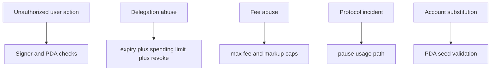

This page is intentionally lightweight.

The important question here is not “did we enumerate every theoretical edge case,” but “what does the contract trust, and what does it defend on-chain?”

## Main trust boundaries

| Boundary | What Rabit trusts | What the contract enforces |
| --- | --- | --- |
| user funding | the user chooses how much SOL to preload | only the user can deposit, withdraw, and create delegations |
| delegated backend charging | the user chooses whether to trust the backend | delegation expiry and spending limit are enforced on-chain |
| admin governance | the admin controls fees and pause state | admin powers are explicit and separated from user funds |
| backend cost reporting | the backend reports `base_cost` and `service_cost` | the contract deterministically applies markup and protocol fee |

## Core threats and mitigations

| Threat | Main mitigation |
| --- | --- |
| someone tries to spend from another user's vault | PDA derivation and owner signer checks |
| backend keeps charging after delegation should be invalid | active flag, expiry checks, and user revocation |
| backend tries to exceed delegated budget | cumulative spend limit is checked on every delegated charge |
| admin tries to set extreme fees | hard-coded fee and markup caps |
| protocol discovers abnormal behavior in production | pause gate blocks new usage recording |

## Residual trust you should understand

The contract does not eliminate all trust. It narrows trust to a smaller and more explicit shape.

| Residual trust | Why it still exists |
| --- | --- |
| backend-reported cost values | the backend still tells the contract what the off-chain work cost |
| admin authority | fee policy and pause control still belong to the admin role |
| user delegation choices | a user can still choose a backend they should not have trusted |

## Simple takeaway

Rabit is secure in the sense that:

- users keep direct control of deposits and withdrawals
- backend automation is bounded instead of unlimited
- every accepted charge creates an immutable usage receipt
- protocol fee extraction is separated from user balances

Rabit is not trustless in the sense that the backend still reports the off-chain cost inputs. The contract's job is to make charging bounded, explicit, and auditable.
