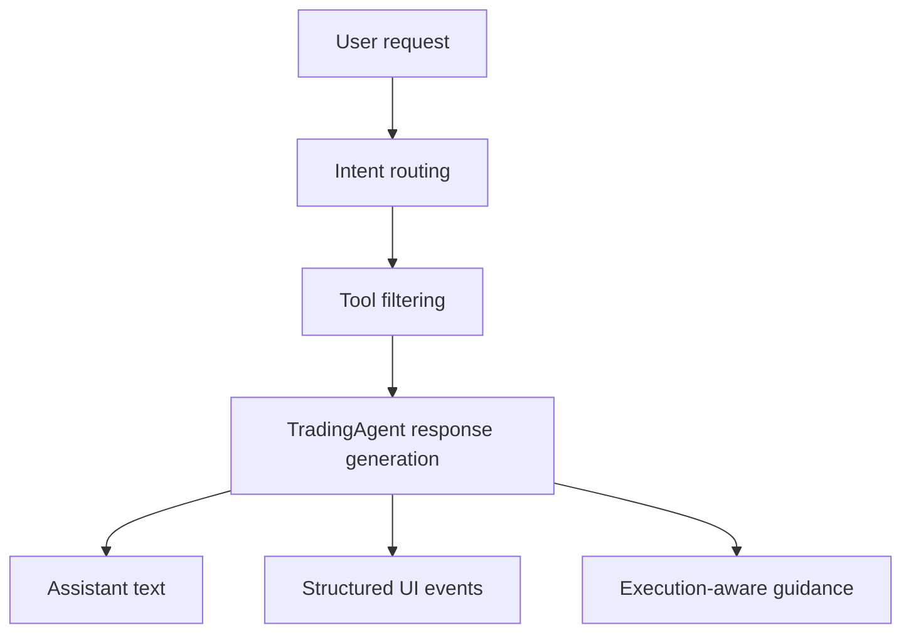

The Rabit backend is built around one adaptive runtime agent: `TradingAgent`.

That is an intentional design choice.

Instead of building many separate runtime agents and then stitching them together, Rabit uses one main entry point that can:

- understand intent
- decide which tool families matter
- stream user-facing progress
- adapt to context such as wallet identity, market focus, and execution readiness

## Why this matters

This is the reason Rabit feels like a trading assistant instead of a search box or a static exchange dashboard.

The backend agent is designed to help the user move through a flow like this:

1. identify what matters
2. understand why it matters
3. decide whether action is available
4. guide the next step in a structured way

## What the agent can do today

| Capability | What it means | Why it matters |
| --- | --- | --- |
| Intent routing | Rabit classifies the request before final response generation | the tool surface stays more relevant and efficient |
| Tool use | the agent can call market, execution, memory, and decision-support tools | responses are grounded in system state instead of pure text generation |
| Streaming | the backend can stream assistant text and structured UI events | the frontend can render progressive guidance, not only final answers |
| Multimodal inputs | the agent can ingest image and PDF uploads | users can provide richer context than plain text alone |
| Context-aware behavior | the agent reacts to conversation style, trading style, market context, and execution gates | the same backend can behave differently depending on the active user flow |

## Why streaming matters in Rabit

In many products, “streaming” only means partial text.

Rabit goes further. The agent can emit structured frontend events that let the UI react while the answer is being built.

## UI-oriented agent events

| Event | What it is | How the frontend can use it |
| --- | --- | --- |
| `thinking_summary` | a short, user-safe summary of what the agent is currently doing | show progress without exposing raw chain-of-thought |
| `plan` | a structured sequence of steps the user can follow | render an action plan instead of a paragraph blob |
| `hint` | a controlled branch prompt when the user needs to choose a path | support human-in-the-loop interaction cleanly |
| `assistant_delta` | streamed assistant text chunks | power the normal chat experience |
| `done` | final completion signal with metadata | close the stream, persist state, and update the UI |

## Why this is useful for a mobile product

On mobile, users usually need:

- shorter explanations
- clearer next steps
- less ambiguity
- faster recognition of what changed

That is exactly why Rabit uses streaming events such as `thinking_summary`, `plan`, and `hint`.

They help the product feel actionable even on smaller screens and shorter attention windows.

## How the agent fits into the system

## What to read next

- [Exchange Execution](../execution)
- [Memory and Context](../memory)
- [Agents](/agents)
- [Agent API](/api-reference/agent)

