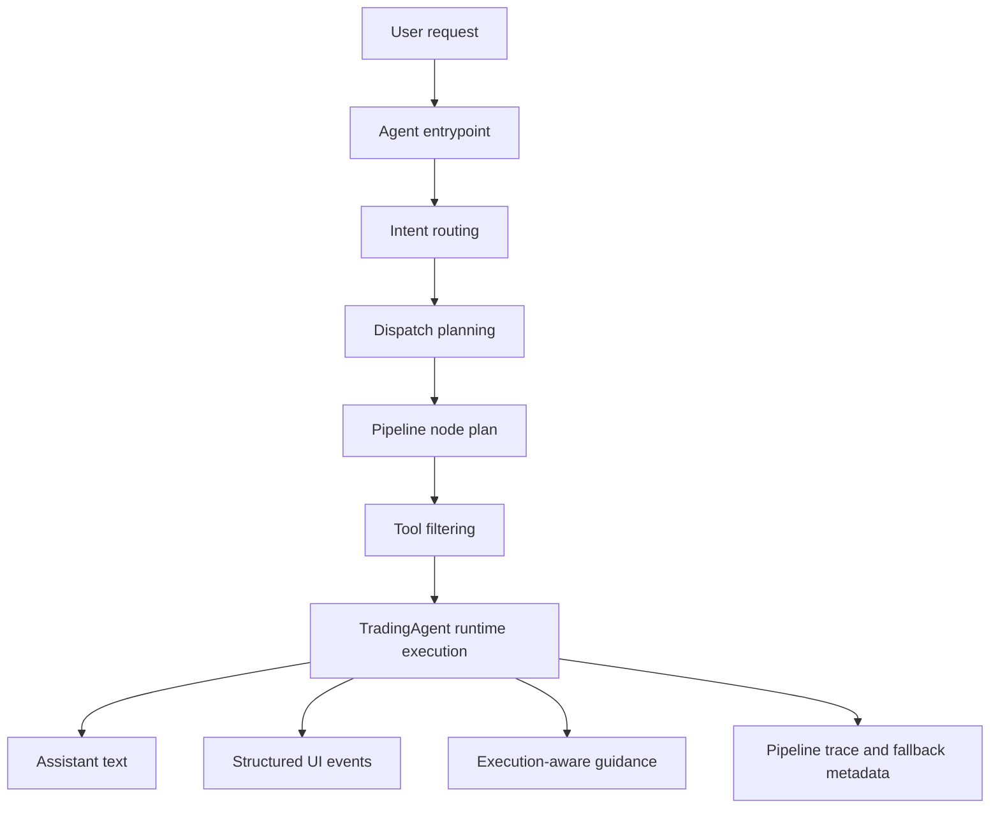
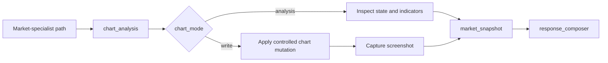

The Rabit backend is built around one adaptive entrypoint: `TradingAgent`.

That is still an intentional design choice.

But the architecture around that runtime is now more structured than before.

Instead of treating the whole request as one opaque agent turn, Rabit now uses:

- an agent entrypoint
- an explicit intent router stage
- a dispatch plan for a future specialist target
- a composable pipeline-node plan for the current runtime
- one stable runtime executor for the current production path

So today the backend still executes through one runtime, but it does so with a pipeline that is already prepared for future specialist agents.

## What the pipeline does now

| Stage | What it does | Why it matters |
| --- | --- | --- |
| Entrypoint | receives request, auth-derived identity, context, and attachments | gives the mobile app one stable integration surface |
| Intent router | classifies the request and computes a structured routing context | makes the runtime less generic and easier to evaluate |
| Dispatch plan | selects the next planned specialist target | keeps the system multi-agent-ready without building premature specialists |
| Pipeline node plan | selects composable pre-response steps such as chart analysis | lets Rabit add specialist behavior without hardcoding a second runtime |
| Runtime execution | runs the current request through the active execution engine | preserves stability while the architecture evolves |
| Completion and fallback | returns response, stream metadata, and safe degraded output when needed | makes failures easier to recover from |

## What the entrypoint can do today

Instead of building many separate runtime agents and then stitching them together, Rabit uses one main entry point that can:

- understand intent
- plan the next specialist path
- decide which tool families matter
- stream user-facing progress
- adapt to context such as wallet identity, market focus, and execution readiness
- fall back safely when routing or tool execution degrades

## Why this matters

This is the reason Rabit feels like a trading assistant instead of a search box or a static exchange dashboard.

The backend agent is designed to help the user move through a flow like this:

1. identify what matters
2. understand why it matters
3. decide whether action is available
4. guide the next step in a structured way

## What the agent can do today

| Capability | What it means | Why it matters |
| --- | --- | --- |
| Intent routing | Rabit classifies the request before final response generation | the tool surface stays more relevant and efficient |
| Dispatch planning | Rabit records the likely future specialist target for the request | future multi-agent rollout can happen without redesigning the API |
| Pipeline nodes | Rabit can run specialist-like steps such as chart analysis before the final answer | the system becomes puzzle-like instead of branching into hardcoded runtimes |
| Tool use | the agent can call market, execution, memory, and decision-support tools | responses are grounded in system state instead of pure text generation |
| Research and news retrieval | the agent can use both generic web search and dedicated news tools through the same routed research surface | catalyst-sensitive answers can use tighter news retrieval instead of broad search only |
| Streaming | the backend can stream assistant text and structured UI events | the frontend can render progressive guidance, not only final answers |
| Multimodal inputs | the agent can ingest image and PDF uploads | users can provide richer context than plain text alone |
| Context-aware behavior | the agent reacts to conversation style, trading style, market context, and execution gates | the same backend can behave differently depending on the active user flow |
| Safe fallback | the backend returns controlled degraded responses instead of dumping raw backend errors | the product stays usable even when one path fails |

## Why streaming matters in Rabit

In many products, “streaming” only means partial text.

Rabit goes further. The agent can emit structured frontend events that let the UI react while the answer is being built.

## UI-oriented agent events

| Event | What it is | How the frontend can use it |
| --- | --- | --- |
| `thinking_summary` | a short, user-safe summary of what the agent is currently doing | show progress without exposing raw chain-of-thought |
| `plan` | a structured sequence of steps the user can follow | render an action plan instead of a paragraph blob |
| `hint` | a controlled branch prompt when the user needs to choose a path | support human-in-the-loop interaction cleanly |
| `chart_screenshot` | a TradingView screenshot payload emitted during chart workflows | show or persist the chart image while the agent continues reasoning |
| `assistant_delta` | streamed assistant text chunks | power the normal chat experience |
| `done` | final completion signal with metadata | close the stream, persist state, and update the UI |

## Why this is useful for a mobile product

On mobile, users usually need:

- shorter explanations
- clearer next steps
- less ambiguity
- faster recognition of what changed

That is exactly why Rabit uses streaming events such as `thinking_summary`, `plan`, and `hint`.

They help the product feel actionable even on smaller screens and shorter attention windows.

## How the agent fits into the system

## First specialist-like nodes: chart analysis, market snapshot, research snapshot, portfolio snapshot, execution snapshot, memory snapshot, general fallback, clarification prep, and response composer

The first real nodes in the composable pipeline are `chart_analysis`, `market_snapshot`, `research_snapshot`, `portfolio_snapshot`, `execution_snapshot`, `memory_snapshot`, `general_fallback`, `clarification_prep`, and `response_composer`.

`chart_analysis` is now one dual-mode node, not two separate runtimes:

| Chart node mode | What it does | What it blocks |
| --- | --- | --- |
| `analysis` | reads chart state, aligns symbol/timeframe, adds indicators temporarily, reads quote and indicator values | drawing tools, alert tools, unrestricted chart mutation |
| `write` | clears drawings when explicitly asked, marks horizontal levels, draws trend lines when enough coordinates exist, captures a post-write screenshot | alert tools, indicator-management tools, free-form chart mutation from the final model |

Internally both modes still follow a bounded `Reason -> Act -> Critique -> Observe` loop, but the write path uses a stricter instruction layer and a narrower LLM-facing tool surface.

That means Rabit can support chart mutation without pretending a second chart runtime already exists.

`market_snapshot` complements that step with a smaller read-only enrichment pass:

| It does | It avoids |
| --- | --- |
| resolve the active symbol from chart observations or market context | pretending to own the request as a separate runtime |
| read live price with `get_price` | placing orders or mutating execution state |
| fetch a short symbol-news tail with `search_news_by_symbols` | broad, noisy research when a compact snapshot is enough |
| inject trusted market/news observations into the final prompt | claiming unsupported always-live awareness |

`research_snapshot` handles research-like requests where the product needs a little more context than a compact market snapshot:

| It does | It avoids |
| --- | --- |
| prefer symbol-specific news first when the request is asset-sensitive | pretending every research turn needs a separate runtime already |
| fall back to trending-news context when no symbol is resolved | broad uncontrolled browsing |
| add a small `web_search` layer for broader context | turning the pipeline into a full autonomous research loop |
| inject trusted research observations into the final prompt | claiming unsupported live feed or search breadth |

The remaining snapshot nodes fill the other specialist-target gaps:

| Node | What it adds |
| --- | --- |
| `portfolio_snapshot` | balances, collateral, and positions before a portfolio-oriented answer |
| `execution_snapshot` | execution policy state plus open-order context before an execution-oriented answer |
| `memory_snapshot` | relevant durable memory recall before a memory-oriented answer |

The remaining non-snapshot nodes close the fallback and composition gaps:

| Node | What it adds |
| --- | --- |
| `general_fallback` | a safer low-confidence execution mode before the final answer |
| `clarification_prep` | structured clarification context and hint guidance before the final answer |
| `response_composer` | a concrete final composition step that summarizes prior node observations |

Those fallback-oriented nodes now also narrow the visible tool surface:

| Node | Restriction |
| --- | --- |
| `general_fallback` | exposes only safe UI tools during low-confidence turns |
| `clarification_prep` | exposes only `show_hint` during clarification turns |

That low-confidence path is also planner-gated now. A raw mention of charts, RSI, or MACD no longer forces `chart_analysis` to run when routing confidence is low, and a low-confidence draw request does not unlock chart write mode either.

Together, these nodes contribute their own instructions into the effective prompt for that turn. That means the final response is not only grounded by chart observations, but also shaped by behavior rules such as:

- respect locked asset scope
- only enter chart-write behavior when the planner explicitly enabled write mode
- prefer indicator evidence only when it improves the answer
- keep the workflow analytical rather than operational
- use compact live price and recent headline context before escalating to broader research

## How the chart node now behaves in practice

The important boundary is that the final model does not directly receive the chart-writing tools during write mode. The node executes the chart mutation itself, then injects trusted observations and optional screenshot metadata into the broader market-specialist turn.

## What to read next

- [Exchange Execution](../execution)
- [Memory and Context](../memory)
- [Agents](/agents)
- [Agent API](/api-reference/agent)
