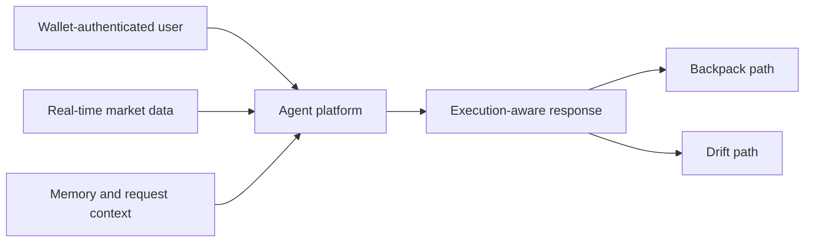

The `Rabit Backend` is the coordination layer behind the product.

It combines market awareness, wallet-linked identity, execution state, and agent reasoning into one system that can support a mobile trading experience.

## What this section explains

This section focuses on four practical questions:

| Question | Why it matters |
| --- | --- |
| what can the backend do today | shows the product is already grounded in working capability |
| why does that matter to a mobile trading product | connects backend behavior to user value |
| how do the major capabilities fit together | makes the system easier to understand quickly |
| what makes Rabit different from a normal exchange wrapper or chatbot | clarifies the product position |

## The four feature pillars

| Feature pillar | What it means in practice | Why it matters |
| --- | --- | --- |
| Agent platform | Rabit can interpret requests, route intent, use tools, and stream structured UI output | the product feels adaptive instead of static |
| Exchange execution | Rabit understands that Backpack and Drift use different authority models and exposes safe execution-aware flows for each | execution is practical and credible |
| Real-time market data | Rabit combines exchange feeds, OHLC, coin metadata, and news context | the assistant reacts to current conditions instead of only prior knowledge |
| Memory and context | Rabit can remember durable user state and adapt behavior to per-request context | the same system can stay personal, scoped, and safer |

## How the feature set connects

## What makes this backend distinctive

Many trading backends do one of these things well:

- serve market data
- wrap exchange APIs
- expose account state
- run chat or assistant features

Rabit stands out because it combines those layers into one decision system.

That lets the backend do more than answer a question. It can:

- understand what the user is trying to do
- attach current market context
- expose execution availability
- stream structured intermediate guidance
- support different exchange authority models without pretending they are the same

## Read this section in order

1. [Agent Platform](./agent)
2. [Exchange Execution](./execution)
3. [Real-Time Market Data](./market-data)
4. [Memory and Context](./memory)

