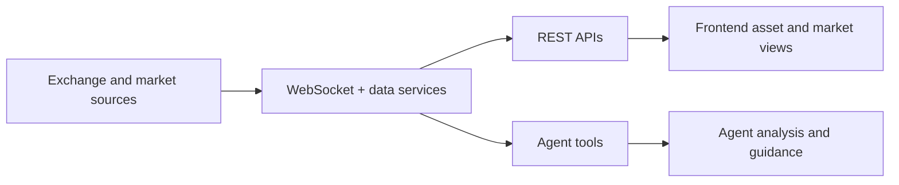

Rabit is not only a reasoning system. It is also a market-aware backend.

This matters because trading support is only useful if the assistant can stay grounded in what is happening now.

## Why this matters

Without real-time and recent market context, a trading assistant quickly becomes generic.

With the right data layer, Rabit can react to:

- price changes
- market structure
- asset context
- current execution state
- narrative changes from news and search

## What the market-data layer includes

| Source type | What Rabit gets from it | Why it matters |
| --- | --- | --- |
| Exchange WebSockets | live market updates | supports responsiveness |
| OHLC and chart data | structured recent price history | supports charting and analysis |
| Coin metadata | names, categories, links, descriptive info | supports asset detail and discovery |
| News and search | narrative context around current moves | helps the assistant explain why something matters |

## Current data sources

- Drift
- Backpack
- Binance for OHLC-style historical workflows
- CoinGecko for metadata
- news and search integrations for narrative context

## Why this is more than a feed layer

The backend does not collect data just to expose raw numbers.

It collects data so the agent, the API, and the frontend can share a more coherent view of the market.

That is what allows Rabit to support workflows like:

- “what changed in BTC and SOL?”
- “what should I watch next?”
- “show me assets related to this category”
- “give me a clearer explanation of why this move matters”

## How the data layer reaches the product

## Read this with

- [WebSocket and Market Data](/websocket/overview)
- [CoinGecko Integration](/integrations/coingecko)
- [Assets API](/api-reference/assets)

