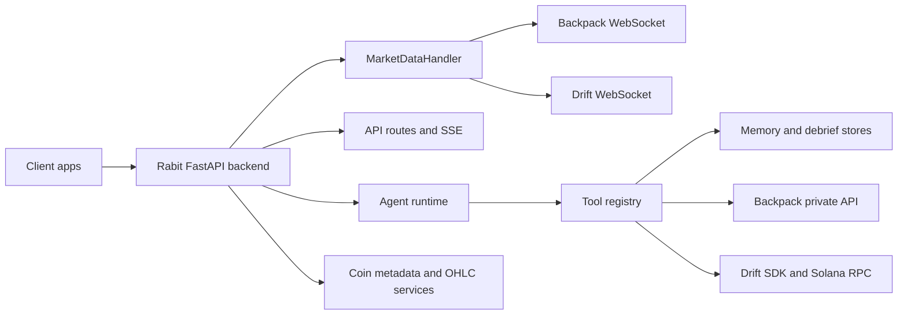
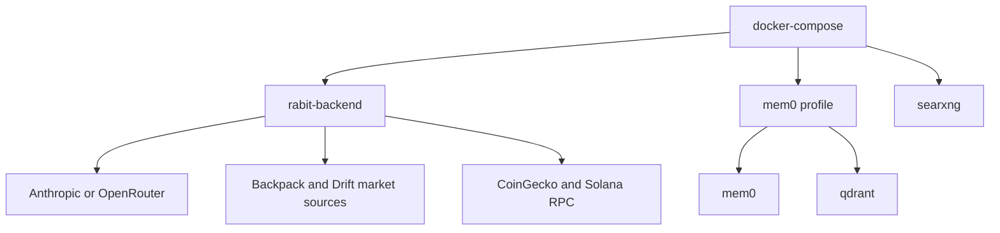

This page is the backend quickstart for the actual Rabit codebase.

It is the fastest way to understand:

- which services exist in the backend
- which environment variables really matter
- how to run the backend locally
- how to run it with Docker Compose
- which optional domains, such as memory and Drift read-only tooling, require extra setup

## What the backend actually contains

| Domain | What it does in the codebase |
| --- | --- |
| FastAPI API layer | exposes REST, SSE, and WebSocket endpoints from `main.py` and `api/routes.py` |
| agent runtime | handles routing, tool calling, streaming UI events, memory, and exchange-aware behavior |
| market-data layer | starts Backpack and Drift price streams, initializes tracked coin metadata, and serves live market state |
| exchange execution layer | supports Backpack credential-based reads/execution and Drift wallet-linked reads plus execution preparation |
| storage layer | persists uploads, exchange connections, wallet nonces, session cost, trade debriefs, and other lightweight JSON-backed stores |

## Runtime map



## Choose a backend run mode

| Mode | Best for | Notes |
| --- | --- | --- |
| local Python | day-to-day development and debugging | easiest for inspecting logs, editing code, and optionally installing Drift read-only dependencies |
| Docker Compose | cleaner team onboarding and service grouping | good for baseline backend plus optional memory stack |

## Environment variables that actually matter

You do not need to reason about every variable in `.env.example` on day one.

Start with these.

### Required baseline

| Variable | Required | Why it matters |
| --- | --- | --- |
| `ANTHROPIC_API_KEY` | yes, unless you use OpenRouter | default LLM provider used by the backend |
| `USE_OPENROUTER` | optional | set to `true` only if you want OpenRouter instead of Anthropic |
| `OPENROUTER_API_KEY` | required when `USE_OPENROUTER=true` | enables OpenRouter requests |
| `OPENROUTER_MODEL` | optional | chooses the OpenRouter model |
| `AUTH_JWT_SECRET` | yes | signs wallet-auth JWTs for mobile and protected API routes |

### Core runtime and market-data config

| Variable | Default in code | Why it matters |
| --- | --- | --- |
| `DRIFT_RPC_URL` | `https://api.mainnet-beta.solana.com` | Solana RPC used by Drift read-only and execution-preparation flows |
| `DRIFT_PROGRAM_ID` | mainnet Drift program | needed by the Drift integration |
| `PRICE_SOURCE` | `backpack` in `settings.py` | controls whether live prices come from Backpack, Drift, or both |
| `BACKPACK_ENABLED` | `true` | allows Backpack WebSocket price source |
| `TRADING_ASSETS` | tracked asset list in `settings.py` | controls the asset universe used across data and scanning flows |
| `WS_HOST` / `WS_PORT` | `0.0.0.0` / `8000` | backend host and port |

### Feature gates and user-scoped storage

| Variable | When you need it | Why it matters |
| --- | --- | --- |
| `BACKPACK_EXECUTION_ENABLED` | when testing live Backpack execution | enables Backpack execution tools and API flow |
| `DRIFT_EXECUTION_ENABLED` | when testing Drift execution preparation | enables Drift execution preparation flow |
| `EXCHANGE_CREDENTIALS_MASTER_KEY` | when using exchange connections | encrypts user Backpack credentials at rest |
| `MEMORY_TOOLS_ENABLED` | usually yes | enables long-term memory tools in the agent |
| `WEB_SEARCH_ENABLED` | usually yes | enables DuckDuckGo-backed search tools |

### Optional memory stack

| Variable | When you need it | Why it matters |
| --- | --- | --- |
| `MEM0_ENABLED` | when you want Mem0-backed memory server integration | activates external Mem0 behavior |
| `MEM0_HOST`, `MEM0_PORT`, `MEM0_URL`, `MEM0_API_KEY` | when running Mem0 | points the backend to the memory service |
| `OPENAI_API_KEY` | when running the Mem0 API server image from Compose | required by the Mem0 container itself |

### File-backed stores used by the backend

| Variable | Default path | What it stores |
| --- | --- | --- |
| `OPENROUTER_SESSION_COST_DB_PATH` | `data/openrouter_session_costs.json` | per-scope accumulated OpenRouter cost |
| `DRIFT_EXECUTION_REQUESTS_DB_PATH` | `data/drift_execution_requests.json` | prepared Drift execution requests |
| `EXCHANGE_CONNECTIONS_DB_PATH` | `data/exchange_connections.json` | encrypted exchange connection metadata |
| `TRADE_DEBRIEF_DB_PATH` | `data/trade_debriefs.json` | structured trade debrief entries |
| `WALLET_AUTH_NONCE_DB_PATH` | `data/wallet_auth_nonces.json` | wallet-auth nonce storage |

## Minimal `.env` for a real local run

```env
ANTHROPIC_API_KEY=your_key_here
AUTH_JWT_SECRET=replace_this_with_a_real_secret

PRICE_SOURCE=both
BACKPACK_ENABLED=true
TRADING_ASSETS=BTC,ETH,SOL,DOGE,BNB,SUI,APT,ARB,RENDER,XRP,INJ,LINK,PYTH,JTO,AVAX,WIF,JUP,TAO,KMNO,TNSR,DRIFT,RAY,HYPE,LTC,FARTCOIN

MEMORY_TOOLS_ENABLED=true
WEB_SEARCH_ENABLED=true
```

## Local Python quickstart

### 1. Create and activate a virtual environment

```bash
python -m venv venv
```

Windows:

```bash
venv\Scripts\activate
```

### 2. Install the main backend dependencies

```bash
pip install -r requirements.txt
```

### 3. Install optional Drift read-only dependencies if you need them

```bash
pip install -r requirements-drift-readonly.txt
```

This matters because the current `Dockerfile` installs only `requirements.txt`. The Drift read-only SDK stack is optional and handled separately in this repo.

### 4. Create `.env` from the example

```bash
copy .env.example .env
```

Then fill in the baseline variables from the tables above.

### 5. Start the backend

```bash
python main.py
```

The backend will:

1. start FastAPI
2. initialize tracked coin metadata
3. start configured price streams based on `PRICE_SOURCE`
4. expose the REST API, docs, SSE, and WebSocket endpoints

### 6. Open the local entry points

| URL | Purpose |
| --- | --- |
| `http://localhost:8000/docs` | Swagger UI |
| `http://localhost:8000/redoc` | ReDoc |
| `http://localhost:8000/api/health` | backend health |
| `http://localhost:8000/api/assets` | quick sanity check for data initialization |

## Docker Compose quickstart

### Service map



### What each Compose service does

| Service | Included by default | Role |
| --- | --- | --- |
| `rabit-backend` | yes | FastAPI app and main backend runtime |
| `mem0` | only with `--profile memory` | optional memory API server |
| `qdrant` | only with `--profile memory` | vector store for Mem0 |
| `searxng` | yes in Compose file, but not primary search path today | optional self-hosted search container; the current code primarily uses DuckDuckGo |

### 1. Build and start the backend container

```bash
docker compose up --build rabit-backend
```

### 2. Start the optional memory stack too

```bash
docker compose --profile memory up --build
```

### 3. Open the backend

| URL | Purpose |
| --- | --- |
| `http://localhost:8000/docs` | Swagger UI |
| `http://localhost:8000/api/health` | backend health |
| `http://localhost:8080` | Mem0 API when memory profile is enabled |
| `http://localhost:6333` | Qdrant API when memory profile is enabled |

## Docker-specific notes that matter

| Reality in the current repo | Why it matters |
| --- | --- |
| the Compose file mounts the repo into `/app` | source edits reflect inside the running backend container |
| the `Dockerfile` installs only `requirements.txt` | optional Drift read-only tooling is more complete in local Python unless you extend the image |
| the Compose file injects only a subset of `.env.example` variables | some advanced features still depend on your local `.env` choices and runtime data files |

## Recommended first backend sanity checks

| Check | What it proves |
| --- | --- |
| `GET /api/health` | FastAPI is running |
| `GET /api/assets` | coin metadata initialization worked |
| `POST /api/auth/wallet/nonce` | wallet auth flow is live |
| `POST /api/agent/chat` | agent runtime and model configuration are working |

## Practical recommendation

| If you want to... | Best path |
| --- | --- |
| inspect the codebase and iterate quickly | local Python |
| demo the main backend service boundaries cleanly | Docker Compose |
| use Drift read-only tooling with the least friction | local Python with `requirements-drift-readonly.txt` |

## Recommended next reading

| If you want... | Read |
| --- | --- |
| the product-level backend story | [Rabit Backend](/features) |
| the system architecture | [Architecture](/architecture) |
| the API contract | [API Overview](/api-reference/introduction) |
| the mobile integration path | [Quickstart Mobile](/getting-started/run/quickstart-mobile) |
