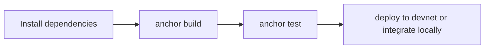

This quickstart follows the actual contract repo workflow and matches the current repository layout.

## What you need

| Requirement | Why it matters |
| --- | --- |
| Rust toolchain | compile the Solana program |
| Solana CLI | local validator, wallet management, and deployment |
| Anchor CLI | build, test, and deploy the program |
| Node.js and Yarn | run TypeScript tests and project scripts |
| Docker (optional) | use the containerized development workflow |

## Main repo commands

| Goal | Command |
| --- | --- |
| install JS dependencies | `yarn install` |
| build program | `anchor build` or `npm run build` |
| run tests | `anchor test` or `npm run test` |
| run tests without validator | `anchor test --skip-local-validator` or `npm run test:unit` |
| deploy to devnet | `anchor deploy --provider.cluster devnet` or `npm run deploy:devnet` |
| deploy to mainnet | `anchor deploy --provider.cluster mainnet-beta` or `npm run deploy:mainnet` |

## Standard local path



### 1. Install dependencies

```bash
yarn install
```

### 2. Build the program

```bash
anchor build
```

If you want to regenerate the IDL directly from the program crate:

```bash
cd programs/rabit-contract
anchor idl build -o ../../target/idl/rabit_contract.json
anchor idl type ../../target/idl/rabit_contract.json -o ../../target/types/rabit_contract.ts
```

### 3. Run the tests

```bash
anchor test
```

The current suite is an off-chain integration suite: it talks to a local validator, invokes real instructions, and validates account state transitions from TypeScript.

### 4. Deploy when ready

```bash
anchor deploy --provider.cluster devnet
```

Before testing or deploying, make sure the global Solana config points to a real wallet path:

```bash
solana config get
```

## Docker path

| Goal | Command |
| --- | --- |
| build containers | `docker-compose build` |
| start containers | `docker-compose up -d` |
| stop containers | `docker-compose down` |
| open shell | `docker-compose exec solana-dev /bin/bash` |
| view logs | `docker-compose logs -f` |

## Read this next

- [/contract/index](/contract/index)
- [/contract/architecture](/contract/architecture)
- [/contract/deployment](/contract/deployment)
- [/contract/security](/contract/security)
