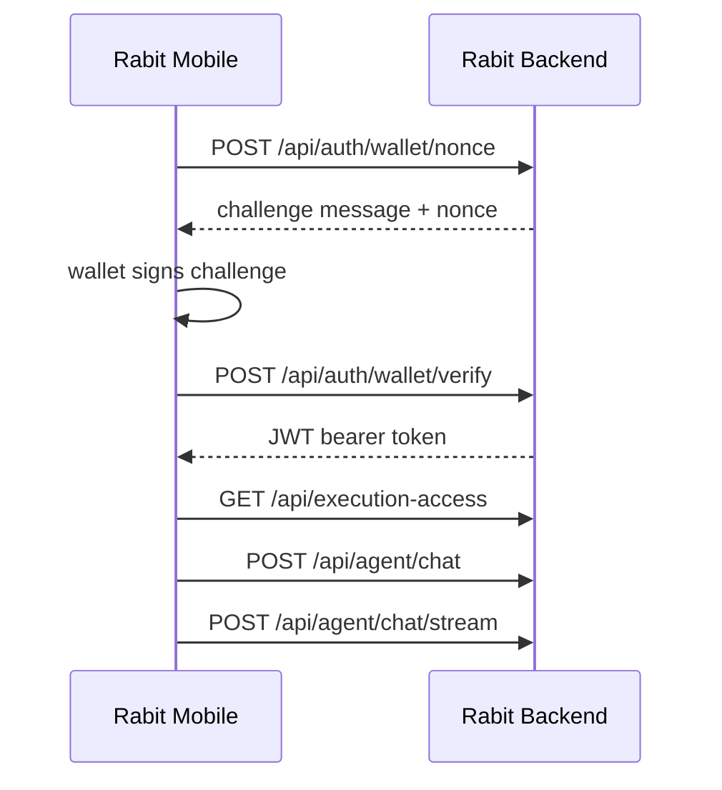

This is the most practical quickstart track today if you want to understand how a Rabit mobile client talks to the backend.

The mobile flow is:

1. connect a wallet
2. request a sign-in challenge
3. verify the signature and store the bearer token
4. call protected backend routes for chat, execution access, and account-aware features

## Flow overview



## 1. Request a wallet sign-in challenge

```ts
const nonceResponse = await fetch("http://localhost:8000/api/auth/wallet/nonce", {
  method: "POST",
  headers: {
    "Content-Type": "application/json",
  },
  body: JSON.stringify({
    wallet_address: publicKey.toBase58(),
  }),
});

const noncePayload = await nonceResponse.json();
```

## 2. Sign the backend challenge

```ts
const encoder = new TextEncoder();
const messageBytes = encoder.encode(noncePayload.message);

const signatureBytes = await wallet.signMessage(messageBytes);
const signatureBase64 = Buffer.from(signatureBytes).toString("base64");
```

## 3. Verify the signature and get a bearer token

```ts
const verifyResponse = await fetch("http://localhost:8000/api/auth/wallet/verify", {
  method: "POST",
  headers: {
    "Content-Type": "application/json",
  },
  body: JSON.stringify({
    wallet_address: publicKey.toBase58(),
    message: noncePayload.message,
    signature: signatureBase64,
  }),
});

const verifyPayload = await verifyResponse.json();
const accessToken = verifyPayload.access_token;
```

## 4. Read execution access state

```ts
const executionAccessResponse = await fetch("http://localhost:8000/api/execution-access", {
  headers: {
    Authorization: `Bearer ${accessToken}`,
  },
});

const executionAccess = await executionAccessResponse.json();
```

This lets the mobile client render one product-level execution state even though:

- Backpack uses API credentials
- Drift uses wallet-linked execution authority

## 5. Send a normal agent chat request

```ts
const chatResponse = await fetch("http://localhost:8000/api/agent/chat", {
  method: "POST",
  headers: {
    "Content-Type": "application/json",
    Authorization: `Bearer ${accessToken}`,
  },
  body: JSON.stringify({
    scope_id: "mobile-demo-session",
    message: "Check BTC and tell me what matters right now",
    market_context: {
      symbols: ["BTC"],
    },
  }),
});

const chatPayload = await chatResponse.json();
```

## 6. Open a streaming chat request

```ts
const streamResponse = await fetch("http://localhost:8000/api/agent/chat/stream", {
  method: "POST",
  headers: {
    "Content-Type": "application/json",
    Authorization: `Bearer ${accessToken}`,
  },
  body: JSON.stringify({
    scope_id: "mobile-demo-session",
    message: "Give me a fast market update for SOL and BTC",
  }),
});

const reader = streamResponse.body?.getReader();
const decoder = new TextDecoder();

while (reader) {
  const { done, value } = await reader.read();
  if (done) break;
  const chunk = decoder.decode(value, { stream: true });
  console.log(chunk);
}
```

## What this quickstart proves

With only these calls, a mobile client can already:

- authenticate with a wallet
- resolve the active Rabit user identity
- read unified execution access
- send normal agent requests
- consume streaming agent output

## Recommended next reading

- [Rabit Mobile](/mobile)
- [Auth Architecture](/api-reference/auth)
- [Agent API](/api-reference/agent)
- [Exchange Connections API](/api-reference/exchange-connections)
