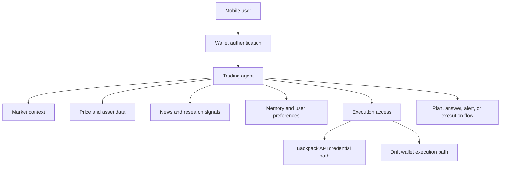
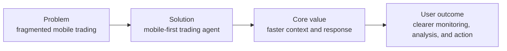

Rabit is a mobile-first trading agent built to help users stay responsive to the market.

Instead of treating trading as a set of disconnected screens, Rabit treats it as a continuous decision problem.

The product brings together market monitoring, contextual reasoning, execution readiness, and wallet-native identity in one system that is designed to work where many users actually trade and monitor most often: on mobile.

The result is something closer to a responsive decision layer than a typical trading app.

## The problem

Most trading flows are still fragmented.

Users usually have to jump between:

- charts
- exchange apps
- X and Telegram
- news feeds
- notes
- portfolio screens

That makes trading more reactive than intentional.

By the time a user connects the dots across price, news, risk, and execution, the market may already have moved.

Traditional trading apps are often very good at showing data, but much weaker at helping users synthesize changing conditions across several inputs at once.

They show:

- prices
- charts
- balances
- order forms

but they rarely help answer the harder question:

what matters right now, and what should the user do with that information?

On mobile, that problem becomes worse:

- attention is limited
- context is easy to lose
- switching apps breaks flow
- fast-moving conditions are harder to interpret in time

That gap between raw information and usable judgment is the core problem Rabit is trying to solve.

## The solution

Rabit acts as a trading agent that runs in a mobile-first product experience.

Instead of only showing market data, it helps the user interpret what is changing and what matters right now.

The product is designed to make trading more responsive to current conditions by combining:

- market context
- live and recent signal inputs
- user intent
- execution availability

into one adaptive interaction layer.

In practice, that means Rabit can move between several product roles without forcing the user to change tools:

- monitoring what is moving
- explaining why it matters
- helping frame a trade setup
- showing whether execution is currently available
- preparing the next step in a clearer way

## What makes Rabit different

Rabit is not just:

- a charting tool
- an exchange wrapper
- a price alert app
- or a generic chatbot

It is built around the idea that the user needs help connecting information and action quickly.

That means Rabit can sit between raw market inputs and trading decisions.

This is important because speed in trading is not only about order placement.

It is also about:

- noticing relevant change earlier
- keeping the right context in memory
- reducing the delay between interpretation and response
- avoiding unnecessary app and mental switching

## How Rabit works

At a high level:

1. the user opens Rabit on mobile
2. Rabit understands the user through wallet-based identity and session context
3. the agent combines market context, prices, news, and user preferences
4. Rabit responds with analysis, setup guidance, monitoring insight, or execution-related flow

That flow is intentionally designed so the user does not need to manually stitch together every part of the market picture each time conditions change.

## Why now

Crypto markets move quickly, but user context still breaks too easily.

In many products, the user can access more data than ever, while still having to do most of the interpretation work alone.

At the same time, wallet-native applications, exchange APIs, and agent tooling are now mature enough to support a product that can do more than display information.

Rabit exists because the infrastructure is now ready for a more context-aware trading layer.

## Why this matters on mobile

Mobile users do not need more fragmented widgets.

They need a system that helps them answer questions such as:

- what changed
- why it matters
- whether it affects my current setup
- what I should pay attention to next

Rabit is designed to reduce that gap between signal and action.

That mobile-first focus is not just a design preference.

It changes the product philosophy:

- the answer needs to be concise enough to act on
- context needs to survive short attention windows
- execution state needs to be obvious
- the system must help the user prioritize, not only browse

## Why it matters for the Solana ecosystem

Rabit is meaningful for Solana because it is designed around wallet-native identity and exchange-aware flows.

That matters for three reasons:

- the user identity model fits crypto-native products better than traditional account-centric apps
- Drift and Solana-native execution paths can be integrated in a way that respects wallet authority
- users get a more context-aware layer on top of trading infrastructure rather than another isolated interface

Rabit is not trying to replace the ecosystem.

It is trying to make the ecosystem easier to navigate in fast-moving moments.

For the Solana ecosystem specifically, that makes Rabit useful as a coordination layer:

- it respects wallet-based identity
- it can work with exchange-specific execution models like Drift and Backpack
- it helps translate ecosystem activity into something actionable for end users

## Mission

Rabit's mission is to make trading more responsive, contextual, and actionable.

The goal is not only to help users see the market.

The goal is to help them understand it sooner and react with more clarity.

That mission matters because better trading tools are not only about more data or more speed in isolation.

They are about making better reactions possible under pressure.

## What users get from Rabit

Users benefit from:

- one place to monitor assets, prices, and news
- faster interpretation of market changes
- more adaptive trading guidance
- execution-aware workflows instead of disconnected analysis
- a mobile-first experience that keeps context together

For judges or technical reviewers, the important point is that these benefits are not only a UX claim. They are backed by concrete backend systems:

- a wallet-native auth layer
- a tool-enabled trading agent
- OpenAPI-backed API reference
- exchange-specific execution paths
- streaming and WebSocket market data infrastructure

## Why Rabit is interesting

Rabit combines several layers that are usually separate:

- wallet-based identity
- agent reasoning
- market and news context
- exchange-specific execution models
- session-aware cost tracking
- real-time and streaming interfaces

That makes it more than a dashboard and more than a chat product.

It is a coordinated trading assistant system.

That coordination is what makes it interesting:

- the agent layer is adaptive
- the execution layer understands that Backpack and Drift are not the same authority model
- the market layer can support real-time monitoring
- the mobile flow keeps the user closer to action when market conditions change

## Product snapshot

## Where to go next

<CardGroup cols={2}>
  <Card title="Getting started" icon="rocket" href="/getting-started">
    See the recommended reading path for judges, builders, and integrators.
  </Card>
  <Card title="Quickstart" icon="rectangle-terminal" href="/getting-started/run/quickstart">
    Run the Rabit backend and docs locally.
  </Card>
  <Card title="API overview" icon="terminal" href="/api-reference/introduction">
    See how authentication, agent flows, execution, and assets are exposed.
  </Card>
  <Card title="API architecture" icon="sitemap" href="/api-reference/design">
    Understand the backend design choices behind Rabit.
  </Card>
  <Card title="Auth architecture" icon="shield-check" href="/api-reference/auth">
    See how wallet auth becomes product identity and protected execution state.
  </Card>
</CardGroup>
