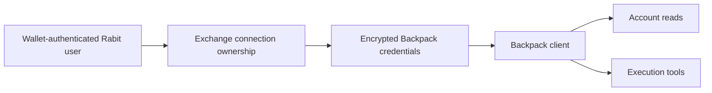

Backpack is the exchange integration in Rabit that is closest to a conventional backend trading model.

That makes it important for two reasons:

- it is the clearest path from backend logic into authenticated exchange operations
- it gives Rabit a practical execution surface that users can actually connect and use

## Why Backpack exists in Rabit

Backpack is the backend-side exchange path where Rabit can most directly support:

- account reads
- portfolio state
- order workflows
- live execution when gates allow it

This makes Backpack the most straightforward execution bridge in the current system.

## What Rabit gets from Backpack

| Capability | What Backpack enables |
| --- | --- |
| account visibility | balances, collateral, positions, open orders, and history |
| execution | place and cancel order flows |
| ownership model | per-user encrypted credential storage |
| product readiness | a backend path that feels operationally real, not hypothetical |

## Why Backpack is different from Drift

Backpack is credential-based.

That means the backend can safely work with:

- encrypted API keys and secrets
- authenticated REST calls
- exchange-scoped execution behavior

This is very different from Drift, where authority is much closer to wallet identity and signer design.

## Integration model

## Security and storage model

| Layer | What Rabit does |
| --- | --- |
| app identity | uses wallet auth to know which user owns the connection |
| credential storage | encrypts Backpack API credentials at rest |
| execution gating | requires backend and request-level execution readiness |
| API usage | signs Backpack requests server-side using the stored credentials |

## Current product status

| Area | Status |
| --- | --- |
| encrypted credential storage | implemented |
| exchange connection CRUD | implemented |
| read-only account tools | implemented |
| place and cancel order tools | implemented |
| execution gating | implemented |
| production hardening such as fuller approval/audit flow | still evolving |

## Why this matters for judges

Backpack is the clearest proof that Rabit is not only “assistant logic.”

It shows that the backend can:

- authenticate a user
- resolve ownership
- read real account state
- expose execution-aware behavior

That makes the product story much more concrete.

## Read this with

- [API Key Flow and Storage](./api-key-flow-and-storage)
- [Exchange Execution](/features/execution)
- [Exchange Connections API](/api-reference/exchange-connections)
- [Backpack WebSocket](/websocket/backpack)

