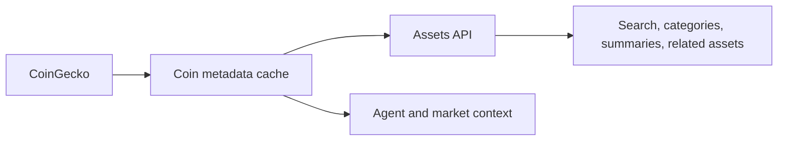

CoinGecko is the asset-metadata side of Rabit.

It matters because a trading product needs more than price alone. It also needs enough asset context to support discovery, category views, and detail pages.

## Why CoinGecko exists in Rabit

CoinGecko gives the backend a practical source for:

- asset names
- descriptions
- categories
- links and metadata

That turns the product into more than a list of tickers.

## What Rabit gets from CoinGecko

| Capability | What it enables |
| --- | --- |
| asset metadata | more useful asset detail pages |
| categorization | category filters and related-asset experiences |
| enrichment | stronger context for both UI and agent workflows |
| cached persistence | less refetching and better operational stability |

## Integration model

## Current product status

| Area | Status |
| --- | --- |
| coin metadata cache | implemented |
| asset detail enrichment | implemented |
| asset search and categories | implemented |
| related assets and summary surfaces | implemented |

## Why this matters for judges

CoinGecko is a good example of how Rabit uses integrations to improve product quality, not only backend connectivity.

The integration helps Rabit feel richer in day-to-day use by making asset surfaces more contextual and less raw.

## Read this with

- [Integration](./integration)
- [Assets API](/api-reference/assets)
- [Data Layer](/architecture/data-layer)

