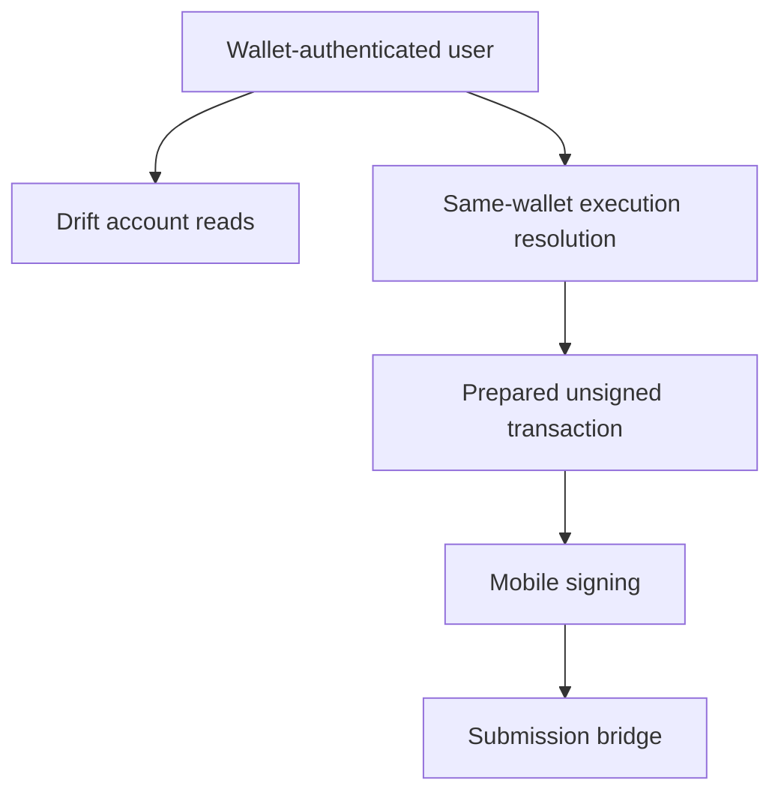

Drift is Rabit’s Solana-native execution path.

It matters because it forces the backend to respect a very different authority model from Backpack.

## Why Drift exists in Rabit

Drift is the exchange path that makes Rabit more aligned with Solana-native product behavior.

It gives the system:

- wallet-linked account reads
- same-wallet execution preparation
- a future path toward session-key or delegated execution

## What Rabit gets from Drift

| Capability | What Drift enables |
| --- | --- |
| account-aware reads | balances, collateral, orders, positions, and history |
| wallet-native execution direction | same-wallet prepare/submit flow |
| Solana alignment | execution authority stays close to wallet identity |
| future architecture path | supports thinking about session keys and delegated models |

## Why Drift is harder than Backpack

Drift is not a normal API credential integration.

The backend cannot honestly pretend that a wallet-based execution model is the same as storing an exchange API secret.

That is why the current direction is intentionally more disciplined:

| Design choice | Why Rabit uses it |
| --- | --- |
| strong read-only coverage first | useful product surface before pushing into risky automation |
| same-wallet execution preparation | keeps execution aligned with verified wallet identity |
| no backend-held signer by default | avoids pretending custody risk is free |
| session-key direction kept architectural for now | leaves room for safer seamless execution later |

## Integration model

## Current product status

| Area | Status |
| --- | --- |
| private read-only account tools | implemented |
| balances, collateral, orders, positions, history | implemented |
| same-wallet execution prepare/submit path | implemented |
| agent execution tools for Drift | implemented as preparation-oriented flows |
| linked-wallet or delegated execution | not yet the default path |
| backend-held signer model | intentionally not the default |

## Why this matters for judges

Drift is where Rabit proves it understands crypto-native authority instead of flattening everything into a fake “trade now” button.

That makes the backend more credible, because it preserves the real distinctions between:

- exchange credentials
- wallet authority
- execution safety
- user trust

## Read this with

- [Auth and Execution Wallet](./auth-and-execution-wallet)
- [Read-Only Setup](./read-only-setup)
- [Signer Architecture](./signer-architecture)
- [Wallet Flow and Storage](./wallet-flow-and-storage)
- [Drift API Architecture](/api-reference/drift)

