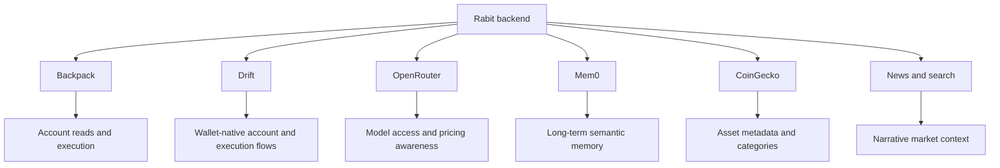

Rabit depends on real external systems. This section explains those systems from the provider side.

## What this section explains

If `Features` explains what the backend can do, `Integrations` explains what outside services make that possible.

This is where you go to understand:

| Integration concern | Why it matters |
| --- | --- |
| auth models | different providers use different trust boundaries |
| storage models | some integrations need encrypted state, some need cache-like persistence |
| SDK and provider assumptions | external services shape what the backend can and cannot do |
| provider-specific operational detail | each integration has its own setup and runtime trade-offs |

## Integration families

| Integration | Why it exists in Rabit |
| --- | --- |
| Backpack | credential-based exchange reads and execution |
| Drift | wallet-native, Solana-aligned execution and account access |
| OpenRouter | model routing, pricing metadata, and session cost accounting |
| Mem0 | durable semantic memory |
| CoinGecko | asset metadata and categorization |
| News and web search | narrative context around market changes |

## How these integrations fit together

## Why this matters

This section shows that Rabit is built around real provider boundaries, not just high-level concepts.

| Boundary | Why it matters |
| --- | --- |
| Backpack is not the same as Drift | exchange authority models are genuinely different |
| memory is not the same as request context | persistent recall and active screen context solve different problems |
| pricing metadata is not the same as chat output | model infrastructure is treated as an operational layer, not hidden behind the UI |

## Read this with

- [Backpack](./backpack)
- [Drift](./drift)
- [OpenRouter](./openrouter)
- [Mem0](./mem0)
- [CoinGecko](./coingecko)

