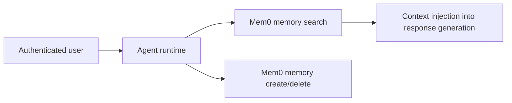

Mem0 is the long-term semantic memory layer in Rabit.

It matters because a trading assistant becomes more useful when it can remember durable user-level information across sessions.

## Why Mem0 exists in Rabit

Conversation persistence alone is not enough.

Rabit also needs a layer for:

- durable preferences
- user-specific facts
- semantically retrievable context

That is the role of Mem0.

## What Rabit gets from Mem0

| Capability | What it enables |
| --- | --- |
| long-term semantic memory | the assistant can remember useful user information across sessions |
| retrieval-oriented recall | memory can be searched instead of only replayed as transcript history |
| memory CRUD behavior | create, search, list, and delete flows become explicit product features |

## Why Mem0 is different from conversation history

| Layer | What it stores |
| --- | --- |
| conversation persistence | transcript-like session history |
| Mem0 | durable semantic memory and recallable user facts |

This distinction matters because not every useful fact belongs in a chat transcript forever.

## Integration model

## Current product status

| Area | Status |
| --- | --- |
| health check | implemented |
| create memory | implemented |
| search memory | implemented |
| list memory | implemented |
| delete memory | implemented |
| system prompt memory injection | implemented when user identity is available |

## Why this matters for judges

Mem0 is one of the clearest signs that Rabit is trying to feel like a long-lived assistant instead of a stateless chat endpoint.

It gives the backend a way to stay personal and persistent without pretending raw transcript history is enough.

## Read this with

- [Integration](./integration)
- [Memory and Context](/features/memory)
- [Memory API](/api-reference/memory)

