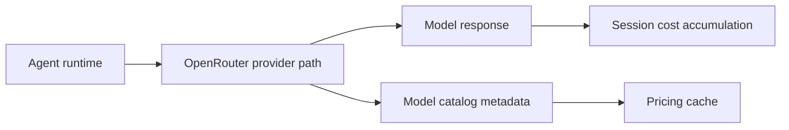

OpenRouter is the model-infrastructure side of Rabit when OpenRouter mode is enabled.

It matters because it gives the backend more than just model access. It also gives Rabit a pricing and catalog layer that can be used operationally.

## Why OpenRouter exists in Rabit

Rabit needs a model layer that can support:

- multiple model providers
- provider-level model metadata
- pricing visibility
- session cost accounting

OpenRouter gives the backend a practical abstraction for those needs.

## What Rabit gets from OpenRouter

| Capability | What it enables |
| --- | --- |
| model routing | switch or compare supported model options |
| model catalog | store model metadata such as pricing and capability support |
| pricing awareness | estimate usage cost per session or scope |
| caching | avoid re-fetching model metadata unnecessarily |

## Why this matters to the product

OpenRouter is not only a backend implementation detail.

It supports a product direction where Rabit can:

- choose appropriate model paths
- expose model-aware operational behavior
- support pay-as-you-go cost accounting

## Integration model

## Current product status

| Area | Status |
| --- | --- |
| OpenRouter-backed chat path | implemented |
| model catalog storage | implemented |
| pricing and capability metadata | implemented |
| caching | implemented |
| per-session cost accumulation by `scope_id` | implemented |

## Why this matters for judges

This integration shows that Rabit is thinking beyond “use an LLM.”

It treats model usage as an operational layer with:

- explicit model selection
- cached metadata
- pricing awareness
- session-level cost tracking

That makes the backend more realistic as a product foundation.

## Read this with

- [Integration](./integration)
- [Models](./models)
- [Caching](./caching)
- [Models API](/api-reference/models)

