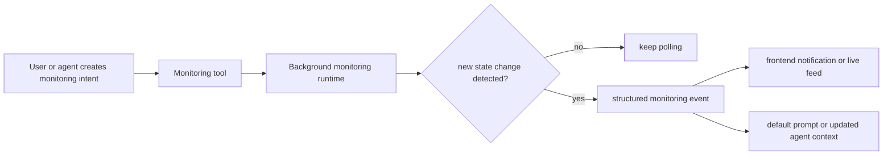

Monitoring is the background-awareness layer in Rabit.

It exists for one reason: some user intents should stay alive after the first answer.

That includes cases like:

- keep watching a trade setup
- tell me when a level validates or invalidates
- keep polling news and surface fresh headlines
- convert background state changes into a frontend notification or the next agent prompt

## Monitoring families

| Monitoring family | What it watches | Main output | Why it exists |
| --- | --- | --- | --- |
| Price monitoring | live market price against validation and invalidation thresholds | `price_alert_triggered` event, alert state, monitoring stats | lets Rabit follow trade setups after the user defines them |
| News monitoring | fresh headlines matching tracked assets or keyword sets | `news_update` event, asset headline tail, monitoring stats | lets Rabit surface new catalyst information instead of relying only on on-demand search |

## All monitoring tools

| Tool | Monitoring family | Useful for | How it works |
| --- | --- | --- | --- |
| `add_price_alert` | Price | register a validation and invalidation setup | stores an alert with symbol, direction, thresholds, and optional trade metadata |
| `remove_price_alert` | Price | stop tracking one setup | removes one alert by `alert_id` |
| `list_price_alerts` | Price | inspect active or triggered setups | reads all current alert objects from the price monitor runtime |
| `get_price_alert` | Price | inspect one setup in detail | reads one alert by `alert_id` |
| `get_price_monitor_stats` | Price | inspect monitoring runtime health | returns running state, alert counts, and check counts |
| `start_price_monitor` | Price | begin live threshold monitoring | starts the background polling loop that checks prices repeatedly |
| `stop_price_monitor` | Price | pause live threshold monitoring | stops the polling loop |
| `start_news_monitoring` | News | begin background headline polling | starts the news monitor with keyword tracking and optional AI review |
| `stop_news_monitoring` | News | pause headline polling | stops the news monitor loop |
| `get_monitoring_status` | News | inspect news monitor health and keyword set | returns running state, tracked keywords, review mode, and headline statistics |

## How monitoring fits into Rabit

## What monitoring is for

| Product need | Monitoring answer |
| --- | --- |
| "watch this setup for me" | price monitoring stores and checks trade thresholds in the background |
| "tell me when this becomes invalid" | price monitoring turns threshold hits into explicit trigger events |
| "keep me aware of fresh catalysts" | news monitoring keeps polling recent public headlines |
| "give the app something actionable when it triggers" | monitoring emits structured payloads that frontend and orchestrators can reuse |

## Monitoring outputs that matter to the client

| Output surface | What the client gets |
| --- | --- |
| `price_alert_triggered` | symbol, trigger type, trigger price, trigger time, trade metadata, and `default_prompt` |
| `news_update` | grouped headline update batch, impact counts, and review metadata |
| monitor stats tools | current runtime state without waiting for the next trigger |

## Breakdown by monitoring family

| If you want to understand... | Read |
| --- | --- |
| trade validation and invalidation workflows | [Price Monitoring](/monitoring/price) |
| background news polling and live headline updates | [News Monitoring](/monitoring/news) |
