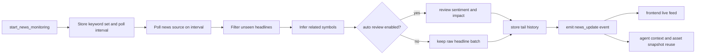

News monitoring is the catalyst-tracking layer in Rabit.

It is used when the product should keep watching the outside world instead of relying only on one on-demand search result.

## What news monitoring is for

| Use case | What Rabit does |
| --- | --- |
| keep polling fresh news for tracked assets | repeatedly searches for new headlines using keyword and symbol-oriented matching |
| surface live updates in the app | emits `news_update` events to subscribers |
| keep a short headline tail per asset | stores recent history so the app and agent can reuse it |
| enrich the agent with recent headlines | supports asset-specific news snapshots and `market_context.news_context.tail_titles` |

## News monitoring tools

| Tool | Useful for | How it works |
| --- | --- | --- |
| `start_news_monitoring` | start background headline polling | configures keyword list, poll interval, and launches the monitor loop |
| `stop_news_monitoring` | stop headline polling | stops the background loop |
| `get_monitoring_status` | inspect news monitor health | returns running state, tracked keywords, review mode, and counts |

## How news monitoring works

## Tool breakdown in detail

| Tool | Input shape | Output shape | What the output is used for |
| --- | --- | --- | --- |
| `start_news_monitoring` | optional keyword string and poll interval | started state, tracked keywords, auto-review flag | enables live news monitoring for the current runtime |
| `stop_news_monitoring` | no input | stopped state and monitor stats | cleanly pauses polling |
| `get_monitoring_status` | no input | running state, keyword set, review mode, and counts | shows whether the monitor is actually alive and what it is watching |

## Runtime outputs

| Output | Meaning | Why it matters |
| --- | --- | --- |
| `news_update` | a new batch of headlines detected by the monitor | lets the app update a live feed without waiting for manual refresh |
| `general_history` | rolling global headline tail | supports global recent-headline views |
| `asset_history` | rolling per-symbol headline tail | supports asset-specific news cards and agent context |
| review metadata | sentiment, impact, recommendation, or fallback analysis | gives the app a first-pass prioritization signal |

## What the monitor tracks internally

| Internal state | What it does |
| --- | --- |
| `keywords` | defines which headline patterns should be searched repeatedly |
| `seen_urls` | prevents re-sending the same article again and again |
| `tracked_symbols` | maps keyword and headline matches back to supported assets |
| `general_history` | keeps a short rolling headline history across all news |
| `asset_history` | keeps a short rolling history per asset symbol |

## Failure handling

| Failure type | How it behaves | What the client or agent should expect |
| --- | --- | --- |
| provider fetch failure | returns no new articles for that poll iteration | monitoring keeps running and tries again on the next cycle |
| review callback failure | article is still kept, often with fallback or error review metadata | live feed still updates even if AI review is degraded |
| duplicate headline detection | duplicate URLs are skipped | subscribers only get genuinely new items |
| broadcast failure | dead subscribers are removed | the monitor keeps running for healthy subscribers |

## Why this matters in Rabit

News monitoring gives Rabit a background sense of catalyst flow.

That matters because the product is not only trying to answer "what is the price now", but also "what changed that might make the user care now".

It is what allows:

- live news feeds in the client
- recent headline tails per asset
- fresh-news context injected back into the agent turn
