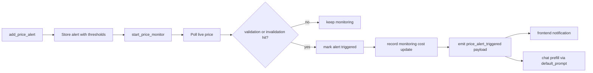

Price monitoring is the setup-tracking layer in Rabit.

It is meant for moments where a one-time answer is not enough and the user really means:

- keep this trade idea alive
- tell me when this setup validates
- tell me when this setup breaks

## What price monitoring is for

| Use case | What Rabit does |
| --- | --- |
| watch a breakout setup | stores validation and invalidation levels and keeps polling live price |
| track a stop-loss style invalidation | marks the setup as broken when price crosses the invalidation threshold |
| trigger a frontend notification | emits a structured event when the threshold is hit |
| prefill the next agent prompt | returns `default_prompt` in the trigger payload so the client can reuse it directly |

## Price monitoring tools

| Tool | Useful for | How it works |
| --- | --- | --- |
| `add_price_alert` | create a new monitored setup | saves symbol, direction, validation price, invalidation price, exchange, and optional trade metadata |
| `remove_price_alert` | stop monitoring one setup | deletes one alert by `alert_id` |
| `list_price_alerts` | see all monitored setups | returns active and triggered alerts from the runtime store |
| `get_price_alert` | inspect one setup | returns one stored alert with trigger state and prompt info |
| `get_price_monitor_stats` | check monitor health | returns running state, alert counts, and number of price checks |
| `start_price_monitor` | start background monitoring | starts the polling loop that checks live prices repeatedly |
| `stop_price_monitor` | pause background monitoring | stops the polling loop |

## Monitoring cost

Price monitoring is now priced separately from model usage.

| Cost field | What it means |
| --- | --- |
| `alert_setup_cost_usd` | charged when a new alert is created |
| `monitoring_cost_usd` | charged from active symbol-hours while the alert stays alive |
| `trigger_cost_usd` | charged when the alert actually triggers |
| `total_cost_usd` | combined monitoring cost for the scope |

Default backend pricing in this codebase:

| Config | Default |
| --- | --- |
| `ALERT_SETUP_COST_USD` | `0.001` |
| `MONITORING_COST_PER_SYMBOL_HOUR_USD` | `0.002` |
| `ALERT_TRIGGER_COST_USD` | `0.0005` |

## How price monitoring works

## Trigger event payload

| Field | Meaning | Why it matters |
| --- | --- | --- |
| `alert_id` | unique alert reference | lets the client map the trigger back to a stored setup |
| `symbol` | tracked asset | tells the client which market moved |
| `direction` | `LONG` or `SHORT` | makes the setup semantics explicit |
| `exchange` | monitored exchange source | shows which price feed produced the trigger |
| `trigger_type` | `VALIDATION` or `INVALIDATION` | tells the client whether the setup confirmed or broke |
| `trigger_price` | actual detected price | provides the real crossing value |
| `trigger_time` | trigger timestamp | lets the app tell recent hits from older ones |
| `trade_label` / `trade_id` / `setup_id` | optional trade references | makes the trigger usable in product workflows |
| `default_prompt` | ready-to-send prompt text | lets the frontend prefill chat or automation immediately |

## Example default prompts

| Trigger branch | Example |
| --- | --- |
| validation | `Trade A hit validation price at $95,000.00 on DRIFT for BTC.` |
| invalidation | `SOL breakout setup hit invalidation price at $142.50 on BACKPACK for SOL.` |

## Tool breakdown in detail

| Tool | Input shape | Output shape | What the output is used for |
| --- | --- | --- | --- |
| `add_price_alert` | symbol, thresholds, direction, exchange, optional trade metadata | alert id, monitoring summary, preview prompts | register the setup and preview the automation copy |
| `remove_price_alert` | alert id | success or not-found result | stop tracking a setup |
| `list_price_alerts` | optional `active_only` flag | active and triggered alert list | render setup lists in the app |
| `get_price_alert` | alert id | one alert object | inspect one setup in detail |
| `get_price_monitor_stats` | no input | runtime counters and running state | diagnose whether the monitor is actually alive |
| `start_price_monitor` | no input | started state and poll interval | enable background checks |
| `stop_price_monitor` | no input | stopped state | disable background checks |

## Failure handling

| Failure type | How the tool behaves | What the agent or client should do |
| --- | --- | --- |
| invalid symbol, direction, or exchange | returns structured validation failure | correct the setup input instead of guessing |
| invalid numeric thresholds | returns structured validation failure | ask for real price levels |
| alert id not found | returns structured not-found failure | refresh from `list_price_alerts` |
| monitor start/stop problem | returns runtime failure | explain that background monitoring is not active |
| event delivery problem | trigger state is still persisted even if broadcast fails | recover from `get_price_alert` or `list_price_alerts` |

## Why this matters in Rabit

Price monitoring turns Rabit from a one-turn assistant into a setup watcher.

That is especially important on mobile, where the user often wants the next meaningful change pushed back into the product instead of manually checking the chart again and again.
