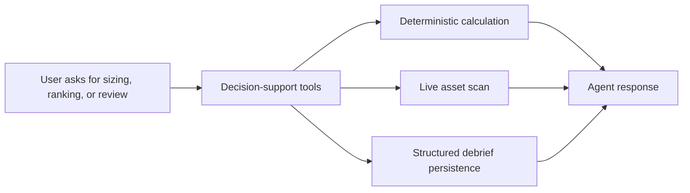

Decision-support tools exist for workflows where Rabit should be more structured than a normal chat answer.

This is the family for outputs that should feel repeatable, auditable, and easier to trust.

## Full coverage

| Tool | What it does | Where the value comes from | Failure model |
| --- | --- | --- | --- |
| `calculate_position_size` | computes position size from entry, stop, and risk budget | pure deterministic formula logic | raises validation error on invalid prices, side, or missing risk inputs |
| `scan_markets` | ranks the tracked asset universe | tracked assets, `market_context`, market service, live price data | invalid sort/bias raises; per-asset failures are skipped rather than crashing the scan |
| `create_trade_debrief` | stores a structured post-trade review | trade debrief service + authenticated `user_id` | raises when the request has no active user or persistence fails |

## How this family fits into the product

## Why this family exists

| Workflow | Why conversation alone is not enough |
| --- | --- |
| position sizing | users expect the same input to produce the same output |
| market scanning | ranking should come from current signals instead of arbitrary model preference |
| trade debrief | post-trade review becomes more valuable when stored in a consistent structure |

## Error handling and agent behavior

| Tool | Internal handling | What the agent should do |
| --- | --- | --- |
| `calculate_position_size` | hard-fails on invalid inputs such as zero prices or missing risk budget | ask for corrected inputs instead of improvising a number |
| `scan_markets` | validates sorting/bias, but quietly skips individual assets that fail during fetch | return the matched universe and mention that the scan is over tracked assets only |
| `create_trade_debrief` | requires active user identity and valid storage path | explain that debrief persistence requires an authenticated user context |

## Why this family matters

These tools are where Rabit becomes more dependable for real trading workflows.

They reduce the gap between:

- a helpful explanation
- and a structured output the user can actually act on or save

## Related docs

| If you want... | Read |
| --- | --- |
| the storage used by debriefs | [Data Layer](../architecture/data-layer) |
| how this connects to memory | [Memory and Context](../features/memory) |
| the runtime that chooses these tools | [Agent Platform](../features/agent) |
