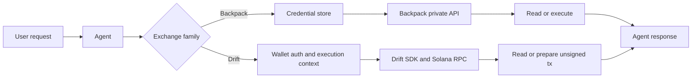

Execution tools are the tools that connect Rabit to account state and order workflows.

This is the family where the difference between Backpack and Drift matters the most.

## Why the two exchanges are not the same

| Exchange | Authority model | What the backend can do |
| --- | --- | --- |
| Backpack | API key + secret stored in encrypted exchange connection storage | read private account state and place/cancel orders server-side |
| Drift | authenticated wallet identity plus same-wallet execution preparation | read private account state and prepare unsigned execution payloads for client signing |

Because of that, Rabit cannot treat the two exchanges as one generic “trade API”.

## Full execution coverage

### Backpack tools

| Tool | Purpose | Main value source | Common failure modes |
| --- | --- | --- | --- |
| `backpack_get_balances` | read balances | Backpack private API | missing active connection, bad credentials, API failure |
| `backpack_get_collateral` | read collateral | Backpack private API | missing active connection, API failure |
| `backpack_get_open_orders` | read open orders | Backpack private API | missing active connection, API failure |
| `backpack_get_order_history` | read order history | Backpack private API | missing active connection, API failure |
| `backpack_get_fill_history` | read fill history | Backpack private API | missing active connection, API failure |
| `backpack_get_positions` | read current positions | Backpack private API | missing active connection, API failure |
| `backpack_get_position_history` | read position history | Backpack private API | missing active connection, API failure |
| `backpack_place_order` | place live order | Backpack private API + execution gate | execution disabled, missing credentials, invalid order params, API rejection |
| `backpack_cancel_order` | cancel live order | Backpack private API + execution gate | execution disabled, missing order identifier, API rejection |

### Drift tools

| Tool | Purpose | Main value source | Common failure modes |
| --- | --- | --- | --- |
| `drift_get_account_context` | return request wallet and execution context | wallet auth + runtime context | missing auth-derived wallet |
| `drift_get_account_snapshot` | read account snapshot | Drift SDK + Solana RPC | missing wallet auth, SDK missing, RPC failure |
| `drift_get_balances` | read balances | Drift SDK + Solana RPC | missing wallet auth, SDK missing, RPC failure |
| `drift_get_collateral` | read collateral | Drift SDK + Solana RPC | missing wallet auth, SDK missing, RPC failure |
| `drift_get_open_orders` | read open orders | Drift SDK + Solana RPC | missing wallet auth, SDK missing, RPC failure |
| `drift_get_order_history` | parse recent order records | Drift SDK + transaction/event parsing | missing wallet auth, SDK missing, RPC/rate-limit failure |
| `drift_get_fill_history` | parse recent fills | Drift SDK + transaction/event parsing | missing wallet auth, SDK missing, RPC/rate-limit failure |
| `drift_get_position_history` | parse position-affecting records | Drift SDK + transaction/event parsing | missing wallet auth, SDK missing, RPC/rate-limit failure |
| `drift_get_positions` | read positions | Drift SDK + Solana RPC | missing wallet auth, SDK missing, RPC failure |
| `drift_get_open_positions` | read open perp positions | Drift SDK + Solana RPC | missing wallet auth, SDK missing, RPC failure |
| `drift_place_order` | prepare unsigned order payload | Drift tx builder + execution request store | execution disabled, not same-wallet verified, tx-builder failure |
| `drift_cancel_order` | prepare unsigned cancel payload | Drift tx builder + execution request store | execution disabled, missing order ID, tx-builder failure |

## How value flows

## Error handling inside the execution family

| Layer | Backpack behavior | Drift behavior |
| --- | --- | --- |
| identity and ownership | user-scoped credential lookup can fail if no active connection exists | wallet-derived identity check fails if the user is not authenticated with a wallet |
| execution gate | backend and request gate can block live execution | backend gate plus same-wallet verification can block live execution |
| provider layer | Backpack API may reject credentials or request parameters | Drift SDK or Solana RPC may fail, rate-limit, or lack dependencies |
| tool result | raised exceptions are normalized by the tool registry into error details the agent can interpret | same normalized registry behavior |

## What the agent does when execution tools fail

| Failure type | Typical agent response |
| --- | --- |
| missing Backpack connection | explain that a connection must be created before private reads or execution |
| Backpack execution disabled | explain that execution is gated even if read-only access exists |
| missing Drift wallet auth | explain that Drift tools require wallet-authenticated identity |
| Drift same-wallet requirement not met | explain that v1 execution only supports verified same-wallet mode |
| provider outage or RPC issue | continue with available context and avoid pretending an order was prepared or placed |

## Why this family matters

Execution tools are what make Rabit more than an analysis assistant.

They are the bridge from:

- “tell me what I have”
- to “tell me what I can do”
- and, where allowed, to “prepare or execute the next action”

## Related docs

| If you want... | Read |
| --- | --- |
| Backpack credential model | [Backpack API Key Flow and Storage](../integrations/backpack/api-key-flow-and-storage) |
| Drift wallet and execution identity | [Drift Auth and Execution Wallet](../integrations/drift/auth-and-execution-wallet) |
| Drift signer tradeoffs | [Drift Signer Architecture](../integrations/drift/signer-architecture) |
| endpoint-level contract for these flows | [API Reference: Exchange Connections](/api-reference/exchange-connections) and [API Reference: Drift](/api-reference/drift) |
